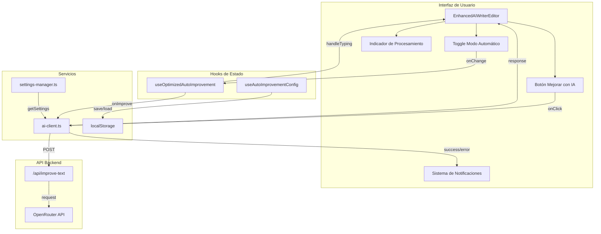
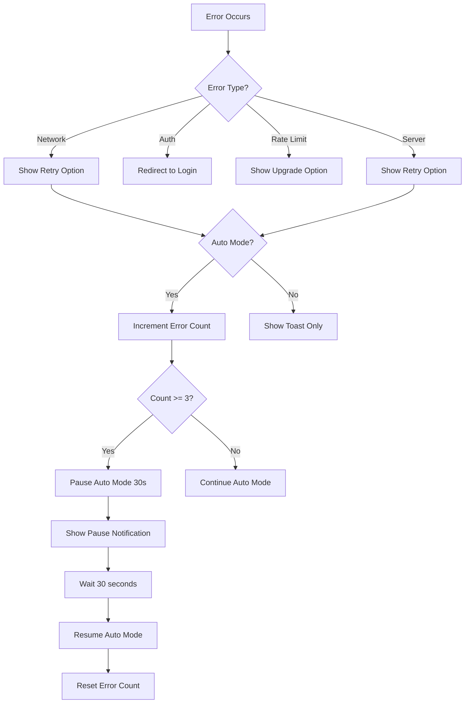

# Design Document: Corrección Funcional del Escritor IA

## Overview

Este documento describe el diseño técnico para corregir los problemas funcionales del Escritor IA. Los dos problemas principales son:

1. **Botón "Mejorar con IA" no funciona**: El botón no ejecuta la mejora correctamente o no actualiza el contenido del editor.
2. **Modo automático no responde**: El sistema no detecta la escritura del usuario ni activa la mejora automática.

La solución se centra en asegurar la conexión correcta entre los componentes de la interfaz y los servicios de IA, implementar retroalimentación visual clara, y manejar errores de forma robusta.

## Architecture



## Components and Interfaces

### 1. EnhancedAIWriterEditor (Componente Principal)

```typescript
interface EnhancedAIWriterEditorProps {
  content: string;
  onContentChange: (content: string) => void;
  onImprove: () => void;
  onSave: () => void;
  onCopy: () => void;
  onOpenSettings: () => void;
  isProcessing: boolean;
  isSaving?: boolean;
  disabled?: boolean;
  usageInfo?: UsageInfo | null;
  enableRealTimeAnalysis?: boolean;
  enableAgentMode?: boolean;
  onAnalysisComplete?: (result: AnalysisResult) => void;
  onAgentModeChange?: (isActive: boolean) => void;
  isSettingsPanelOpen?: boolean;
}

interface UsageInfo {
  usage: number;
  limit: number;
  isPremium: boolean;
}
```

**Responsabilidades**:
- Renderizar el editor de texto y controles
- Coordinar el estado de procesamiento entre componentes
- Manejar eventos de mejora manual y automática
- Mostrar indicadores de estado y notificaciones

### 2. useOptimizedAutoImprovement (Hook de Mejora Automática)

```typescript
interface AutoImprovementConfig {
  enabled: boolean;
  delay: number;           // milliseconds (default: 2000)
  minWords: number;        // minimum words to trigger (default: 10)
  maxRetries: number;      // max consecutive errors (default: 3)
  debounceDelay: number;   // typing debounce (default: 1000)
  improvementLevel?: 'conservative' | 'balanced' | 'creative';
}

interface AutoImprovementState {
  isTyping: boolean;
  isPaused: boolean;
  isImproving: boolean;
  lastImprovement: number;
  improvementCount: number;
  consecutiveErrors: number;  // NEW: track consecutive errors
  pausedUntil: number;        // NEW: timestamp when pause ends
}

interface UseOptimizedAutoImprovementReturn {
  state: AutoImprovementState;
  handleTyping: () => void;
  pauseAutoImprovement: (duration?: number) => void;
  resumeAutoImprovement: () => void;
  forceImprovement: () => Promise<void>;
  resetState: () => void;
  canImprove: boolean;
  timeSinceLastImprovement: number;
}
```

**Responsabilidades**:
- Detectar actividad de escritura del usuario
- Gestionar temporizadores de debounce y delay
- Activar mejora automática cuando se cumplen las condiciones
- Implementar circuit breaker para errores consecutivos

### 3. API de Mejora de Texto

```typescript
// POST /api/improve-text
interface ImproveTextRequest {
  content: string;
  prompt?: string;
  language?: string;
}

interface ImproveTextResponse {
  improvedContent: string;
}

interface ImproveTextError {
  error: string;
  code?: 'limit_reached' | 'auth_required' | 'invalid_key';
  details?: string;
  usage?: number;
  limit?: number;
  upgradeUrl?: string;
}
```

### 4. Sistema de Notificaciones

```typescript
interface NotificationConfig {
  type: 'success' | 'error' | 'loading' | 'info';
  message: string;
  duration?: number;
  action?: {
    label: string;
    onClick: () => void;
  };
}

// Error messages mapping
const ERROR_MESSAGES: Record<string, string> = {
  'network_error': 'Error de conexión. Verifica tu internet.',
  'invalid_key': 'API key inválida. Verifica tu configuración.',
  'empty_content': 'Escribe algo de texto primero.',
  'limit_reached': 'Has alcanzado el límite diario.',
  'server_error': 'Error del servidor. Intenta de nuevo.',
  'timeout': 'La solicitud tardó demasiado. Intenta de nuevo.'
};
```

## Data Models

### Estado del Editor

```typescript
interface EditorState {
  content: string;
  isProcessing: boolean;
  processingSource: 'manual' | 'auto' | null;
  lastError: ErrorInfo | null;
  autoConfig: AutoImprovementConfig;
}

interface ErrorInfo {
  code: string;
  message: string;
  timestamp: number;
  recoverable: boolean;
}
```

### Configuración Persistida

```typescript
// localStorage key: 'ai-writer-auto-config'
interface PersistedConfig {
  enabled: boolean;
  delay: number;
  minWords: number;
  improvementLevel: 'conservative' | 'balanced' | 'creative';
  lastUpdated: number;
}
```

## Correctness Properties

*A property is a characteristic or behavior that should hold true across all valid executions of a system—essentially, a formal statement about what the system should do. Properties serve as the bridge between human-readable specifications and machine-verifiable correctness guarantees.*

### Property 1: Manual Improvement Round-Trip

*For any* non-empty content in the editor, when the user clicks "Mejorar con IA" and the API responds successfully, the editor content SHALL be replaced with the improved content from the API response.

**Validates: Requirements 1.1, 1.2, 4.2, 4.3**

### Property 2: Processing State Consistency

*For any* improvement operation (manual or automatic), the processing indicator SHALL be visible from the moment the operation starts until it completes (success or failure), and the improve button SHALL be disabled during this time.

**Validates: Requirements 1.3, 1.5, 2.3, 3.1, 3.5**

### Property 3: Auto-Improvement Trigger Conditions

*For any* content with word count >= minWords, when auto mode is enabled and the user stops typing for the configured delay time, the system SHALL automatically trigger an improvement request.

**Validates: Requirements 2.1, 2.2, 2.4**

### Property 4: Typing Debounce Reset

*For any* typing activity during the delay period, the auto-improvement timer SHALL reset to the full delay duration, preventing premature improvement triggers.

**Validates: Requirements 2.5**

### Property 5: Error Message Specificity

*For any* API error response, the system SHALL display a user-friendly error message that corresponds to the specific error type (network, auth, limit, etc.).

**Validates: Requirements 1.4, 3.4, 5.1, 5.2, 5.3, 5.4**

### Property 6: Circuit Breaker for Auto Mode

*For any* sequence of 3 consecutive errors in auto mode, the system SHALL automatically pause auto-improvement for 30 seconds and resume automatically after the pause period.

**Validates: Requirements 5.5**

### Property 7: Configuration Persistence Round-Trip

*For any* auto-improvement configuration change, saving to localStorage and then loading SHALL produce an equivalent configuration object.

**Validates: Requirements 6.1, 6.2, 6.3**

### Property 8: Content Reference Integrity

*For any* improvement operation, the system SHALL use a ref-based content reference to ensure the most current content is used, avoiding race conditions from stale closures.

**Validates: Requirements 4.4**

### Property 9: State Synchronization

*For any* processing state change in the editor, the parent component's isProcessing prop and the internal processing state SHALL remain synchronized.

**Validates: Requirements 4.5**

## Error Handling

### Error Classification

| Error Type | HTTP Status | User Message | Recovery Action |
|------------|-------------|--------------|-----------------|
| Network Error | N/A | "Error de conexión. Verifica tu internet." | Retry button |
| Auth Required | 401 | "Sesión expirada. Inicia sesión de nuevo." | Redirect to login |
| Invalid API Key | 403 | "API key inválida. Verifica tu configuración." | Open settings |
| Rate Limit | 403 (limit_reached) | "Has alcanzado el límite diario." | Show upgrade option |
| Empty Content | 400 | "Escribe algo de texto primero." | Focus editor |
| Server Error | 500 | "Error del servidor. Intenta de nuevo." | Retry button |
| Timeout | 408/504 | "La solicitud tardó demasiado." | Retry button |

### Circuit Breaker Implementation

```typescript
const CIRCUIT_BREAKER_CONFIG = {
  maxConsecutiveErrors: 3,
  pauseDuration: 30000, // 30 seconds
  resetOnSuccess: true
};

// State tracking
interface CircuitBreakerState {
  consecutiveErrors: number;
  pausedUntil: number | null;
  lastError: Error | null;
}
```

### Error Recovery Flow



## Testing Strategy

### Unit Tests

Unit tests should focus on specific examples and edge cases:

1. **Empty content validation**: Verify error message when content is empty
2. **Button disabled state**: Verify button is disabled during processing
3. **Default configuration values**: Verify defaults when no localStorage exists
4. **Specific error messages**: Verify each error type shows correct message

### Property-Based Tests

Property-based tests should use a minimum of 100 iterations per test. Each test must be tagged with the format: **Feature: ai-writer-functional-fix, Property {number}: {property_text}**

1. **Manual Improvement Round-Trip** (Property 1)
   - Generate random valid content
   - Mock successful API response
   - Verify content is replaced with improved version

2. **Processing State Consistency** (Property 2)
   - Generate random operations (manual/auto)
   - Verify indicator visibility and button state throughout lifecycle

3. **Auto-Improvement Trigger Conditions** (Property 3)
   - Generate content with varying word counts
   - Verify trigger only occurs when conditions are met

4. **Typing Debounce Reset** (Property 4)
   - Generate typing sequences with varying intervals
   - Verify timer resets on each keystroke within delay period

5. **Error Message Specificity** (Property 5)
   - Generate various error responses
   - Verify correct message mapping

6. **Circuit Breaker** (Property 6)
   - Generate sequences of errors
   - Verify pause activation after 3 consecutive errors

7. **Configuration Persistence** (Property 7)
   - Generate random valid configurations
   - Verify save/load round-trip produces equivalent config

8. **Content Reference Integrity** (Property 8)
   - Generate rapid content changes during improvement
   - Verify correct content is used for API call

9. **State Synchronization** (Property 9)
   - Generate state changes from various sources
   - Verify parent and child states remain synchronized

### Testing Framework

- **Framework**: Vitest with React Testing Library
- **Property Testing Library**: fast-check
- **Mocking**: MSW for API mocking
- **Minimum iterations**: 100 per property test

## Implementation Notes

### Key Design Decisions

1. **Ref-based content tracking**: Using `useRef` for content ensures the most current value is always available, avoiding stale closure issues in async callbacks.

2. **Centralized processing state**: A single `isProcessing` state is shared between manual and auto modes to prevent concurrent operations.

3. **Toast-based notifications**: Using the `sonner` library for consistent, non-blocking notifications that don't interrupt the user's workflow.

4. **Circuit breaker pattern**: Implementing automatic pause after consecutive errors prevents infinite retry loops and gives the system time to recover.

5. **localStorage for persistence**: Simple, synchronous storage for configuration that doesn't require server round-trips.

### Migration Considerations

The existing `EnhancedAIWriterEditor` and `useOptimizedAutoImprovement` components already have most of the structure in place. The fixes will focus on:

1. Ensuring `handleTyping` is properly connected to textarea events
2. Verifying the `performImprovement` function correctly updates content
3. Adding circuit breaker logic to the auto-improvement hook
4. Implementing proper error message mapping
5. Adding localStorage persistence for configuration
