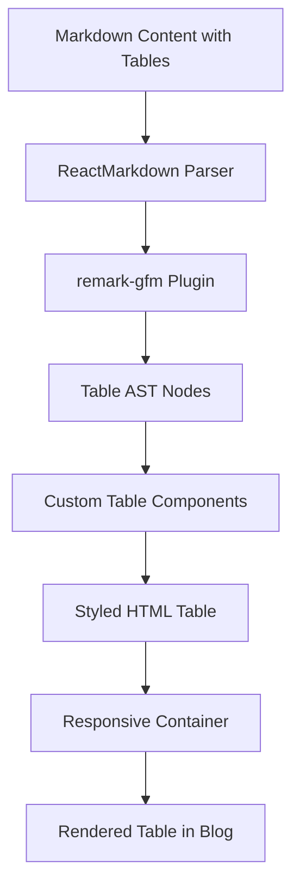

# Design Document: Blog Table Rendering Fix

## Overview

This design addresses the issue of blog article tables not rendering or displaying properly. The current implementation uses `react-markdown` with `remark-gfm` (GitHub Flavored Markdown) to render blog content, but the custom `markdownComponents` object in `BlogPostClientView.tsx` does not include table-specific components. This means tables fall back to default HTML rendering without the custom styling, dark mode support, or responsive behavior that other blog elements receive.

The solution involves:
1. Adding custom table components to the markdown renderer
2. Ensuring tables inherit the blog's design system (dark theme, typography, spacing)
3. Implementing responsive table containers with horizontal scrolling
4. Providing proper accessibility attributes
5. Ensuring consistent styling across all blog articles

## Architecture

### Component Structure

```
BlogPostClientView
├── ReactMarkdown (with remarkGfm)
│   └── markdownComponents
│       ├── h2, h3, p, ul, li (existing)
│       ├── blockquote, a, img, code (existing)
│       └── table, thead, tbody, tr, th, td (NEW)
└── CSS Styles
    ├── blog-styles.css (existing table styles)
    └── Enhanced table styles (additions)
```

### Data Flow



## Components and Interfaces

### 1. Table Component Definitions

The custom markdown components will be extended to include table elements:

```typescript
// Add to markdownComponents object in BlogPostClientView.tsx

const markdownComponents = {
    // ... existing components ...
    
    table: ({ children }: any) => (
        <div className="table-container my-12 overflow-x-auto rounded-xl border border-white/10 shadow-xl">
            <table className="blog-table w-full border-collapse">
                {children}
            </table>
        </div>
    ),
    
    thead: ({ children }: any) => (
        <thead className="blog-table-header bg-white/5 border-b-2 border-purple-500/30">
            {children}
        </thead>
    ),
    
    tbody: ({ children }: any) => (
        <tbody className="blog-table-body">
            {children}
        </tbody>
    ),
    
    tr: ({ children }: any) => (
        <tr className="blog-table-row border-b border-white/5 hover:bg-white/5 transition-colors">
            {children}
        </tr>
    ),
    
    th: ({ children }: any) => (
        <th className="blog-table-header-cell px-6 py-4 text-left font-bold text-sm uppercase tracking-wider text-purple-300">
            {children}
        </th>
    ),
    
    td: ({ children }: any) => (
        <td className="blog-table-cell px-6 py-4 text-gray-300 align-top">
            {children}
        </td>
    )
}
```

### 2. CSS Enhancements

Additional CSS will be added to `blog-styles.css` to ensure tables work properly:

```css
/* Table Container - Responsive Wrapper */
.table-container {
    position: relative;
    width: 100%;
    margin: 3rem 0;
}

/* Scrollbar Styling for Table Container */
.table-container::-webkit-scrollbar {
    height: 8px;
}

.table-container::-webkit-scrollbar-track {
    background: rgba(255, 255, 255, 0.05);
    border-radius: 4px;
}

.table-container::-webkit-scrollbar-thumb {
    background: rgba(168, 85, 247, 0.4);
    border-radius: 4px;
}

.table-container::-webkit-scrollbar-thumb:hover {
    background: rgba(168, 85, 247, 0.6);
}

/* Table Base Styles */
.blog-table {
    min-width: 600px; /* Ensures table doesn't collapse on mobile */
    font-size: 1rem;
    line-height: 1.6;
}

/* Header Cells */
.blog-table-header-cell {
    white-space: nowrap;
    font-weight: 700;
    text-transform: uppercase;
    letter-spacing: 0.05em;
}

/* Data Cells */
.blog-table-cell {
    vertical-align: top;
    word-wrap: break-word;
    max-width: 300px; /* Prevents extremely wide cells */
}

/* Row Hover Effect */
.blog-table-row:last-child {
    border-bottom: none;
}

/* Responsive Adjustments */
@media (max-width: 768px) {
    .blog-table {
        font-size: 0.875rem;
    }
    
    .blog-table-header-cell,
    .blog-table-cell {
        padding: 0.75rem 1rem;
    }
}

/* Dark Mode Specific (already in dark theme context) */
.blog-table-header {
    background: rgba(255, 255, 255, 0.05);
}

.blog-table-row:hover {
    background: rgba(255, 255, 255, 0.05);
}
```

### 3. Accessibility Enhancements

Tables will include proper semantic HTML and ARIA attributes:

```typescript
// Enhanced table component with accessibility
table: ({ children }: any) => (
    <div className="table-container my-12 overflow-x-auto rounded-xl border border-white/10 shadow-xl" role="region" aria-label="Data table" tabIndex={0}>
        <table className="blog-table w-full border-collapse">
            {children}
        </table>
    </div>
),

th: ({ children, ...props }: any) => (
    <th 
        className="blog-table-header-cell px-6 py-4 text-left font-bold text-sm uppercase tracking-wider text-purple-300"
        scope="col"
        {...props}
    >
        {children}
    </th>
)
```

## Data Models

### Table Rendering Context

```typescript
interface TableRenderingContext {
    // Markdown table syntax
    markdownTable: string
    
    // Parsed table structure
    parsedTable: {
        headers: string[]
        rows: string[][]
        alignment?: ('left' | 'center' | 'right')[]
    }
    
    // Rendering options
    options: {
        responsive: boolean
        darkMode: boolean
        maxCellWidth?: number
        minTableWidth?: number
    }
}
```

### Markdown Table Example

```markdown
| Feature | Description | Status |
|---------|-------------|--------|
| Dark Mode | Full dark theme support | ✅ Complete |
| Responsive | Mobile-friendly tables | ✅ Complete |
| Accessibility | WCAG AA compliant | ✅ Complete |
```

## Correctness Properties

*A property is a characteristic or behavior that should hold true across all valid executions of a system—essentially, a formal statement about what the system should do. Properties serve as the bridge between human-readable specifications and machine-verifiable correctness guarantees.*

