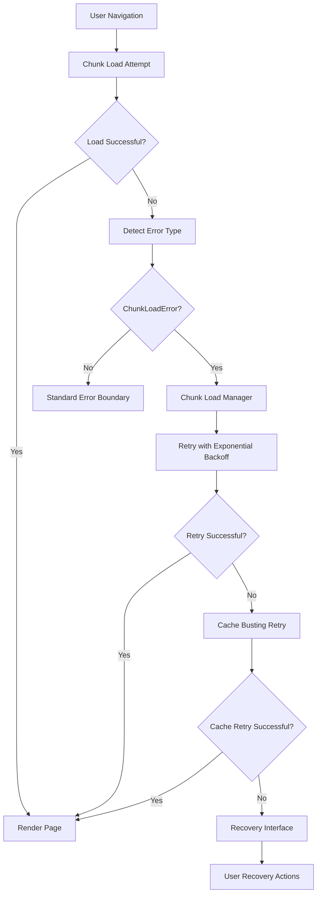

# Design Document

## Overview

This design addresses ChunkLoadError issues in the Next.js application by implementing a comprehensive error handling and recovery system. The solution focuses on preventing chunk loading failures, gracefully handling them when they occur, and providing users with effective recovery mechanisms.

## Architecture

### Core Components

1. **Enhanced Error Boundary** - Upgraded error boundary with chunk-specific error detection and recovery
2. **Chunk Load Manager** - Service for handling chunk loading with retry logic and fallbacks
3. **Cache Management System** - Utilities for detecting and clearing stale caches
4. **Recovery Interface** - User-friendly recovery options with progressive fallback strategies

### System Flow



## Components and Interfaces

### Enhanced Error Boundary

```typescript
interface ChunkErrorBoundaryState {
  hasError: boolean
  error?: Error
  errorType: 'chunk' | 'network' | 'generic'
  retryCount: number
  isRetrying: boolean
}

interface ChunkErrorBoundaryProps {
  children: React.ReactNode
  fallback?: React.ReactNode
  maxRetries?: number
  onError?: (error: Error, errorInfo: React.ErrorInfo) => void
}
```

### Chunk Load Manager

```typescript
interface ChunkLoadManager {
  retryChunkLoad(chunkUrl: string, options?: RetryOptions): Promise<void>
  clearChunkCache(chunkName?: string): void
  detectStaleChunks(): string[]
  preloadCriticalChunks(): Promise<void>
}

interface RetryOptions {
  maxRetries: number
  backoffMultiplier: number
  initialDelay: number
  maxDelay: number
}
```

### Recovery Interface

```typescript
interface RecoveryAction {
  label: string
  description: string
  action: () => Promise<void> | void
  severity: 'low' | 'medium' | 'high'
}

interface RecoveryInterfaceProps {
  error: Error
  onRecovery: (success: boolean) => void
  actions: RecoveryAction[]
}
```

## Data Models

### Error Classification

```typescript
enum ChunkErrorType {
  LOAD_FAILED = 'LOAD_FAILED',
  NETWORK_ERROR = 'NETWORK_ERROR', 
  CACHE_MISMATCH = 'CACHE_MISMATCH',
  BUILD_MISMATCH = 'BUILD_MISMATCH'
}

interface ChunkError {
  type: ChunkErrorType
  chunkName: string
  url: string
  timestamp: number
  userAgent: string
  retryAttempts: number
}
```

### Recovery Strategy

```typescript
interface RecoveryStrategy {
  name: string
  priority: number
  condition: (error: ChunkError) => boolean
  execute: (error: ChunkError) => Promise<boolean>
  fallback?: RecoveryStrategy
}
```

## Error Handling

### Chunk Error Detection

1. **Error Type Classification**: Distinguish between chunk loading errors and other JavaScript errors
2. **Network vs Cache Issues**: Detect whether the error is due to network problems or stale cache
3. **Build Version Mismatch**: Identify when cached chunks don't match current build

### Recovery Strategies

1. **Immediate Retry**: Quick retry for transient network issues
2. **Cache Busting**: Append cache-busting parameters to chunk URLs
3. **Hard Refresh**: Full page reload with cache clearing
4. **Graceful Degradation**: Load essential functionality only

### Progressive Fallback System

```typescript
const recoveryStrategies: RecoveryStrategy[] = [
  {
    name: 'immediate-retry',
    priority: 1,
    condition: (error) => error.retryAttempts === 0,
    execute: (error) => retryChunkLoad(error.url)
  },
  {
    name: 'cache-bust-retry', 
    priority: 2,
    condition: (error) => error.retryAttempts < 3,
    execute: (error) => retryChunkLoad(error.url + '?v=' + Date.now())
  },
  {
    name: 'hard-refresh',
    priority: 3,
    condition: () => true,
    execute: () => window.location.reload()
  }
]
```

## Testing Strategy

### Unit Tests

1. **Error Boundary Tests**: Verify proper error catching and state management
2. **Chunk Manager Tests**: Test retry logic and cache management
3. **Recovery Interface Tests**: Ensure proper user interaction handling

### Integration Tests

1. **Error Simulation**: Mock chunk loading failures and verify recovery
2. **Network Condition Tests**: Test behavior under various network conditions
3. **Cache Scenarios**: Verify handling of stale cache situations

### End-to-End Tests

1. **User Journey Tests**: Complete user flows with simulated chunk errors
2. **Mobile Device Tests**: Specific testing on mobile devices and slow networks
3. **Recovery Flow Tests**: User interaction with recovery interface

### Performance Tests

1. **Retry Performance**: Measure impact of retry logic on load times
2. **Cache Management**: Verify cache operations don't impact performance
3. **Fallback Loading**: Test performance of graceful degradation scenarios

## Implementation Considerations

### Next.js Configuration

- Configure webpack to generate stable chunk names
- Implement proper cache headers for chunk files
- Set up service worker for offline chunk caching (optional)

### Browser Compatibility

- Ensure error handling works across all supported browsers
- Implement polyfills for older browsers if needed
- Test on various mobile browsers and WebView implementations

### Monitoring and Analytics

- Log chunk loading errors for monitoring
- Track recovery success rates
- Monitor user behavior during error scenarios

### Security Considerations

- Validate chunk URLs before retry attempts
- Prevent infinite retry loops
- Sanitize error messages displayed to users