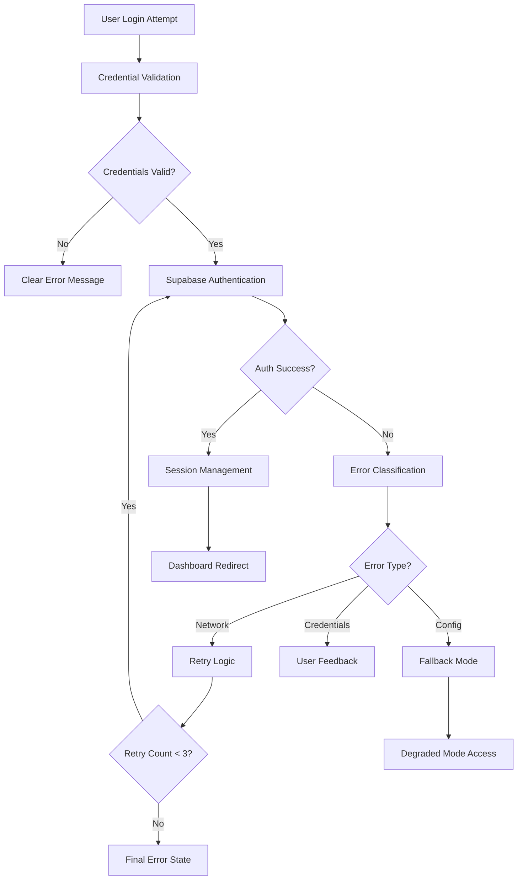

# Design Document - Login Authentication Fix

## Overview

This design addresses the critical authentication issues preventing users from logging into the application despite entering correct credentials. The solution implements a robust, resilient authentication system with comprehensive error handling, diagnostic capabilities, and fallback mechanisms to ensure reliable user access.

The design focuses on three core areas: fixing the immediate login issues, implementing comprehensive error handling and user feedback, and creating diagnostic tools for ongoing maintenance and troubleshooting.

## Architecture

### Authentication Flow Architecture



### System Components

1. **Authentication Service**: Core authentication logic with Supabase integration
2. **Error Handler**: Centralized error classification and user feedback
3. **Retry Manager**: Implements exponential backoff for network issues
4. **Session Manager**: Handles token lifecycle and persistence
5. **Diagnostic Service**: Monitors and logs authentication health
6. **Fallback System**: Provides degraded functionality during outages

## Components and Interfaces

### AuthenticationService

**Purpose**: Primary interface for all authentication operations
**Rationale**: Centralizes authentication logic to ensure consistency and maintainability

```typescript
interface AuthenticationService {
  login(email: string, password: string): Promise<AuthResult>
  logout(): Promise<void>
  refreshSession(): Promise<AuthResult>
  validateSession(): Promise<boolean>
  diagnoseConnection(): Promise<DiagnosticResult>
}

interface AuthResult {
  success: boolean
  user?: User
  error?: AuthError
  requiresRetry?: boolean
}
```

### ErrorHandler

**Purpose**: Provides consistent error classification and user-friendly messages
**Rationale**: Users need clear, actionable feedback instead of technical error messages

```typescript
interface ErrorHandler {
  classifyError(error: any): ErrorType
  getUserMessage(errorType: ErrorType): string
  shouldRetry(errorType: ErrorType): boolean
  logError(error: AuthError): void
}

enum ErrorType {
  INVALID_CREDENTIALS,
  NETWORK_ERROR,
  SERVICE_UNAVAILABLE,
  CONFIGURATION_ERROR,
  TOKEN_EXPIRED,
  UNKNOWN_ERROR
}
```

### RetryManager

**Purpose**: Implements intelligent retry logic with exponential backoff
**Rationale**: Network issues are common and temporary; automatic retries improve user experience

```typescript
interface RetryManager {
  executeWithRetry<T>(
    operation: () => Promise<T>,
    maxRetries: number,
    backoffMs: number
  ): Promise<T>
  shouldRetry(error: any, attemptCount: number): boolean
}
```

### SessionManager

**Purpose**: Handles secure session persistence and token management
**Rationale**: Users expect their sessions to persist across browser sessions while maintaining security

```typescript
interface SessionManager {
  storeSession(session: Session): void
  getSession(): Session | null
  clearSession(): void
  isSessionValid(): boolean
  refreshTokens(): Promise<Session>
}
```

## Data Models

### User Authentication State

```typescript
interface AuthState {
  isAuthenticated: boolean
  user: User | null
  loading: boolean
  error: AuthError | null
  lastLoginAttempt: Date | null
  retryCount: number
}

interface User {
  id: string
  email: string
  name?: string
  lastLogin: Date
  sessionExpiry: Date
}

interface AuthError {
  type: ErrorType
  message: string
  userMessage: string
  timestamp: Date
  retryable: boolean
  details?: any
}
```

### Diagnostic Information

```typescript
interface DiagnosticResult {
  supabaseConnection: boolean
  configurationValid: boolean
  networkConnectivity: boolean
  tokenStatus: TokenStatus
  lastError?: AuthError
  recommendations: string[]
}

enum TokenStatus {
  VALID,
  EXPIRED,
  CORRUPTED,
  MISSING
}
```

## Error Handling

### Error Classification Strategy

**Design Decision**: Implement a comprehensive error classification system
**Rationale**: Different error types require different handling strategies and user messages

1. **Network Errors**: Implement retry logic with exponential backoff
2. **Credential Errors**: Provide clear feedback without revealing system details
3. **Configuration Errors**: Log for developers, show generic message to users
4. **Service Unavailable**: Activate fallback mode when possible
5. **Token Issues**: Automatic cleanup and re-authentication flow

### User Feedback Strategy

**Design Decision**: Provide specific, actionable error messages
**Rationale**: Users need to understand what went wrong and how to fix it

- Invalid credentials: "Email o contraseña incorrectos"
- Network issues: "Error de conexión. Verifica tu internet e intenta nuevamente"
- Service unavailable: "Servicio temporalmente no disponible. Intenta más tarde"
- System errors: "Error del sistema. Contacta al soporte"
- User not found: Suggest account creation

### Retry Logic Implementation

**Design Decision**: Use exponential backoff with maximum retry limits
**Rationale**: Prevents system overload while giving temporary issues time to resolve

- Maximum 3 retry attempts
- Initial delay: 1 second
- Exponential multiplier: 2x
- Maximum delay: 8 seconds
- Only retry network and temporary service errors

## Resilience and Fallback Mechanisms

### Fallback Mode Design

**Design Decision**: Implement degraded functionality when Supabase is unavailable
**Rationale**: Users should have some access even during service outages

1. **Local Session Validation**: Use cached session data when possible
2. **Read-Only Mode**: Allow viewing of cached data
3. **Offline Indicators**: Clear communication about limited functionality
4. **Automatic Recovery**: Resume full functionality when service returns

### Token Management Strategy

**Design Decision**: Implement proactive token refresh and cleanup
**Rationale**: Prevents authentication failures due to token issues

1. **Automatic Refresh**: Refresh tokens before expiration
2. **Corruption Detection**: Validate token format and content
3. **Cleanup on Failure**: Remove invalid tokens automatically
4. **Graceful Degradation**: Handle refresh failures elegantly

## Testing Strategy

### Unit Testing

- **Authentication Service**: Test all authentication flows and error conditions
- **Error Handler**: Verify correct error classification and message generation
- **Retry Manager**: Test backoff timing and retry limits
- **Session Manager**: Test token storage, retrieval, and validation

### Integration Testing

- **Supabase Integration**: Test actual authentication with Supabase
- **Network Failure Simulation**: Test retry logic with simulated network issues
- **Token Lifecycle**: Test complete token refresh and expiration flows
- **Error Flow Testing**: Verify end-to-end error handling

### End-to-End Testing

- **Complete Login Flow**: Test successful authentication from UI to dashboard
- **Error Scenarios**: Test user experience with various error conditions
- **Session Persistence**: Test session maintenance across browser restarts
- **Fallback Mode**: Test degraded functionality during service outages

### Diagnostic Testing

- **Connection Diagnostics**: Verify diagnostic tool accuracy
- **Error Logging**: Ensure proper error capture and reporting
- **Performance Monitoring**: Test authentication performance under load
- **Recovery Testing**: Verify automatic recovery from failure states

## Security Considerations

### Token Security

**Design Decision**: Implement secure token storage and transmission
**Rationale**: Protect user sessions from security vulnerabilities

- Use secure HTTP-only cookies when possible
- Implement proper token rotation
- Clear tokens on logout and errors
- Validate token integrity

### Error Information Disclosure

**Design Decision**: Limit error information exposed to users
**Rationale**: Prevent information leakage that could aid attackers

- Generic messages for system errors
- Detailed logging for developers only
- No exposure of internal system details
- Consistent response timing to prevent enumeration

## Implementation Priorities

### Phase 1: Core Authentication Fix
1. Fix immediate login issues
2. Implement basic error handling
3. Add session management
4. Create diagnostic tools

### Phase 2: Resilience Features
1. Add retry logic
2. Implement fallback mechanisms
3. Enhance error classification
4. Add comprehensive logging

### Phase 3: Advanced Features
1. Performance optimizations
2. Advanced diagnostics
3. Monitoring and alerting
4. User experience enhancements

This design ensures a robust, user-friendly authentication system that addresses all identified requirements while providing a foundation for future enhancements.