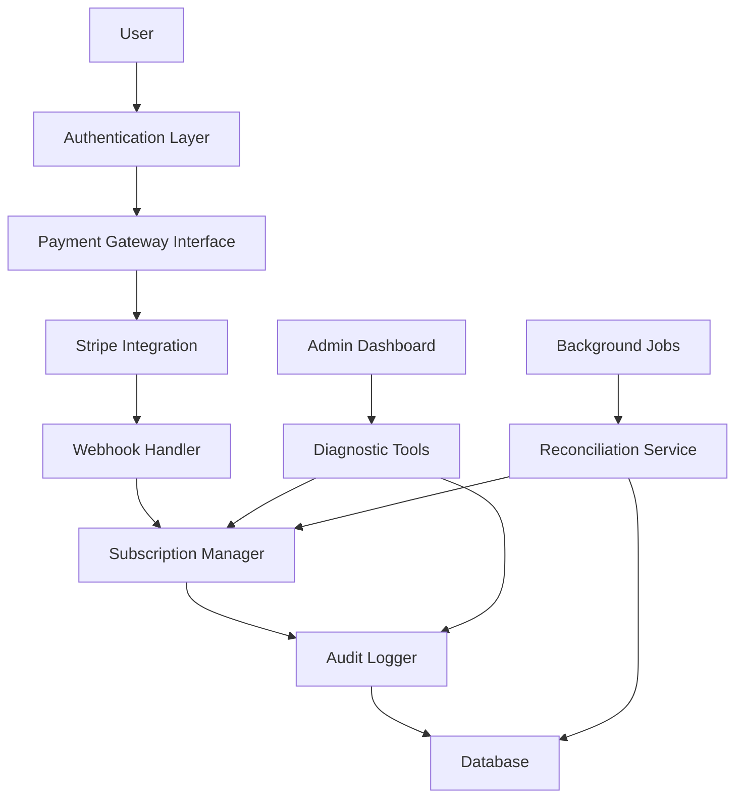

# Secure Payment Flow Design Document

## Overview

This design document outlines a comprehensive secure payment system that addresses critical vulnerabilities in subscription management and user authentication. The system ensures that subscriptions are correctly assigned to authenticated users through robust identity verification, transaction tracking, and error handling mechanisms.

The design implements a multi-layered security approach with authentication verification, session management, audit logging, and automatic reconciliation to prevent subscription misassignment and billing errors.

## Architecture

### High-Level Architecture



### Security Layers

1. **Authentication Layer**: Verifies user identity before any payment operations
2. **Session Management**: Maintains secure session state throughout payment process
3. **Transaction Validation**: Ensures payment metadata matches authenticated user
4. **Audit Trail**: Comprehensive logging for all payment-related operations
5. **Reconciliation Service**: Detects and resolves inconsistencies

## Components and Interfaces

### 1. Authentication Guard Component

**Purpose**: Ensures only authenticated users can access payment flows

**Interface**:
```typescript
interface AuthenticationGuard {
  verifyUserAuthentication(): Promise<AuthResult>
  validateSessionActive(): Promise<boolean>
  redirectToLogin(): void
  getUserIdentity(): Promise<UserIdentity>
}

interface AuthResult {
  isAuthenticated: boolean
  user: UserIdentity | null
  sessionExpiry: Date
}

interface UserIdentity {
  userId: string
  email: string
  sessionId: string
}
```

**Design Rationale**: Centralized authentication logic prevents bypass attempts and ensures consistent security checks across all payment entry points.

### 2. Secure Payment Processor

**Purpose**: Manages Stripe integration with enhanced security validations

**Interface**:
```typescript
interface SecurePaymentProcessor {
  createSecureCheckoutSession(user: UserIdentity, planId: string): Promise<CheckoutSession>
  validatePaymentMetadata(session: CheckoutSession): Promise<ValidationResult>
  processPaymentCompletion(webhookData: StripeWebhook): Promise<ProcessingResult>
}

interface CheckoutSession {
  sessionId: string
  userEmail: string
  userId: string
  planId: string
  createdAt: Date
  expiresAt: Date
}

interface ValidationResult {
  isValid: boolean
  errors: string[]
  userMatch: boolean
}
```

**Design Rationale**: Embedding user identity directly into Stripe metadata ensures traceability and prevents session hijacking or misassignment.

### 3. Webhook Security Handler

**Purpose**: Validates and processes Stripe webhooks with security checks

**Interface**:
```typescript
interface WebhookSecurityHandler {
  validateWebhookSignature(payload: string, signature: string): Promise<boolean>
  verifyCustomerEmailMatch(stripeCustomer: StripeCustomer, expectedEmail: string): Promise<boolean>
  processSecureWebhook(webhook: StripeWebhook): Promise<WebhookResult>
}

interface WebhookResult {
  success: boolean
  subscriptionId?: string
  userId?: string
  errors: string[]
  requiresManualReview: boolean
}
```

**Design Rationale**: Webhook validation prevents fraudulent requests and ensures only legitimate Stripe events are processed.

### 4. Subscription Manager

**Purpose**: Manages subscription lifecycle with conflict detection

**Interface**:
```typescript
interface SubscriptionManager {
  assignSubscription(userId: string, subscriptionData: SubscriptionData): Promise<AssignmentResult>
  checkExistingSubscriptions(userId: string): Promise<SubscriptionStatus[]>
  resolveSubscriptionConflicts(userId: string): Promise<ConflictResolution>
  updateSubscriptionStatus(subscriptionId: string, status: SubscriptionStatus): Promise<void>
}

interface AssignmentResult {
  success: boolean
  subscriptionId?: string
  conflicts: SubscriptionConflict[]
  requiresManualReview: boolean
}

interface SubscriptionConflict {
  existingSubscriptionId: string
  conflictType: 'duplicate' | 'overlapping' | 'inconsistent'
  resolution: 'auto' | 'manual'
}
```

**Design Rationale**: Centralized subscription management prevents duplicate subscriptions and provides clear conflict resolution paths.

### 5. Audit Logger

**Purpose**: Comprehensive logging for security and compliance

**Interface**:
```typescript
interface AuditLogger {
  logPaymentInitiation(user: UserIdentity, planId: string, sessionId: string): Promise<void>
  logWebhookReceived(webhook: StripeWebhook, validationResult: ValidationResult): Promise<void>
  logSubscriptionAssignment(assignment: SubscriptionAssignment): Promise<void>
  logSecurityEvent(event: SecurityEvent): Promise<void>
  generateAuditReport(userId: string, dateRange: DateRange): Promise<AuditReport>
}

interface SubscriptionAssignment {
  userId: string
  email: string
  subscriptionId: string
  planId: string
  timestamp: Date
  sessionId: string
}

interface SecurityEvent {
  type: 'fraud_attempt' | 'webhook_validation_failed' | 'session_hijack' | 'duplicate_subscription'
  userId?: string
  details: Record<string, any>
  severity: 'low' | 'medium' | 'high' | 'critical'
  timestamp: Date
}
```

**Design Rationale**: Detailed audit trails enable forensic analysis and compliance reporting while supporting automated security monitoring.

### 6. Real-time Subscription Status Service

**Purpose**: Provides fast, accurate subscription status checks

**Interface**:
```typescript
interface SubscriptionStatusService {
  getSubscriptionStatus(userId: string): Promise<SubscriptionStatus>
  subscribeToStatusChanges(userId: string, callback: StatusChangeCallback): Promise<void>
  refreshSubscriptionCache(userId: string): Promise<void>
  validateSubscriptionAccess(userId: string, feature: string): Promise<AccessResult>
}

interface SubscriptionStatus {
  isActive: boolean
  planId?: string
  expiresAt?: Date
  features: string[]
  lastUpdated: Date
  source: 'cache' | 'stripe' | 'database'
}

interface AccessResult {
  hasAccess: boolean
  reason?: string
  upgradeRequired?: boolean
}
```

**Design Rationale**: Caching with real-time updates ensures fast response times while maintaining accuracy through multiple data sources.

### 7. Diagnostic and Recovery Tools

**Purpose**: Automated problem detection and resolution

**Interface**:
```typescript
interface DiagnosticTools {
  runSubscriptionDiagnostic(userId: string): Promise<DiagnosticReport>
  detectInconsistencies(userId: string): Promise<Inconsistency[]>
  executeAutoRepair(userId: string, issues: RepairableIssue[]): Promise<RepairResult>
  generateSupportReport(userId: string): Promise<SupportReport>
}

interface DiagnosticReport {
  userId: string
  subscriptionStatus: SubscriptionStatus
  stripeCustomerStatus: StripeCustomerStatus
  inconsistencies: Inconsistency[]
  repairableIssues: RepairableIssue[]
  requiresManualIntervention: boolean
}

interface RepairableIssue {
  type: 'missing_subscription' | 'duplicate_subscription' | 'status_mismatch'
  description: string
  autoRepairAvailable: boolean
  riskLevel: 'low' | 'medium' | 'high'
}
```

**Design Rationale**: Automated diagnostics reduce support burden and provide users with self-service options while maintaining safety through risk assessment.

## Data Models

### User Session Model
```typescript
interface UserSession {
  sessionId: string
  userId: string
  email: string
  createdAt: Date
  expiresAt: Date
  isActive: boolean
  lastActivity: Date
  paymentSessionId?: string
}
```

### Payment Transaction Model
```typescript
interface PaymentTransaction {
  transactionId: string
  userId: string
  email: string
  stripeSessionId: string
  stripeCustomerId?: string
  planId: string
  amount: number
  currency: string
  status: 'pending' | 'completed' | 'failed' | 'cancelled'
  createdAt: Date
  completedAt?: Date
  metadata: Record<string, any>
}
```

### Subscription Model
```typescript
interface Subscription {
  subscriptionId: string
  userId: string
  email: string
  stripeSubscriptionId: string
  planId: string
  status: 'active' | 'cancelled' | 'past_due' | 'unpaid'
  currentPeriodStart: Date
  currentPeriodEnd: Date
  createdAt: Date
  updatedAt: Date
  metadata: Record<string, any>
}
```

### Audit Log Model
```typescript
interface AuditLog {
  logId: string
  userId?: string
  email?: string
  action: string
  entityType: 'payment' | 'subscription' | 'session' | 'webhook'
  entityId: string
  details: Record<string, any>
  timestamp: Date
  ipAddress?: string
  userAgent?: string
}
```

## Error Handling

### Error Categories and Responses

1. **Authentication Errors**
   - Session expired: Redirect to login with return URL
   - Invalid user: Clear session and redirect to login
   - Permission denied: Show error message with upgrade options

2. **Payment Processing Errors**
   - Stripe API errors: Retry with exponential backoff
   - Network timeouts: Queue for later processing
   - Validation failures: Log security event and reject

3. **Subscription Conflicts**
   - Duplicate subscriptions: Automatic consolidation if safe
   - Status mismatches: Reconciliation service resolution
   - Missing subscriptions: Trigger webhook replay

4. **System Errors**
   - Database unavailable: Graceful degradation with caching
   - External service failures: Circuit breaker pattern
   - Unexpected errors: Comprehensive logging and user notification

### Recovery Mechanisms

1. **Automatic Retry Logic**
   - Exponential backoff for transient failures
   - Circuit breaker for external service failures
   - Dead letter queue for failed webhook processing

2. **Reconciliation Service**
   - Periodic comparison between Stripe and local data
   - Automatic resolution of safe inconsistencies
   - Manual review queue for complex conflicts

3. **Rollback Capabilities**
   - Transaction rollback for partial failures
   - State backup before risky operations
   - Audit trail for all state changes

## Testing Strategy

### Unit Testing
- Authentication guard logic
- Payment validation functions
- Subscription conflict detection
- Audit logging mechanisms
- Error handling scenarios

### Integration Testing
- Stripe webhook processing end-to-end
- Database transaction consistency
- Session management across requests
- Real-time status updates
- Diagnostic tool accuracy

### Security Testing
- Authentication bypass attempts
- Session hijacking scenarios
- Webhook signature validation
- SQL injection prevention
- Cross-site scripting protection

### Performance Testing
- Subscription status check latency
- Concurrent payment processing
- Database query optimization
- Cache effectiveness
- Webhook processing throughput

### End-to-End Testing
- Complete payment flow scenarios
- Error recovery workflows
- Multi-user conflict scenarios
- Subscription lifecycle management
- Diagnostic and repair processes

## Security Considerations

### Data Protection
- Encrypt sensitive data at rest and in transit
- Implement proper access controls
- Regular security audits and penetration testing
- Compliance with PCI DSS requirements

### Session Security
- Secure session token generation
- Proper session expiration handling
- Protection against session fixation
- CSRF token validation

### API Security
- Rate limiting on payment endpoints
- Input validation and sanitization
- Proper error message handling
- Webhook signature verification

### Monitoring and Alerting
- Real-time fraud detection
- Unusual activity pattern recognition
- Failed authentication attempt monitoring
- System health and performance alerts 