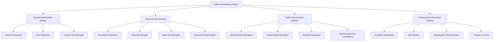

# Traffic Acceleration System Design

## Overview

The Traffic Acceleration System is designed to transform a low-traffic website (8 impressions/7 days) into a high-performing site with 100+ daily views (3,000+ monthly views). The system implements a multi-faceted approach combining content optimization, technical SEO, traffic diversification, and performance monitoring to achieve rapid and sustainable traffic growth.

The design follows a data-driven methodology with automated optimization, real-time monitoring, and scalable architecture to support continued growth beyond the initial target.

## Architecture

### System Components



### Data Flow Architecture

The system processes traffic acceleration through multiple parallel pipelines:

1. **Content Pipeline**: Keyword research → Content creation → SEO optimization → Publishing → Performance tracking
2. **Technical Pipeline**: Site audit → Issue identification → Automated fixes → Performance validation
3. **Traffic Pipeline**: Source analysis → Channel optimization → Campaign execution → Results measurement
4. **Monitoring Pipeline**: Data collection → Analysis → Alert generation → Recommendation delivery

## Components and Interfaces

### Content Optimization Module

**Purpose**: Generate high-quality, SEO-optimized content at scale to capture search traffic.

**Key Components**:
- **Content Generator**: Automated article creation targeting specific keywords
- **SEO Optimizer**: On-page optimization for meta tags, headers, and content structure
- **Internal Link Manager**: Strategic internal linking to boost page authority

**Interfaces**:
```typescript
interface ContentOptimizationService {
  generateContent(keywords: string[], targetLength: number): Promise<Article>
  optimizeExistingContent(pageId: string): Promise<OptimizationResult>
  manageInternalLinks(pageId: string): Promise<LinkingStrategy>
  auditContentQuality(pageId: string): Promise<QualityScore>
}
```

**Design Rationale**: Automated content generation ensures consistent output of 5+ articles per week while maintaining quality standards. The modular approach allows for independent optimization of different content aspects.

### Technical SEO Module

**Purpose**: Establish a solid technical foundation for search engine crawling and indexing.

**Key Components**:
- **Site Speed Optimizer**: Automated performance optimization
- **Sitemap Manager**: Dynamic sitemap generation and submission
- **Meta Data Manager**: Automated meta tag optimization
- **Structured Data Engine**: Schema markup implementation

**Interfaces**:
```typescript
interface TechnicalSEOService {
  optimizeSiteSpeed(): Promise<PerformanceMetrics>
  generateSitemap(): Promise<SitemapResult>
  optimizeMetaData(pageId: string): Promise<MetaOptimization>
  implementStructuredData(pageType: string): Promise<SchemaMarkup>
  auditTechnicalIssues(): Promise<TechnicalAudit>
}
```

**Design Rationale**: Technical SEO forms the foundation for all other optimization efforts. Automated detection and fixing of issues ensures consistent performance without manual intervention.

### Traffic Diversification Module

**Purpose**: Establish multiple traffic sources to reduce dependency on organic search and achieve consistent visitor flow.

**Key Components**:
- **Social Media Automation**: Automated content sharing across platforms
- **Email Marketing Engine**: Newsletter campaigns and traffic driving
- **Backlink Acquisition**: Strategic link building campaigns
- **Brand Awareness Campaigns**: Direct traffic generation initiatives

**Interfaces**:
```typescript
interface TrafficDiversificationService {
  scheduleSocialPosts(content: Content[]): Promise<SocialCampaign>
  executeEmailCampaign(subscribers: string[]): Promise<EmailResults>
  identifyBacklinkOpportunities(): Promise<BacklinkTarget[]>
  launchBrandCampaign(budget: number): Promise<CampaignMetrics>
}
```

**Design Rationale**: Diversified traffic sources provide stability and reduce risk. The 60% maximum from any single source ensures balanced growth and resilience against algorithm changes.

### Performance Monitoring Module

**Purpose**: Provide real-time insights and automated optimization recommendations to maintain traffic growth trajectory.

**Key Components**:
- **Analytics Dashboard**: Comprehensive traffic and performance visualization
- **Alert System**: Proactive notification of performance issues
- **Optimization Recommender**: AI-driven improvement suggestions
- **Progress Tracker**: Goal tracking and milestone management

**Interfaces**:
```typescript
interface PerformanceMonitoringService {
  generateDailyReport(): Promise<TrafficReport>
  monitorPerformanceMetrics(): Promise<PerformanceAlert[]>
  recommendOptimizations(): Promise<OptimizationSuggestion[]>
  trackProgress(goalType: string): Promise<ProgressMetrics>
}
```

**Design Rationale**: Continuous monitoring enables rapid response to issues and opportunities. Automated recommendations ensure optimization efforts are data-driven and impactful.

## Data Models

### Core Data Structures

```typescript
interface TrafficMetrics {
  dailyViews: number
  weeklyViews: number
  monthlyViews: number
  bounceRate: number
  sessionDuration: number
  trafficSources: TrafficSource[]
  conversionRate: number
}

interface ContentPerformance {
  pageId: string
  title: string
  targetKeywords: string[]
  qualityScore: number
  searchRankings: KeywordRanking[]
  trafficContribution: number
  internalLinks: number
  backlinks: number
}

interface OptimizationTask {
  id: string
  type: 'content' | 'technical' | 'traffic' | 'monitoring'
  priority: 'high' | 'medium' | 'low'
  estimatedImpact: number
  implementationTime: number
  status: 'pending' | 'in-progress' | 'completed'
}
```

### Database Schema

The system uses a hybrid approach with real-time analytics data stored in a time-series database and configuration/content data in a relational database:

- **Analytics Data**: Time-series storage for traffic metrics, performance data, and user behavior
- **Content Data**: Relational storage for articles, keywords, optimization tasks, and campaign data
- **Configuration Data**: System settings, thresholds, and automation rules

## Error Handling

### Error Categories and Responses

1. **Content Generation Errors**:
   - Fallback to manual content creation workflows
   - Queue retry mechanisms for API failures
   - Quality validation before publishing

2. **Technical SEO Errors**:
   - Gradual rollback of problematic optimizations
   - Manual override capabilities for critical issues
   - Monitoring alerts for performance degradation

3. **Traffic Acquisition Errors**:
   - Campaign pause mechanisms for budget overruns
   - Alternative channel activation for failed campaigns
   - Performance threshold monitoring

4. **Monitoring System Errors**:
   - Backup data collection methods
   - Alert escalation procedures
   - Manual reporting capabilities

### Recovery Strategies

- **Graceful Degradation**: System continues operating with reduced functionality
- **Automatic Retry**: Transient failures are automatically retried with exponential backoff
- **Manual Intervention**: Critical issues trigger immediate notifications for manual resolution
- **Rollback Capabilities**: All optimizations can be reversed if they negatively impact performance

## Testing Strategy

### Testing Approach

The testing strategy focuses on validating both individual components and the integrated system's ability to achieve traffic growth targets.

### Test Categories

1. **Unit Testing**:
   - Content generation algorithms
   - SEO optimization functions
   - Performance calculation methods
   - Alert triggering logic

2. **Integration Testing**:
   - End-to-end content publishing workflows
   - Cross-module data synchronization
   - External API integrations (analytics, social media)
   - Database consistency across modules

3. **Performance Testing**:
   - System response under high traffic loads
   - Content generation speed and quality
   - Real-time monitoring accuracy
   - Optimization recommendation relevance

4. **A/B Testing Framework**:
   - Content variation testing
   - Technical optimization impact measurement
   - Traffic source effectiveness comparison
   - User experience optimization

### Success Metrics

- **Primary Goal**: Achieve 100+ daily views within 30 days
- **Content Metrics**: 5+ articles/week, 80+ quality score, <7 days to ranking
- **Technical Metrics**: <3s load time, >90 Core Web Vitals, <24h issue resolution
- **Traffic Metrics**: <60% single source dependency, >25% weekly growth, <60% bounce rate
- **Engagement Metrics**: >2min session duration, measurable return visitor rate

### Monitoring and Validation

- **Real-time Dashboards**: Live traffic and performance monitoring
- **Automated Testing**: Continuous validation of system components
- **Weekly Reviews**: Progress assessment and strategy adjustment
- **Goal Tracking**: Milestone achievement and timeline adherence

This design provides a comprehensive, scalable approach to traffic acceleration that addresses all requirements while maintaining flexibility for future enhancements and optimizations.