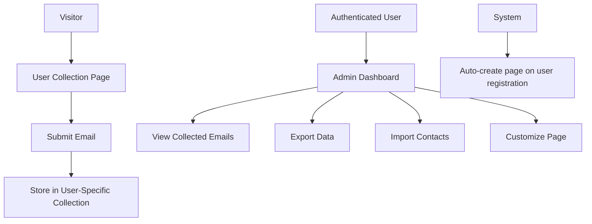

# Design Document

## Overview

This design transforms the current email collection system from a complex multi-page management approach to a simplified single-page-per-user model. Each registered user will automatically receive a personalized email collection page at `/correosia/{user-email}`, eliminating the need for backend contact and template management while providing users with full control over their data through import/export functionality.

## Architecture

### URL Structure
- **Collection Page**: `/correosia/{user-email}` (e.g., `/correosia/selamu.garcia@gmail.com`)
- **Admin Dashboard**: `/correosia/{user-email}/admin` (authenticated access only)
- **API Endpoints**: 
  - `/api/email-collection/{user-email}` - Submit emails to user's collection
  - `/api/email-collection/{user-email}/export` - Export collected emails
  - `/api/email-collection/{user-email}/settings` - Manage page customization

### Data Flow


## Components and Interfaces

### 1. Email Collection Page Component
**Location**: `app/correosia/[userEmail]/page.tsx`

**Props**:
```typescript
interface CollectionPageProps {
  userEmail: string;
  pageSettings: UserPageSettings;
  isOwner: boolean;
}

interface UserPageSettings {
  title: string;
  description: string;
  callToActionText: string;
  successMessage: string;
  customBranding?: {
    primaryColor?: string;
    logoUrl?: string;
  };
}
```

**Features**:
- Responsive design for mobile and desktop
- Custom branding support
- Email validation
- Success/error feedback
- Privacy-focused (no tracking)

### 2. Admin Dashboard Component
**Location**: `app/correosia/[userEmail]/admin/page.tsx`

**Features**:
- View collected emails with pagination
- Export functionality (CSV/JSON)
- Import contacts from file
- Page customization settings
- Analytics (basic counts)

### 3. Email Collection API
**Location**: `app/api/email-collection/[userEmail]/route.ts`

**Endpoints**:
- `POST /api/email-collection/{userEmail}` - Submit email
- `GET /api/email-collection/{userEmail}/export` - Export data
- `PUT /api/email-collection/{userEmail}/settings` - Update settings

## Data Models

### Simplified Email Collection Data
```typescript
interface CollectedEmail {
  id: string;
  email: string;
  collectedAt: string;
  userEmail: string; // Owner of the collection page
  source: 'collection-page';
  ipAddress?: string; // For basic analytics
}

interface UserPageSettings {
  userEmail: string;
  title: string;
  description: string;
  callToActionText: string;
  successMessage: string;
  customBranding?: {
    primaryColor?: string;
    logoUrl?: string;
  };
  isActive: boolean;
  createdAt: string;
  updatedAt: string;
}
```

### Migration Strategy
1. **Remove existing data structures**:
   - Delete `ContactData` interface and related functions
   - Delete `EmailCollectionPageData` interface and related functions
   - Delete `TemplateData` interface and related functions

2. **Create new simplified structures**:
   - `CollectedEmail` for storing submitted emails
   - `UserPageSettings` for page customization

## Error Handling

### Client-Side Error Handling
- **Invalid Email Format**: Show inline validation message
- **Network Errors**: Display retry button with exponential backoff
- **Rate Limiting**: Show friendly message about trying again later
- **Page Not Found**: Redirect to main site with explanation

### Server-Side Error Handling
- **User Not Found**: Return 404 with helpful message
- **Duplicate Email Submission**: Handle gracefully (update timestamp)
- **File Upload Errors**: Validate format and size, provide clear feedback
- **Database Errors**: Log for monitoring, show generic user message

### Rate Limiting
- **Email Submissions**: 5 submissions per IP per hour
- **Export Requests**: 10 exports per user per day
- **Import Requests**: 5 imports per user per day

## Testing Strategy

### Unit Tests
- Email validation functions
- Data transformation utilities
- Export/import functionality
- Page settings validation

### Integration Tests
- Email collection API endpoints
- User authentication flow
- File upload/download processes
- Database operations

### End-to-End Tests
- Complete email collection flow
- Admin dashboard functionality
- Import/export workflows
- Page customization features

### Performance Tests
- Page load times under various conditions
- API response times with large datasets
- File export performance with thousands of emails
- Concurrent user access patterns

## Security Considerations

### Data Protection
- **User Isolation**: Strict email-based data separation
- **Authentication**: JWT-based auth for admin access
- **Input Validation**: Sanitize all user inputs
- **Rate Limiting**: Prevent abuse and spam

### Privacy Compliance
- **Minimal Data Collection**: Only email and timestamp
- **Data Retention**: User-controlled through export/delete
- **No Cross-User Data Sharing**: Complete isolation between users
- **Transparent Data Usage**: Clear privacy policy on collection pages

## Performance Optimizations

### Caching Strategy
- **Static Page Generation**: Pre-generate collection pages for active users
- **API Response Caching**: Cache user settings and page data
- **CDN Integration**: Serve static assets from CDN

### Database Optimization
- **Indexed Queries**: Index on userEmail and collectedAt fields
- **Pagination**: Implement cursor-based pagination for large datasets
- **Batch Operations**: Optimize bulk import/export operations

## Migration Plan

### Phase 1: Data Cleanup
1. Backup existing data files
2. Remove unused contact, template, and email-page data
3. Create migration script for any essential data

### Phase 2: New Implementation
1. Implement new data models
2. Create collection page component
3. Build admin dashboard
4. Implement API endpoints

### Phase 3: User Migration
1. Auto-create pages for existing users
2. Send notification emails about new system
3. Provide migration guide for existing workflows

### Phase 4: Cleanup
1. Remove old API endpoints
2. Delete unused components
3. Update documentation and help content