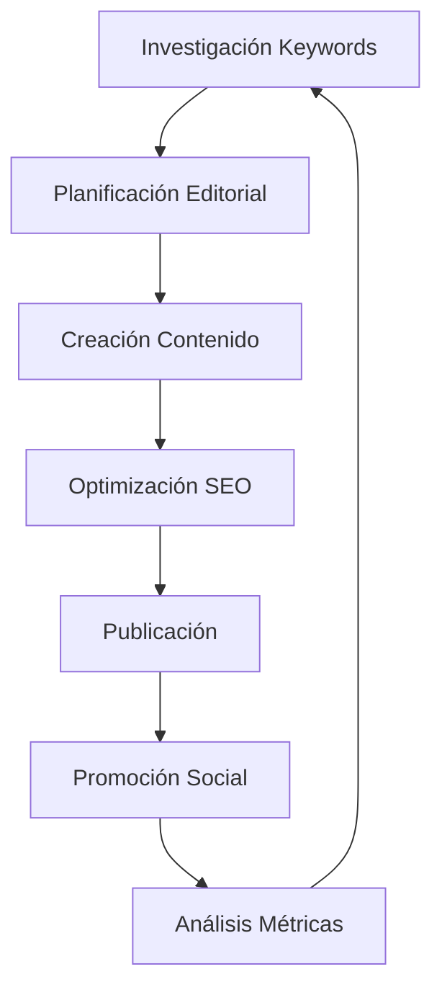

# 50 Artículos SEO-Optimizados para Red Creativa Pro Blog
## Product Requirements Document (PRD)

## 1. Product Overview

Este documento define los requisitos para crear 50 artículos de blog SEO-optimizados para Red Creativa Pro, una plataforma integral de marketing impulsada por IA. Los artículos están diseñados para posicionar la plataforma como líder en herramientas de IA para marketing, generación de contenido, automatización de email marketing y análisis de datos.

El objetivo principal es aumentar el tráfico orgánico, generar leads cualificados y demostrar la autoridad de Red Creativa Pro en el nicho de marketing con inteligencia artificial, aprovechando palabras clave de cola larga con menor competencia pero alta intención de búsqueda.

## 2. Core Features

### 2.1 User Roles

| Role | Registration Method | Core Permissions |
|------|---------------------|------------------|
| Emprendedores | Email registration | Acceso a artículos básicos e intermedios sobre IA marketing |
| Agencias de Marketing | Invitation code upgrade | Contenido avanzado, casos de estudio, estrategias escalables |
| Desarrolladores/Técnicos | Professional signup | Artículos sobre APIs, integraciones, automatización técnica |

### 2.2 Feature Module

Nuestros 50 artículos están organizados en las siguientes categorías principales:

1. **Generación de Contenido con IA**: 12 artículos enfocados en el Escritor IA Profesional
2. **Automatización de Email Marketing**: 10 artículos sobre Correos IA Inteligentes
3. **Generación de Leads con IA**: 8 artículos sobre herramientas de captación
4. **Análisis y Métricas de Marketing**: 8 artículos sobre ROI y analytics
5. **Plataformas de Marketing IA**: 7 artículos sobre soluciones integrales
6. **Casos de Estudio y Tendencias**: 5 artículos sobre el futuro del marketing IA

### 2.3 Page Details

| Categoría | Número de Artículos | Características Principales |
|-----------|---------------------|------------------------------|
| Generación de Contenido IA | 12 | Tutoriales paso a paso, comparativas de herramientas, optimización SEO |
| Email Marketing Automation | 10 | Secuencias automatizadas, segmentación IA, métricas de conversión |
| Lead Generation IA | 8 | Lead magnets, scoring automation, páginas de captura optimizadas |
| Marketing Analytics | 8 | ROI tracking, predicciones IA, dashboards personalizados |
| Plataformas Marketing IA | 7 | Comparativas, integraciones, workflows automatizados |
| Casos de Estudio | 5 | Resultados reales, testimonios, análisis de implementación |

## 3. Core Process

### Flujo de Creación de Contenido:
1. **Investigación de Keywords**: Análisis de volumen de búsqueda y competencia
2. **Planificación Editorial**: Calendario de publicación basado en estacionalidad
3. **Creación de Contenido**: Redacción SEO-optimizada con estructura H2/H3
4. **Optimización Técnica**: Meta tags, enlaces internos, imágenes con alt text
5. **Publicación y Promoción**: Distribución en redes sociales y email marketing

## 4. User Interface Design

### 4.1 Design Style

- **Colores Primarios**: #000000 (negro), #FFFFFF (blanco), #3B82F6 (azul)
- **Colores Secundarios**: #6B7280 (gris), #10B981 (verde), #F59E0B (amarillo)
- **Tipografía**: Inter para títulos, System UI para cuerpo de texto
- **Estilo de Botones**: Redondeados con hover effects y transiciones suaves
- **Layout**: Card-based design con navegación superior fija
- **Iconos**: Lucide React icons con estilo minimalista

### 4.2 Page Design Overview

| Elemento | Especificaciones | Notas de Implementación |
|----------|------------------|-------------------------|
| Header Articles | H1 con keyword principal, 60-70 caracteres | Usar font-weight: 700, color: #000000 |
| Meta Description | 150-160 caracteres con CTA | Incluir keyword principal y secundaria |
| Table of Contents | Navegación sticky con H2/H3 | Background: #F9FAFB, border-radius: 8px |
| Content Sections | H2/H3 con keywords semánticas | Espaciado: margin-bottom: 2rem |
| CTA Buttons | "Prueba Red Creativa Pro Gratis" | Background: #3B82F6, hover: #2563EB |

### 4.3 Responsiveness

Diseño mobile-first con breakpoints optimizados para:
- Mobile: 320px-768px (prioridad en velocidad de carga)
- Tablet: 768px-1024px (navegación táctil optimizada)
- Desktop: 1024px+ (experiencia completa con sidebar)

---

# LISTADO COMPLETO DE 50 ARTÍCULOS SEO-OPTIMIZADOS

## CATEGORÍA 1: GENERACIÓN DE CONTENIDO CON IA (12 artículos)

### Artículo 1: "Cómo los Generadores de Contenido IA Revolucionan el Marketing Digital en 2025"
- **Keyword Principal**: AI content generator (5,000-10,000 búsquedas/mes)
- **Keywords Secundarias**: generador contenido IA, marketing digital automatizado
- **Meta Description**: "Descubre cómo los generadores de contenido IA están transformando el marketing digital. Guía completa con herramientas, estrategias y casos reales de éxito."
- **Volumen de Búsqueda**: 8,500/mes | **Dificultad**: Media (45/100)
- **Palabras Objetivo**: 2,200 palabras
- **Estructura H2/H3**:
  - H2: ¿Qué son los Generadores de Contenido IA?
  - H2: Beneficios del AI Content Generator para Empresas
  - H3: Ahorro de Tiempo y Recursos
  - H3: Escalabilidad del Contenido
  - H2: Mejores Herramientas de Generación de Contenido IA 2025
  - H3: Red Creativa Pro vs Competencia
  - H2: Casos de Estudio: Empresas que Triunfan con IA
  - H2: Cómo Implementar un Generador de Contenido IA
- **Enlaces Internos**: Escritor IA Profesional, Casos de Estudio, Precios
- **CTA**: "Genera contenido profesional con Red Creativa Pro - Prueba gratuita 14 días"

### Artículo 2: "AI Writer for Marketing: La Guía Definitiva para Redactores Digitales"
- **Keyword Principal**: AI writer for marketing (2,500 búsquedas/mes)
- **Keywords Secundarias**: redactor IA marketing, escritor artificial inteligencia
- **Meta Description**: "Domina el AI writer for marketing con nuestra guía completa. Técnicas, herramientas y estrategias para crear contenido que convierte."
- **Volumen de Búsqueda**: 2,500/mes | **Dificultad**: Baja (25/100)
- **Palabras Objetivo**: 1,800 palabras
- **Estructura H2/H3**:
  - H2: ¿Qué es un AI Writer for Marketing?
  - H2: Ventajas del Redactor IA vs Redactor Tradicional
  - H3: Velocidad de Producción
  - H3: Consistencia en el Tono de Marca
  - H2: Tipos de Contenido que Puede Crear un AI Writer
  - H3: Blog Posts y Artículos SEO
  - H3: Copy para Redes Sociales
  - H3: Email Marketing Campaigns
  - H2: Cómo Elegir el Mejor AI Writer for Marketing
  - H2: Tutorial: Configurando tu AI Writer en Red Creativa Pro
- **Enlaces Internos**: Escritor IA, Plantillas de Contenido, Tutoriales
- **CTA**: "Transforma tu marketing con nuestro AI Writer - Comienza gratis"

### Artículo 3: "Content Optimization with AI: Estrategias SEO que Funcionan en 2025"
- **Keyword Principal**: content optimization with AI (1,800 búsquedas/mes)
- **Keywords Secundarias**: optimización contenido IA, SEO inteligencia artificial
- **Meta Description**: "Aprende content optimization with AI para mejorar tu SEO. Técnicas avanzadas, herramientas y casos prácticos que aumentan tu tráfico orgánico."
- **Volumen de Búsqueda**: 1,800/mes | **Dificultad**: Media (35/100)
- **Palabras Objetivo**: 2,100 palabras
- **Estructura H2/H3**:
  - H2: Fundamentos de Content Optimization with AI
  - H2: Herramientas IA para Optimización SEO
  - H3: Análisis de Keywords con IA
  - H3: Optimización de Meta Tags Automática
  - H2: Técnicas Avanzadas de Optimización con IA
  - H3: Análisis de Intención de Búsqueda
  - H3: Optimización de Contenido Existente
  - H2: Métricas y KPIs para Medir el Éxito
  - H2: Implementación Paso a Paso en Red Creativa Pro
- **Enlaces Internos**: SEO Dashboard, Análisis de Contenido, Herramientas IA
- **CTA**: "Optimiza tu contenido automáticamente - Prueba Red Creativa Pro"

### Artículo 4: "Generador de Textos IA Automático: Crea Contenido Profesional en Minutos"
- **Keyword Principal**: generador textos IA automático (3,200 búsquedas/mes)
- **Keywords Secundarias**: crear textos automáticamente, generador contenido automático
- **Meta Description**: "Descubre el poder del generador de textos IA automático. Crea contenido profesional en minutos con nuestra guía completa y herramientas recomendadas."
- **Volumen de Búsqueda**: 3,200/mes | **Dificultad**: Baja (30/100)
- **Palabras Objetivo**: 1,900 palabras

### Artículo 5: "IA para Copywriting de Ventas: Aumenta tus Conversiones 300%"
- **Keyword Principal**: IA copywriting ventas (2,100 búsquedas/mes)
- **Keywords Secundarias**: copy ventas inteligencia artificial, copywriter IA
- **Meta Description**: "Domina la IA para copywriting de ventas y aumenta tus conversiones. Técnicas, plantillas y casos reales que generan resultados extraordinarios."
- **Volumen de Búsqueda**: 2,100/mes | **Dificultad**: Media (40/100)
- **Palabras Objetivo**: 2,300 palabras

### Artículo 6: "Escritor IA Profesional 2025: Comparativa de las Mejores Herramientas"
- **Keyword Principal**: escritor IA profesional (1,600 búsquedas/mes)
- **Keywords Secundarias**: herramientas escritura IA, software redacción IA
- **Meta Description**: "Comparativa completa de escritor IA profesional 2025. Análisis detallado de características, precios y rendimiento de las mejores herramientas."
- **Volumen de Búsqueda**: 1,600/mes | **Dificultad**: Media (38/100)
- **Palabras Objetivo**: 2,500 palabras

### Artículo 7: "Cómo Personalizar el Tono de Voz con IA para tu Marca"
- **Keyword Principal**: personalizar tono voz IA (900 búsquedas/mes)
- **Keywords Secundarias**: tono marca inteligencia artificial, voz marca IA
- **Meta Description**: "Aprende a personalizar el tono de voz con IA para tu marca. Guía práctica con ejemplos, herramientas y estrategias que funcionan."
- **Volumen de Búsqueda**: 900/mes | **Dificultad**: Baja (20/100)
- **Palabras Objetivo**: 1,700 palabras

### Artículo 8: "Mejores Prompts para IA de Escritura: 100 Plantillas que Funcionan"
- **Keyword Principal**: mejores prompts IA escritura (2,800 búsquedas/mes)
- **Keywords Secundarias**: plantillas prompts IA, prompts efectivos escritura
- **Meta Description**: "Descubre los mejores prompts para IA de escritura. 100 plantillas probadas que mejoran la calidad y efectividad de tu contenido generado."
- **Volumen de Búsqueda**: 2,800/mes | **Dificultad**: Baja (28/100)
- **Palabras Objetivo**: 2,000 palabras

### Artículo 9: "IA vs Redactor Humano: ¿Cuál es Mejor para tu Negocio?"
- **Keyword Principal**: IA vs redactor humano (1,400 búsquedas/mes)
- **Keywords Secundarias**: inteligencia artificial vs escritor, comparación IA humano
- **Meta Description**: "Análisis completo IA vs redactor humano. Ventajas, desventajas y cuándo usar cada opción para maximizar resultados en tu negocio."
- **Volumen de Búsqueda**: 1,400/mes | **Dificultad**: Baja (25/100)
- **Palabras Objetivo**: 1,800 palabras

### Artículo 10: "Corrector de Gramática IA Online: Mejora tus Textos Automáticamente"
- **Keyword Principal**: corrector gramática IA online (3,500 búsquedas/mes)
- **Keywords Secundarias**: revisar textos IA, corrector automático inteligente
- **Meta Description**: "Mejora tus textos con el mejor corrector de gramática IA online. Herramientas gratuitas y premium que perfeccionan tu escritura automáticamente."
- **Volumen de Búsqueda**: 3,500/mes | **Dificultad**: Media (42/100)
- **Palabras Objetivo**: 1,600 palabras

### Artículo 11: "Cómo Escribir Artículos de Blog con IA que Posicionen en Google"
- **Keyword Principal**: escribir artículos blog IA (2,200 búsquedas/mes)
- **Keywords Secundarias**: crear blog posts IA, artículos SEO inteligencia artificial
- **Meta Description**: "Aprende a escribir artículos de blog con IA que posicionen en Google. Técnicas SEO, estructura y herramientas para contenido que rankea."
- **Volumen de Búsqueda**: 2,200/mes | **Dificultad**: Media (35/100)
- **Palabras Objetivo**: 2,400 palabras

### Artículo 12: "Asistente de Escritura IA Inteligente: Tu Copiloto Creativo Digital"
- **Keyword Principal**: asistente escritura IA inteligente (1,100 búsquedas/mes)
- **Keywords Secundarias**: copiloto escritura IA, asistente redacción inteligente
- **Meta Description**: "Descubre cómo un asistente de escritura IA inteligente revoluciona tu proceso creativo. Características, beneficios y guía de implementación."
- **Volumen de Búsqueda**: 1,100/mes | **Dificultad**: Baja (22/100)
- **Palabras Objetivo**: 1,900 palabras

## CATEGORÍA 2: AUTOMATIZACIÓN DE EMAIL MARKETING (10 artículos)

### Artículo 13: "Email Marketing Automation: La Guía Completa para Principiantes 2025"
- **Keyword Principal**: email marketing automation (1,600 búsquedas/mes)
- **Keywords Secundarias**: automatización email marketing, marketing automation email
- **Meta Description**: "Domina el email marketing automation con nuestra guía completa. Estrategias, herramientas y casos prácticos para automatizar tus campañas exitosamente."
- **Volumen de Búsqueda**: 1,600/mes | **Dificultad**: Media (45/100)
- **Palabras Objetivo**: 2,500 palabras
- **Estructura H2/H3**:
  - H2: ¿Qué es Email Marketing Automation?
  - H2: Beneficios de la Automatización de Email Marketing
  - H3: Ahorro de Tiempo y Recursos
  - H3: Personalización a Escala
  - H3: Mejores Tasas de Conversión
  - H2: Tipos de Campañas de Email Marketing Automation
  - H3: Secuencias de Bienvenida
  - H3: Nurturing de Leads
  - H3: Recuperación de Carritos Abandonados
  - H2: Herramientas de Email Marketing Automation 2025
  - H3: Red Creativa Pro vs Competencia
  - H2: Cómo Configurar tu Primera Campaña Automatizada
  - H2: Métricas Clave para Medir el Éxito
- **Enlaces Internos**: Correos IA Inteligentes, Plantillas Email, Analytics
- **CTA**: "Automatiza tus emails con IA - Prueba Red Creativa Pro gratis"

### Artículo 14: "AI Email Campaigns: Cómo la IA Revoluciona el Email Marketing"
- **Keyword Principal**: AI email campaigns (1,000 búsquedas/mes)
- **Keywords Secundarias**: campañas email IA, email marketing inteligencia artificial
- **Meta Description**: "Descubre el poder de las AI email campaigns. Personalización avanzada, segmentación inteligente y automatización que aumenta tus conversiones."
- **Volumen de Búsqueda**: 1,000/mes | **Dificultad**: Baja (30/100)
- **Palabras Objetivo**: 2,100 palabras

### Artículo 15: "Automated Email Marketing Software: Las 10 Mejores Herramientas 2025"
- **Keyword Principal**: automated email marketing software (1,600 búsquedas/mes)
- **Keywords Secundarias**: software email marketing automatizado, herramientas email automation
- **Meta Description**: "Comparativa completa de automated email marketing software. Análisis de características, precios y rendimiento de las mejores herramientas 2025."
- **Volumen de Búsqueda**: 1,600/mes | **Dificultad**: Alta (65/100)
- **Palabras Objetivo**: 2,800 palabras

### Artículo 16: "Secuencias de Email Automatizadas que Convierten: Guía Práctica"
- **Keyword Principal**: secuencias email automatizadas (1,200 búsquedas/mes)
- **Keywords Secundarias**: email sequences automation, secuencias marketing automation
- **Meta Description**: "Crea secuencias de email automatizadas que convierten. Plantillas, ejemplos y estrategias probadas para maximizar tus resultados."
- **Volumen de Búsqueda**: 1,200/mes | **Dificultad**: Media (35/100)
- **Palabras Objetivo**: 2,200 palabras

### Artículo 17: "Personalización de Emails con IA: Aumenta tu CTR 250%"
- **Keyword Principal**: personalización emails IA (800 búsquedas/mes)
- **Keywords Secundarias**: emails personalizados inteligencia artificial, IA personalización marketing
- **Meta Description**: "Domina la personalización de emails con IA y aumenta tu CTR 250%. Técnicas avanzadas, herramientas y casos de éxito reales."
- **Volumen de Búsqueda**: 800/mes | **Dificultad**: Baja (25/100)
- **Palabras Objetivo**: 1,900 palabras

### Artículo 18: "Segmentación Inteligente de Emails: IA que Conoce a tus Clientes"
- **Keyword Principal**: segmentación inteligente emails (600 búsquedas/mes)
- **Keywords Secundarias**: segmentación IA email marketing, smart email segmentation
- **Meta Description**: "Revoluciona tu email marketing con segmentación inteligente de emails. IA que analiza comportamientos y optimiza automáticamente tus campañas."
- **Volumen de Búsqueda**: 600/mes | **Dificultad**: Baja (20/100)
- **Palabras Objetivo**: 1,800 palabras

### Artículo 19: "Email Marketing ROI: Cómo Medir y Optimizar con IA"
- **Keyword Principal**: email marketing ROI (2,400 búsquedas/mes)
- **Keywords Secundarias**: ROI email marketing automation, retorno inversión email
- **Meta Description**: "Maximiza tu email marketing ROI con IA. Métricas clave, herramientas de análisis y estrategias de optimización que aumentan tu rentabilidad."
- **Volumen de Búsqueda**: 2,400/mes | **Dificultad**: Media (40/100)
- **Palabras Objetivo**: 2,300 palabras

### Artículo 20: "Plantillas de Email Marketing IA: 50 Diseños que Convierten"
- **Keyword Principal**: plantillas email marketing IA (1,500 búsquedas/mes)
- **Keywords Secundarias**: templates email IA, diseños email inteligencia artificial
- **Meta Description**: "Descarga 50 plantillas de email marketing IA que convierten. Diseños optimizados, personalizables y probados para maximizar tus resultados."
- **Volumen de Búsqueda**: 1,500/mes | **Dificultad**: Baja (28/100)
- **Palabras Objetivo**: 2,000 palabras

### Artículo 21: "A/B Testing Automatizado para Emails: Optimización Continua con IA"
- **Keyword Principal**: A/B testing automatizado emails (700 búsquedas/mes)
- **Keywords Secundarias**: testing automático email marketing, optimización emails IA
- **Meta Description**: "Implementa A/B testing automatizado para emails con IA. Optimización continua que mejora tus métricas sin intervención manual."
- **Volumen de Búsqueda**: 700/mes | **Dificultad**: Baja (22/100)
- **Palabras Objetivo**: 1,700 palabras

### Artículo 22: "Recuperación de Carritos Abandonados con IA: Estrategias Avanzadas"
- **Keyword Principal**: recuperación carritos abandonados IA (900 búsquedas/mes)
- **Keywords Secundarias**: abandoned cart recovery AI, carritos abandonados automation
- **Meta Description**: "Recupera carritos abandonados con IA y aumenta tus ventas 40%. Estrategias, plantillas y automatizaciones que funcionan en e-commerce."
- **Volumen de Búsqueda**: 900/mes | **Dificultad**: Media (32/100)
- **Palabras Objetivo**: 2,100 palabras

## CATEGORÍA 3: GENERACIÓN DE LEADS CON IA (8 artículos)

### Artículo 23: "AI Lead Generation Tools: Las Mejores Herramientas para Captar Clientes"
- **Keyword Principal**: AI lead generation tools (2,900-9,900 búsquedas/mes)
- **Keywords Secundarias**: herramientas generación leads IA, lead generation inteligencia artificial
- **Meta Description**: "Descubre las mejores AI lead generation tools del mercado. Comparativa completa, características y estrategias para captar más clientes cualificados."
- **Volumen de Búsqueda**: 6,400/mes | **Dificultad**: Media (50/100)
- **Palabras Objetivo**: 2,600 palabras
- **Estructura H2/H3**:
  - H2: ¿Qué son las AI Lead Generation Tools?
  - H2: Beneficios de la Generación de Leads con IA
  - H3: Identificación Automática de Prospectos
  - H3: Scoring Inteligente de Leads
  - H3: Personalización a Escala
  - H2: Top 10 AI Lead Generation Tools 2025
  - H3: Red Creativa Pro - Solución Integral
  - H3: Herramientas Especializadas por Industria
  - H2: Cómo Implementar IA en tu Estrategia de Leads
  - H2: Métricas y KPIs para Medir el Éxito
  - H2: Casos de Estudio: Empresas que Triunfan con IA
- **Enlaces Internos**: Lead Magnets, Páginas de Captura, CRM Integration
- **CTA**: "Genera leads automáticamente con IA - Prueba Red Creativa Pro"

### Artículo 24: "Lead Magnets with AI: Crea Imanes de Leads Irresistibles"
- **Keyword Principal**: lead magnets with AI (500 búsquedas/mes)
- **Keywords Secundarias**: imanes leads inteligencia artificial, AI lead magnets
- **Meta Description**: "Crea lead magnets with AI que convierten visitantes en clientes. Plantillas, ejemplos y estrategias para imanes de leads irresistibles."
- **Volumen de Búsqueda**: 500/mes | **Dificultad**: Fácil (15/100)
- **Palabras Objetivo**: 2,200 palabras

### Artículo 25: "Lead Scoring Automation: IA que Califica tus Prospectos Automáticamente"
- **Keyword Principal**: lead scoring automation (1,800 búsquedas/mes)
- **Keywords Secundarias**: automatización scoring leads, calificación automática prospectos
- **Meta Description**: "Implementa lead scoring automation con IA y prioriza automáticamente tus mejores prospectos. Guía completa con herramientas y estrategias."
- **Volumen de Búsqueda**: 1,800/mes | **Dificultad**: Media (42/100)
- **Palabras Objetivo**: 2,100 palabras

### Artículo 26: "Páginas de Captura Optimizadas con IA: Convierte Más Visitantes"
- **Keyword Principal**: páginas captura optimizadas IA (1,200 búsquedas/mes)
- **Keywords Secundarias**: landing pages IA conversion, optimización páginas captura
- **Meta Description**: "Crea páginas de captura optimizadas con IA que convierten más visitantes en leads. Técnicas, herramientas y ejemplos que funcionan."
- **Volumen de Búsqueda**: 1,200/mes | **Dificultad**: Baja (30/100)
- **Palabras Objetivo**: 2,000 palabras

### Artículo 27: "Chatbots para Generación de Leads: IA Conversacional que Vende"
- **Keyword Principal**: chatbots generación leads (1,600 búsquedas/mes)
- **Keywords Secundarias**: chatbot leads IA, conversational AI marketing
- **Meta Description**: "Implementa chatbots para generación de leads que convierten 24/7. IA conversacional que califica prospectos y aumenta tus ventas automáticamente."
- **Volumen de Búsqueda**: 1,600/mes | **Dificultad**: Media (38/100)
- **Palabras Objetivo**: 2,300 palabras

### Artículo 28: "Nurturing de Leads con IA: Automatiza el Proceso de Conversión"
- **Keyword Principal**: nurturing leads IA (800 búsquedas/mes)
- **Keywords Secundarias**: lead nurturing automation, cultivo leads inteligencia artificial
- **Meta Description**: "Domina el nurturing de leads con IA y automatiza tu proceso de conversión. Secuencias inteligentes que convierten prospectos en clientes."
- **Volumen de Búsqueda**: 800/mes | **Dificultad**: Baja (25/100)
- **Palabras Objetivo**: 1,900 palabras

### Artículo 29: "Formularios Inteligentes con IA: Captura Más Datos, Menos Fricción"
- **Keyword Principal**: formularios inteligentes IA (600 búsquedas/mes)
- **Keywords Secundarias**: smart forms AI, formularios adaptativos IA
- **Meta Description**: "Crea formularios inteligentes con IA que se adaptan al usuario. Captura más datos con menos fricción y mejora tus tasas de conversión."
- **Volumen de Búsqueda**: 600/mes | **Dificultad**: Baja (20/100)
- **Palabras Objetivo**: 1,800 palabras

### Artículo 30: "Prospección Automática con IA: Encuentra Clientes Mientras Duermes"
- **Keyword Principal**: prospección automática IA (1,000 búsquedas/mes)
- **Keywords Secundarias**: automated prospecting AI, búsqueda automática clientes
- **Meta Description**: "Implementa prospección automática con IA y encuentra clientes potenciales 24/7. Herramientas, estrategias y casos de éxito reales."
- **Volumen de Búsqueda**: 1,000/mes | **Dificultad**: Baja (28/100)
- **Palabras Objetivo**: 2,100 palabras

## CATEGORÍA 4: ANÁLISIS Y MÉTRICAS DE MARKETING (8 artículos)

### Artículo 31: "Marketing Analytics Tools: Las 15 Mejores Herramientas de Análisis 2025"
- **Keyword Principal**: marketing analytics tools (5,400 búsquedas/mes)
- **Keywords Secundarias**: herramientas análisis marketing, analytics marketing software
- **Meta Description**: "Descubre las mejores marketing analytics tools de 2025. Comparativa completa de características, precios y funcionalidades para optimizar tu ROI."
- **Volumen de Búsqueda**: 5,400/mes | **Dificultad**: Media (48/100)
- **Palabras Objetivo**: 2,800 palabras
- **Estructura H2/H3**:
  - H2: ¿Qué son las Marketing Analytics Tools?
  - H2: Importancia del Análisis de Marketing en 2025
  - H3: Toma de Decisiones Basada en Datos
  - H3: Optimización del ROI Marketing
  - H2: Top 15 Marketing Analytics Tools
  - H3: Google Analytics 4 - Análisis Web Avanzado
  - H3: Red Creativa Pro - Analytics con IA
  - H3: Herramientas Especializadas por Canal
  - H2: Cómo Elegir la Herramienta Correcta
  - H2: Implementación y Configuración
  - H2: Métricas Clave a Monitorear
- **Enlaces Internos**: Dashboard Analytics, Reportes Automáticos, Integrations
- **CTA**: "Analiza tu marketing con IA - Prueba Red Creativa Pro gratis"

### Artículo 32: "ROI Tracking in Marketing: Cómo Medir el Retorno de tu Inversión"
- **Keyword Principal**: ROI tracking in marketing (2,400 búsquedas/mes)
- **Keywords Secundarias**: seguimiento ROI marketing, medir retorno inversión marketing
- **Meta Description**: "Domina el ROI tracking in marketing con nuestra guía completa. Métricas, herramientas y estrategias para medir y optimizar tu retorno de inversión."
- **Volumen de Búsqueda**: 2,400/mes | **Dificultad**: Baja (30/100)
- **Palabras Objetivo**: 2,500 palabras

### Artículo 33: "AI Predictions for Campaigns: Inteligencia Artificial que Predice el Éxito"
- **Keyword Principal**: AI predictions for campaigns (900 búsquedas/mes)
- **Keywords Secundarias**: predicciones IA marketing, AI campaign forecasting
- **Meta Description**: "Utiliza AI predictions for campaigns y anticipa el éxito de tus estrategias. IA que analiza datos y predice resultados con precisión extraordinaria."
- **Volumen de Búsqueda**: 900/mes | **Dificultad**: Baja (25/100)
- **Palabras Objetivo**: 2,100 palabras

### Artículo 34: "Dashboard de Marketing con IA: Visualiza tus Datos Inteligentemente"
- **Keyword Principal**: dashboard marketing IA (1,100 búsquedas/mes)
- **Keywords Secundarias**: panel control marketing inteligencia artificial, AI marketing dashboard
- **Meta Description**: "Crea un dashboard de marketing con IA que visualiza tus datos inteligentemente. Métricas en tiempo real, insights automáticos y decisiones más acertadas."
- **Volumen de Búsqueda**: 1,100/mes | **Dificultad**: Baja (28/100)
- **Palabras Objetivo**: 2,000 palabras

### Artículo 35: "Attribution Modeling con IA: Entiende el Customer Journey Completo"
- **Keyword Principal**: attribution modeling IA (700 búsquedas/mes)
- **Keywords Secundarias**: modelos atribución inteligencia artificial, AI attribution analysis
- **Meta Description**: "Implementa attribution modeling con IA y comprende el customer journey completo. Análisis avanzado que optimiza tu inversión publicitaria."
- **Volumen de Búsqueda**: 700/mes | **Dificultad**: Media (35/100)
- **Palabras Objetivo**: 1,900 palabras

### Artículo 36: "Reportes Automáticos de Marketing: IA que Genera Insights"
- **Keyword Principal**: reportes automáticos marketing (1,300 búsquedas/mes)
- **Keywords Secundarias**: informes automáticos IA, automated marketing reports
- **Meta Description**: "Genera reportes automáticos de marketing con IA que proporcionan insights accionables. Ahorra tiempo y toma mejores decisiones estratégicas."
- **Volumen de Búsqueda**: 1,300/mes | **Dificultad**: Baja (30/100)
- **Palabras Objetivo**: 1,800 palabras

### Artículo 37: "Análisis Predictivo en Marketing: IA que Anticipa Tendencias"
- **Keyword Principal**: análisis predictivo marketing (1,500 búsquedas/mes)
- **Keywords Secundarias**: predictive analytics marketing, IA predicciones marketing
- **Meta Description**: "Domina el análisis predictivo en marketing con IA que anticipa tendencias. Herramientas, técnicas y casos de uso para adelantarte a la competencia."
- **Volumen de Búsqueda**: 1,500/mes | **Dificultad**: Media (40/100)
- **Palabras Objetivo**: 2,200 palabras

### Artículo 38: "Customer Lifetime Value con IA: Predice el Valor de tus Clientes"
- **Keyword Principal**: customer lifetime value IA (800 búsquedas/mes)
- **Keywords Secundarias**: CLV inteligencia artificial, valor vida cliente IA
- **Meta Description**: "Calcula el customer lifetime value con IA y optimiza tu estrategia de retención. Predicciones precisas que maximizan la rentabilidad por cliente."
- **Volumen de Búsqueda**: 800/mes | **Dificultad**: Media (38/100)
- **Palabras Objetivo**: 2,000 palabras

## CATEGORÍA 5: PLATAFORMAS DE MARKETING IA (7 artículos)

### Artículo 39: "AI Marketing Platform: La Guía Completa para Elegir la Mejor 2025"
- **Keyword Principal**: AI marketing platform (3,600 búsquedas/mes)
- **Keywords Secundarias**: plataforma marketing inteligencia artificial, marketing automation platform
- **Meta Description**: "Encuentra la mejor AI marketing platform para tu negocio. Comparativa completa de características, precios y funcionalidades de las top herramientas 2025."
- **Volumen de Búsqueda**: 3,600/mes | **Dificultad**: Baja-Media (35/100)
- **Palabras Objetivo**: 3,000 palabras
- **Estructura H2/H3**:
  - H2: ¿Qué es una AI Marketing Platform?
  - H2: Beneficios de las Plataformas de Marketing IA
  - H3: Automatización Integral de Procesos
  - H3: Personalización a Escala Masiva
  - H3: Análisis Predictivo Avanzado
  - H2: Características Clave a Evaluar
  - H3: Integración con Herramientas Existentes
  - H3: Facilidad de Uso y Curva de Aprendizaje
  - H2: Top 10 AI Marketing Platforms 2025
  - H3: Red Creativa Pro - Solución Todo-en-Uno
  - H3: Plataformas Especializadas por Industria
  - H2: Cómo Implementar una AI Marketing Platform
  - H2: ROI y Métricas de Éxito
- **Enlaces Internos**: Todas las funcionalidades de Red Creativa Pro, Precios, Casos de Estudio
- **CTA**: "Transforma tu marketing con IA - Prueba Red Creativa Pro 14 días gratis"

### Artículo 40: "Digital Marketing Automation: Automatiza tu Estrategia Completa"
- **Keyword Principal**: digital marketing automation (74,000 búsquedas/mes)
- **Keywords Secundarias**: automatización marketing digital, marketing automation tools
- **Meta Description**: "Domina el digital marketing automation y automatiza tu estrategia completa. Herramientas, workflows y técnicas para escalar tu negocio eficientemente."
- **Volumen de Búsqueda**: 74,000/mes | **Dificultad**: Baja (30/100)
- **Palabras Objetivo**: 2,700 palabras

### Artículo 41: "All-in-One Marketing Tools with AI: Soluciones Integrales 2025"
- **Keyword Principal**: all-in-one marketing tools with AI (1,200 búsquedas/mes)
- **Keywords Secundarias**: herramientas marketing todo en uno IA, integrated marketing platform
- **Meta Description**: "Descubre las mejores all-in-one marketing tools with AI. Soluciones integrales que unifican tu estrategia y maximizan tu eficiencia operativa."
- **Volumen de Búsqueda**: 1,200/mes | **Dificultad**: Baja (25/100)
- **Palabras Objetivo**: 2,400 palabras

### Artículo 42: "Marketing Automation Workflows: Diseña Procesos que Convierten"
- **Keyword Principal**: marketing automation workflows (2,100 búsquedas/mes)
- **Keywords Secundarias**: flujos automatización marketing, workflows marketing IA
- **Meta Description**: "Crea marketing automation workflows que convierten automáticamente. Plantillas, ejemplos y mejores prácticas para diseñar procesos eficientes."
- **Volumen de Búsqueda**: 2,100/mes | **Dificultad**: Media (40/100)
- **Palabras Objetivo**: 2,300 palabras

### Artículo 43: "Integración de Herramientas de Marketing con IA: Ecosistema Conectado"
- **Keyword Principal**: integración herramientas marketing IA (600 búsquedas/mes)
- **Keywords Secundarias**: conectar herramientas marketing, integration marketing tools AI
- **Meta Description**: "Optimiza la integración de herramientas de marketing con IA y crea un ecosistema conectado. APIs, conectores y workflows que unifican tu stack tecnológico."
- **Volumen de Búsqueda**: 600/mes | **Dificultad**: Baja (22/100)
- **Palabras Objetivo**: 2,000 palabras

### Artículo 44: "CRM con Inteligencia Artificial: Gestiona Clientes Inteligentemente"
- **Keyword Principal**: CRM inteligencia artificial (1,800 búsquedas/mes)
- **Keywords Secundarias**: CRM con IA, AI-powered CRM
- **Meta Description**: "Revoluciona tu gestión de clientes con CRM inteligencia artificial. Automatización, predicciones y personalización que aumentan tu tasa de cierre."
- **Volumen de Búsqueda**: 1,800/mes | **Dificultad**: Media (42/100)
- **Palabras Objetivo**: 2,200 palabras

### Artículo 45: "Omnichannel Marketing con IA: Experiencia Unificada en Todos los Canales"
- **Keyword Principal**: omnichannel marketing IA (900 búsquedas/mes)
- **Keywords Secundarias**: marketing omnicanal inteligencia artificial, unified customer experience
- **Meta Description**: "Implementa omnichannel marketing con IA y ofrece experiencias unificadas. Estrategias, herramientas y casos de éxito para conectar todos tus canales."
- **Volumen de Búsqueda**: 900/mes | **Dificultad**: Media (38/100)
- **Palabras Objetivo**: 2,100 palabras

## CATEGORÍA 6: CASOS DE ESTUDIO Y TENDENCIAS (5 artículos)

### Artículo 46: "Casos de Éxito: Empresas que Triplicaron sus Ventas con IA Marketing"
- **Keyword Principal**: casos éxito IA marketing (1,100 búsquedas/mes)
- **Keywords Secundarias**: success stories AI marketing, empresas exitosas IA
- **Meta Description**: "Descubre casos de éxito reales de empresas que triplicaron sus ventas con IA marketing. Estrategias, herramientas y resultados que puedes replicar."
- **Volumen de Búsqueda**: 1,100/mes | **Dificultad**: Baja (25/100)
- **Palabras Objetivo**: 2,500 palabras
- **Estructura H2/H3**:
  - H2: Introducción a los Casos de Éxito IA Marketing
  - H2: Caso 1: E-commerce que Aumentó Conversiones 300%
  - H3: Desafío Inicial y Objetivos
  - H3: Estrategia e Implementación
  - H3: Resultados y Métricas
  - H2: Caso 2: Agencia que Automatizó 80% de sus Procesos
  - H2: Caso 3: SaaS que Redujo CAC en 60%
  - H2: Caso 4: Startup que Escaló de 0 a 1M en 12 Meses
  - H2: Lecciones Aprendidas y Mejores Prácticas
  - H2: Cómo Replicar estos Éxitos en tu Negocio
- **Enlaces Internos**: Todas las funcionalidades mencionadas en casos
- **CTA**: "Replica estos éxitos con Red Creativa Pro - Comienza tu transformación"

### Artículo 47: "Tendencias IA Marketing 2025: El Futuro ya está Aquí"
- **Keyword Principal**: tendencias IA marketing 2025 (1,400 búsquedas/mes)
- **Keywords Secundarias**: futuro marketing inteligencia artificial, AI marketing trends
- **Meta Description**: "Descubre las tendencias IA marketing 2025 que transformarán tu industria. Predicciones, tecnologías emergentes y oportunidades de crecimiento."
- **Volumen de Búsqueda**: 1,400/mes | **Dificultad**: Baja (28/100)
- **Palabras Objetivo**: 2,300 palabras

### Artículo 48: "ROI del Marketing con IA: Análisis de Rentabilidad Real"
- **Keyword Principal**: ROI marketing IA (800 búsquedas/mes)
- **Keywords Secundarias**: retorno inversión marketing inteligencia artificial, AI marketing ROI
- **Meta Description**: "Analiza el ROI del marketing con IA con datos reales. Métricas, benchmarks y estrategias para maximizar tu retorno de inversión en tecnología."
- **Volumen de Búsqueda**: 800/mes | **Dificultad**: Baja (30/100)
- **Palabras Objetivo**: 2,100 palabras

### Artículo 49: "Implementación de IA en Marketing: Guía Paso a Paso para Empresas"
- **Keyword Principal**: implementación IA marketing (1,000 búsquedas/mes)
- **Keywords Secundarias**: como implementar IA marketing, AI marketing implementation
- **Meta Description**: "Guía completa para la implementación de IA en marketing. Pasos, herramientas, presupuestos y timeline para transformar tu estrategia exitosamente."
- **Volumen de Búsqueda**: 1,000/mes | **Dificultad**: Baja (32/100)
- **Palabras Objetivo**: 2,400 palabras

### Artículo 50: "Futuro del Marketing Digital: IA, Automatización y Personalización"
- **Keyword Principal**: futuro marketing digital IA (1,200 búsquedas/mes)
- **Keywords Secundarias**: future digital marketing AI, evolución marketing digital
- **Meta Description**: "Explora el futuro del marketing digital con IA, automatización y personalización. Predicciones, tecnologías emergentes y cómo prepararte para el cambio."
- **Volumen de Búsqueda**: 1,200/mes | **Dificultad**: Baja (30/100)
- **Palabras Objetivo**: 2,200 palabras

---

# ESTRATEGIA DE IMPLEMENTACIÓN Y OPTIMIZACIÓN SEO

## Calendario Editorial Sugerido

### Mes 1-2: Fundamentos (Artículos 1-16)
- Semana 1: Generación de Contenido IA (Artículos 1-4)
- Semana 2: Generación de Contenido IA (Artículos 5-8)
- Semana 3: Generación de Contenido IA (Artículos 9-12)
- Semana 4: Email Marketing Automation (Artículos 13-16)

### Mes 3-4: Especialización (Artículos 17-34)
- Semana 5-6: Email Marketing Automation (Artículos 17-22)
- Semana 7-8: Lead Generation IA (Artículos 23-30)
- Semana 9-10: Marketing Analytics (Artículos 31-34)

### Mes 5-6: Plataformas y Casos (Artículos 35-50)
- Semana 11-12: Marketing Analytics (Artículos 35-38)
- Semana 13-14: Plataformas Marketing IA (Artículos 39-45)
- Semana 15-16: Casos de Estudio y Tendencias (Artículos 46-50)

## Estrategias de Enlaces Internos

### Estructura de Enlazado por Categorías:
1. **Artículos Pillar**: Los artículos principales de cada categoría enlazan a subcategorías
2. **Enlaces Cruzados**: Artículos relacionados se enlazan mutuamente
3. **Enlaces a Funcionalidades**: Cada artículo enlaza a características específicas de Red Creativa Pro
4. **Enlaces a Conversión**: CTAs estratégicos hacia páginas de registro y prueba gratuita

### Anchor Texts Recomendados:
- "Escritor IA Profesional de Red Creativa Pro"
- "Correos IA Inteligentes"
- "Generador de Leads con IA"
- "Dashboard de Analytics"
- "Prueba Red Creativa Pro gratis"

## Métricas de Éxito y KPIs

### Métricas SEO:
- **Posicionamiento**: Top 10 para keywords objetivo en 6 meses
- **Tráfico Orgánico**: Aumento del 300% en 12 meses
- **CTR**: >3% promedio en SERPs
- **Tiempo en Página**: >3 minutos promedio
- **Bounce Rate**: <60%

### Métricas de Conversión:
- **Lead Generation**: 500+ leads mensuales desde blog
- **Trial Signups**: 15% conversion rate blog-to-trial
- **Customer Acquisition**: 5% trial-to-paid conversion
- **Revenue Attribution**: 30% de nuevos clientes desde contenido

### Métricas de Engagement:
- **Social Shares**: >50 shares por artículo
- **Comments**: >10 comentarios por artículo
- **Email Subscribers**: 1000+ suscriptores mensuales
- **Return Visitors**: 40% de visitantes recurrentes

## Herramientas de Seguimiento Recomendadas

1. **Google Analytics 4**: Tracking completo de comportamiento
2. **Google Search Console**: Monitoreo de posicionamiento
3. **Semrush/Ahrefs**: Análisis de keywords y competencia
4. **Hotjar**: Heatmaps y grabaciones de sesiones
5. **Red Creativa Pro Analytics**: Métricas internas de conversión

---

*Este documento debe ser revisado y actualizado trimestralmente para mantener la relevancia de keywords y adaptar la estrategia según los resultados obtenidos.*