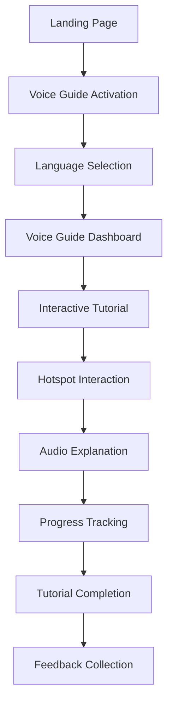

# AI Voice Guide - Product Requirements Document

## 1. Product Overview

An intelligent voice-guided tutorial system that uses ElevenLabs AI to provide interactive audio explanations of software features and functionality. The system helps users navigate and understand different parts of the application through voice narration with visual hotspots and multi-language support.

* **Purpose**: Enhance user onboarding and provide contextual help through AI-powered voice guidance

* **Target Users**: New users, existing users exploring new features, and users preferring audio-visual learning

* **Market Value**: Improves user experience, reduces support tickets, and increases feature adoption rates

## 2. Core Features

### 2.1 User Roles

| Role            | Registration Method      | Core Permissions                                       |
| --------------- | ------------------------ | ------------------------------------------------------ |
| Guest User      | No registration required | Can access basic voice guide features                  |
| Registered User | Email registration       | Full access to voice guide, language preferences saved |
| Premium User    | Subscription upgrade     | Advanced voice features, custom voice selection        |

### 2.2 Feature Module

Our AI Voice Guide consists of the following main components:

1. **Voice Guide Dashboard**: Main control panel, language selector, voice settings, tutorial navigation
2. **Interactive Hotspots**: Clickable areas on UI elements, voice explanation triggers, visual indicators
3. **Audio Player Interface**: Play/pause controls, volume adjustment, speed control, progress tracking
4. **Language Selection**: Multi-language support, voice accent options, regional preferences
5. **Tutorial Management**: Topic categories, progress tracking, bookmark system

### 2.3 Page Details

| Page Name              | Module Name       | Feature description                                                                                |
| ---------------------- | ----------------- | -------------------------------------------------------------------------------------------------- |
| Voice Guide Dashboard  | Control Panel     | Initialize voice guide system, display available tutorials, show user progress                     |
| Voice Guide Dashboard  | Language Selector | Choose from supported languages (English, Spanish, French, German), select voice accent and gender |
| Voice Guide Dashboard  | Settings Panel    | Adjust playback speed, volume control, enable/disable auto-play, manage preferences                |
| Interactive Hotspots   | Hotspot Overlay   | Display clickable areas over UI elements, show tooltip previews, highlight active areas            |
| Interactive Hotspots   | Voice Triggers    | Generate contextual explanations, trigger audio playback, provide step-by-step guidance            |
| Audio Player Interface | Playback Controls | Play, pause, stop, rewind, fast-forward audio explanations                                         |
| Audio Player Interface | Progress Tracking | Show current position, total duration, chapter navigation, bookmark creation                       |
| Tutorial Management    | Content Library   | Browse available tutorials by category, search functionality, filter by difficulty level           |
| Tutorial Management    | Progress System   | Track completion status, save user progress, resume from last position                             |

## 3. Core Process

**New User Flow:**

1. User accesses the application and sees voice guide introduction
2. System prompts for language selection and voice preferences
3. Interactive tutorial begins with dashboard overview
4. User clicks on hotspots to hear detailed explanations
5. Progress is tracked and saved for future sessions

**Returning User Flow:**

1. User activates voice guide from any page
2. System loads saved preferences and progress
3. User can continue from last position or start new tutorial
4. Contextual help available on-demand via hotspot clicks

## 4. User Interface Design

### 4.1 Design Style

* **Primary Colors**: #3B82F6 (blue), #10B981 (green), #F59E0B (amber)

* **Secondary Colors**: #6B7280 (gray), #EF4444 (red), #8B5CF6 (purple)

* **Button Style**: Rounded corners (8px), subtle shadows, hover animations

* **Font**: Inter for UI text, 16px base size, 14px for secondary text

* **Layout Style**: Overlay-based design, non-intrusive floating panels, responsive grid

* **Icons**: Feather icons for controls, custom voice wave animations, language flags

### 4.2 Page Design Overview

| Page Name              | Module Name        | UI Elements                                                                                                             |
| ---------------------- | ------------------ | ----------------------------------------------------------------------------------------------------------------------- |
| Voice Guide Dashboard  | Control Panel      | Floating panel with rounded corners, glass morphism effect, primary blue background (#3B82F6), white text, 24px padding |
| Voice Guide Dashboard  | Language Selector  | Dropdown with flag icons, hover states, smooth transitions, 200ms animation duration                                    |
| Interactive Hotspots   | Hotspot Indicators | Pulsing blue circles (#3B82F6), 40px diameter, 0.8 opacity, scale animation on hover                                    |
| Interactive Hotspots   | Tooltip Previews   | White background, subtle shadow, 12px border radius, dark gray text (#374151)                                           |
| Audio Player Interface | Playback Controls  | Circular buttons, 48px size, primary colors, disabled states in gray (#9CA3AF)                                          |
| Audio Player Interface | Progress Bar       | Green gradient (#10B981 to #059669), 4px height, rounded ends, interactive scrubbing                                    |

### 4.3 Responsiveness

Desktop-first design with mobile adaptation. Touch-optimized hotspots (minimum 44px touch targets), collapsible panels on smaller screens, and gesture support for audio controls.

## 5. Technical Integration

### 5.1 ElevenLabs API Integration

* **API Key**: sk\_79d9be1773370f81499e7a424aeb84bb0964368a19140b48

* **Voice Models**: Multilingual support with native speakers

* **Audio Format**: MP3, 44.1kHz, optimized for web streaming

* **Caching**: Local storage for frequently accessed audio clips

### 5.2 Content Management

* **Script Templates**: Pre-defined explanations for common UI elements

* **Dynamic Content**: Context-aware explanations based on user actions

* **Localization**: Translation support for all voice scripts

* **Quality Control**: Audio preview and approval workflow

### 5.3 Performance Considerations

* **Lazy Loading**: Audio files loaded on-demand

* **Compression**: Optimized audio files for faster loading

* **Offline Support**: Critical audio files cached locally

* **Bandwidth Management**: Adaptive quality based on connection speed

