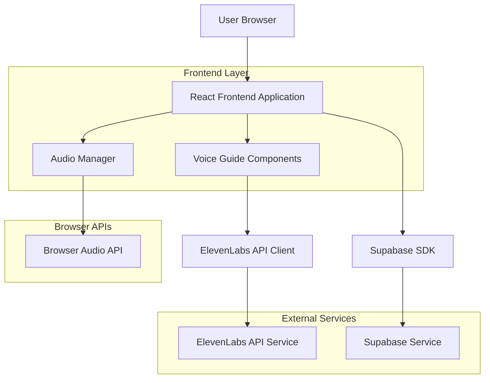
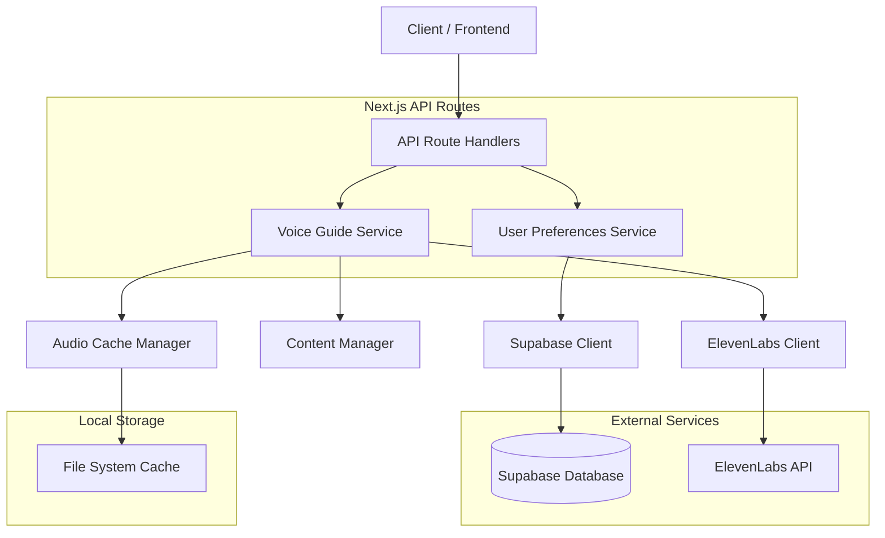
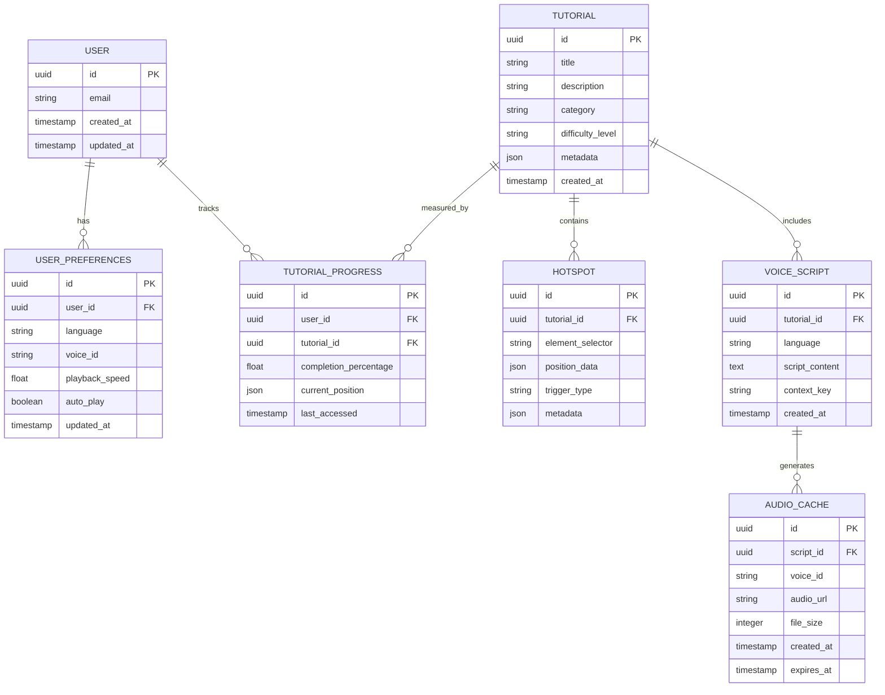

# AI Voice Guide - Technical Architecture Document

## 1. Architecture Design



## 2. Technology Description

* Frontend: React\@18 + TypeScript + TailwindCSS\@3 + Vite

* Audio Processing: Web Audio API + HTML5 Audio

* External APIs: ElevenLabs Text-to-Speech API

* State Management: React Context + useState/useEffect hooks

* Storage: Supabase (user preferences) + localStorage (audio cache)

* UI Components: Headless UI + Custom components

## 3. Route Definitions

| Route                     | Purpose                                              |
| ------------------------- | ---------------------------------------------------- |
| /voice-guide              | Main voice guide dashboard and settings              |
| /voice-guide/tutorial/:id | Specific tutorial with interactive hotspots          |
| /voice-guide/settings     | Voice preferences and language configuration         |
| /voice-guide/library      | Browse available tutorials and content               |
| /\*                       | Voice guide overlay available on all existing routes |

## 4. API Definitions

### 4.1 ElevenLabs Text-to-Speech API

**Generate Speech**

```
POST https://api.elevenlabs.io/v1/text-to-speech/{voice_id}
```

Request Headers:

| Header Name  | Value                                                | Description          |
| ------------ | ---------------------------------------------------- | -------------------- |
| xi-api-key   | sk\_79d9be1773370f81499e7a424aeb84bb0964368a19140b48 | ElevenLabs API key   |
| Content-Type | application/json                                     | Request content type |

Request Body:

| Param Name      | Param Type | isRequired | Description                                        |
| --------------- | ---------- | ---------- | -------------------------------------------------- |
| text            | string     | true       | Text to convert to speech                          |
| model\_id       | string     | false      | Voice model (default: eleven\_multilingual\_v2)    |
| voice\_settings | object     | false      | Voice configuration (stability, similarity\_boost) |

Response: Binary audio data (MP3 format)

**Get Available Voices**

```
GET https://api.elevenlabs.io/v1/voices
```

Response:

| Param Name | Param Type | Description                            |
| ---------- | ---------- | -------------------------------------- |
| voices     | array      | List of available voice models         |
| voice\_id  | string     | Unique identifier for voice            |
| name       | string     | Voice name                             |
| category   | string     | Voice category (premade, cloned, etc.) |

### 4.2 Internal API Endpoints

**Voice Guide Content**

```
GET /api/voice-guide/content
```

Response:

| Param Name | Param Type | Description                       |
| ---------- | ---------- | --------------------------------- |
| tutorials  | array      | Available tutorial content        |
| hotspots   | array      | Interactive hotspot definitions   |
| scripts    | object     | Text scripts for voice generation |

**User Preferences**

```
POST /api/voice-guide/preferences
```

Request:

| Param Name      | Param Type | isRequired | Description                             |
| --------------- | ---------- | ---------- | --------------------------------------- |
| language        | string     | true       | Selected language code (en, es, fr, de) |
| voice\_id       | string     | true       | ElevenLabs voice identifier             |
| playback\_speed | number     | false      | Audio playback speed (0.5-2.0)          |
| auto\_play      | boolean    | false      | Auto-play preference                    |

## 5. Server Architecture Diagram



## 6. Data Model

### 6.1 Data Model Definition



### 6.2 Data Definition Language

**User Preferences Table**

```sql
CREATE TABLE user_preferences (
    id UUID PRIMARY KEY DEFAULT gen_random_uuid(),
    user_id UUID REFERENCES auth.users(id) ON DELETE CASCADE,
    language VARCHAR(10) DEFAULT 'en' CHECK (language IN ('en', 'es', 'fr', 'de', 'it', 'pt')),
    voice_id VARCHAR(100) NOT NULL,
    playback_speed DECIMAL(3,2) DEFAULT 1.0 CHECK (playback_speed >= 0.5 AND playback_speed <= 2.0),
    auto_play BOOLEAN DEFAULT true,
    created_at TIMESTAMP WITH TIME ZONE DEFAULT NOW(),
    updated_at TIMESTAMP WITH TIME ZONE DEFAULT NOW(),
    UNIQUE(user_id)
);

CREATE INDEX idx_user_preferences_user_id ON user_preferences(user_id);
```

**Tutorial Content Table**

```sql
CREATE TABLE tutorials (
    id UUID PRIMARY KEY DEFAULT gen_random_uuid(),
    title VARCHAR(200) NOT NULL,
    description TEXT,
    category VARCHAR(50) NOT NULL,
    difficulty_level VARCHAR(20) DEFAULT 'beginner' CHECK (difficulty_level IN ('beginner', 'intermediate', 'advanced')),
    metadata JSONB DEFAULT '{}',
    is_active BOOLEAN DEFAULT true,
    created_at TIMESTAMP WITH TIME ZONE DEFAULT NOW(),
    updated_at TIMESTAMP WITH TIME ZONE DEFAULT NOW()
);

CREATE INDEX idx_tutorials_category ON tutorials(category);
CREATE INDEX idx_tutorials_difficulty ON tutorials(difficulty_level);
```

**Tutorial Progress Table**

```sql
CREATE TABLE tutorial_progress (
    id UUID PRIMARY KEY DEFAULT gen_random_uuid(),
    user_id UUID REFERENCES auth.users(id) ON DELETE CASCADE,
    tutorial_id UUID REFERENCES tutorials(id) ON DELETE CASCADE,
    completion_percentage DECIMAL(5,2) DEFAULT 0.0 CHECK (completion_percentage >= 0 AND completion_percentage <= 100),
    current_position JSONB DEFAULT '{}',
    last_accessed TIMESTAMP WITH TIME ZONE DEFAULT NOW(),
    created_at TIMESTAMP WITH TIME ZONE DEFAULT NOW(),
    UNIQUE(user_id, tutorial_id)
);

CREATE INDEX idx_tutorial_progress_user_id ON tutorial_progress(user_id);
CREATE INDEX idx_tutorial_progress_tutorial_id ON tutorial_progress(tutorial_id);
```

**Interactive Hotspots Table**

```sql
CREATE TABLE hotspots (
    id UUID PRIMARY KEY DEFAULT gen_random_uuid(),
    tutorial_id UUID REFERENCES tutorials(id) ON DELETE CASCADE,
    element_selector VARCHAR(500) NOT NULL,
    position_data JSONB NOT NULL,
    trigger_type VARCHAR(50) DEFAULT 'click' CHECK (trigger_type IN ('click', 'hover', 'auto')),
    metadata JSONB DEFAULT '{}',
    sort_order INTEGER DEFAULT 0,
    is_active BOOLEAN DEFAULT true,
    created_at TIMESTAMP WITH TIME ZONE DEFAULT NOW()
);

CREATE INDEX idx_hotspots_tutorial_id ON hotspots(tutorial_id);
CREATE INDEX idx_hotspots_sort_order ON hotspots(sort_order);
```

**Voice Scripts Table**

```sql
CREATE TABLE voice_scripts (
    id UUID PRIMARY KEY DEFAULT gen_random_uuid(),
    tutorial_id UUID REFERENCES tutorials(id) ON DELETE CASCADE,
    hotspot_id UUID REFERENCES hotspots(id) ON DELETE CASCADE,
    language VARCHAR(10) NOT NULL,
    script_content TEXT NOT NULL,
    context_key VARCHAR(100) NOT NULL,
    created_at TIMESTAMP WITH TIME ZONE DEFAULT NOW(),
    updated_at TIMESTAMP WITH TIME ZONE DEFAULT NOW()
);

CREATE INDEX idx_voice_scripts_tutorial_id ON voice_scripts(tutorial_id);
CREATE INDEX idx_voice_scripts_language ON voice_scripts(language);
CREATE INDEX idx_voice_scripts_context_key ON voice_scripts(context_key);
```

**Audio Cache Table**

```sql
CREATE TABLE audio_cache (
    id UUID PRIMARY KEY DEFAULT gen_random_uuid(),
    script_id UUID REFERENCES voice_scripts(id) ON DELETE CASCADE,
    voice_id VARCHAR(100) NOT NULL,
    audio_url TEXT NOT NULL,
    file_size INTEGER,
    duration_seconds DECIMAL(8,2),
    created_at TIMESTAMP WITH TIME ZONE DEFAULT NOW(),
    expires_at TIMESTAMP WITH TIME ZONE DEFAULT (NOW() + INTERVAL '30 days'),
    UNIQUE(script_id, voice_id)
);

CREATE INDEX idx_audio_cache_script_id ON audio_cache(script_id);
CREATE INDEX idx_audio_cache_expires_at ON audio_cache(expires_at);
```

**Row Level Security Policies**

```sql
-- Enable RLS
ALTER TABLE user_preferences ENABLE ROW LEVEL SECURITY;
ALTER TABLE tutorial_progress ENABLE ROW LEVEL SECURITY;

-- User preferences policies
CREATE POLICY "Users can view own preferences" ON user_preferences
    FOR SELECT USING (auth.uid() = user_id);

CREATE POLICY "Users can update own preferences" ON user_preferences
    FOR ALL USING (auth.uid() = user_id);

-- Tutorial progress policies
CREATE POLICY "Users can view own progress" ON tutorial_progress
    FOR SELECT USING (auth.uid() = user_id);

CREATE POLICY "Users can update own progress" ON tutorial_progress
    FOR ALL USING (auth.uid() = user_id);

-- Public read access for tutorials, hotspots, voice_scripts
GRANT SELECT ON tutorials TO anon, authenticated;
GRANT SELECT ON hotspots TO anon, authenticated;
GRANT SELECT ON voice_scripts TO anon, authenticated;
GRANT SELECT ON audio_cache TO anon, authenticated;

-- Full access for authenticated users on their data
GRANT ALL PRIVILEGES ON user_preferences TO authenticated;
GRANT ALL PRIVILEGES ON tutorial_progress TO authenticated;
```

**Initial Data**

```sql
-- Insert default tutorial
INSERT INTO tutorials (title, description, category, difficulty_level) VALUES
('Dashboard Overview', 'Complete guide to understanding your dashboard', 'getting-started', 'beginner'),
('Email AI Features', 'Learn how to use AI-powered email generation', 'ai-tools', 'intermediate'),
('Contact Management', 'Manage your contacts and campaigns effectively', 'contacts', 'beginner');

-- Insert sample hotspots for dashboard tutorial
INSERT INTO hotspots (tutorial_id, element_selector, position_data, trigger_type) 
SELECT 
    t.id,
    '.dashboard-header',
    '{"x": 50, "y": 20, "placement": "bottom"}',
    'click'
FROM tutorials t WHERE t.title = 'Dashboard Overview';

-- Insert voice scripts
INSERT INTO voice_scripts (tutorial_id, hotspot_id, language, script_content, context_key)
SELECT 
    t.id,
    h.id,
    'en',
    'Welcome to your dashboard! This is your central hub where you can access all the AI-powered tools for creative professionals.',
    'dashboard-header-intro'
FROM tutorials t
JOIN hotspots h ON h.tutorial_id = t.id
WHERE t.title = 'Dashboard Overview' AND h.element_selector = '.dashboard-header';
```

