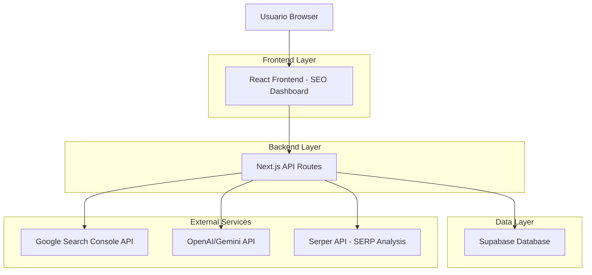
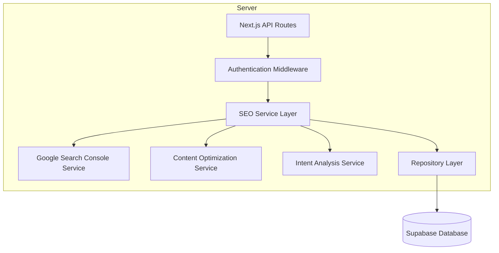
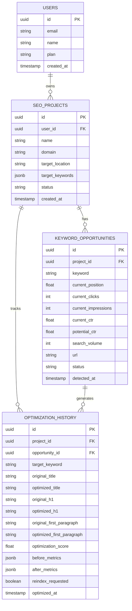

# Documento de Arquitectura Técnica: Sistema de Optimización SEO "Tres Reyes"

## 1. Diseño de Arquitectura



## 2. Descripción de Tecnologías

- Frontend: React@18 + TypeScript + Tailwind CSS@3 + Next.js@14
- Backend: Next.js API Routes + Supabase Client SDK
- Base de datos: Supabase (PostgreSQL)
- APIs externas: Google Search Console API, OpenAI/Gemini API, Serper API

## 3. Definiciones de Rutas

| Ruta | Propósito |
|------|-----------|
| /seo-dashboard | Dashboard principal con navegación por tabs |
| /seo-dashboard/opportunities | Página de detección de keywords 5-15 |
| /seo-dashboard/optimizer | Herramienta de optimización de tres reyes |
| /seo-dashboard/intent-analyzer | Analizador de intención de búsqueda |
| /seo-dashboard/results | Monitor de resultados y seguimiento |
| /seo-dashboard/settings | Configuración de conexiones API |

## 4. Definiciones de API

### 4.1 APIs Principales

**Detección de Keywords 5-15**
```
GET /api/seo/opportunities
```

Request:
| Parámetro | Tipo | Requerido | Descripción |
|-----------|------|-----------|-------------|
| projectId | string | true | ID del proyecto SEO |
| dateRange | number | false | Días hacia atrás para análisis (default: 30) |
| minPosition | number | false | Posición mínima (default: 5) |
| maxPosition | number | false | Posición máxima (default: 15) |

Response:
| Parámetro | Tipo | Descripción |
|-----------|------|-------------|
| opportunities | KeywordOpportunity[] | Lista de keywords con potencial |
| totalKeywords | number | Total de keywords encontradas |
| avgCtrIncrease | number | Incremento promedio de CTR estimado |

Ejemplo:
```json
{
  "opportunities": [
    {
      "keyword": "marketing digital para pymes",
      "currentPosition": 8.5,
      "currentClicks": 45,
      "currentImpressions": 1200,
      "currentCtr": 3.75,
      "potentialCtr": 12.8,
      "potentialIncrease": 241,
      "searchVolume": 2400,
      "url": "/servicios/marketing-digital"
    }
  ],
  "totalKeywords": 23,
  "avgCtrIncrease": 185
}
```

**Optimización de Tres Reyes**
```
POST /api/seo/optimize-three-kings
```

Request:
| Parámetro | Tipo | Requerido | Descripción |
|-----------|------|-----------|-------------|
| url | string | true | URL de la página a optimizar |
| targetKeyword | string | true | Keyword objetivo |
| titleTag | string | true | Nuevo title tag |
| h1Tag | string | true | Nuevo H1 |
| firstParagraph | string | true | Nueva primera frase/párrafo |

Response:
| Parámetro | Tipo | Descripción |
|-----------|------|-------------|
| success | boolean | Estado de la operación |
| optimizationScore | number | Score de optimización (0-100) |
| suggestions | string[] | Sugerencias adicionales |
| reindexRequested | boolean | Si se solicitó reindexado |

**Análisis de Intención de Búsqueda**
```
POST /api/seo/analyze-intent
```

Request:
| Parámetro | Tipo | Requerido | Descripción |
|-----------|------|-----------|-------------|
| keyword | string | true | Keyword a analizar |
| currentUrl | string | true | URL actual del contenido |
| contentPreview | string | true | Preview del contenido actual |

Response:
| Parámetro | Tipo | Descripción |
|-----------|------|-------------|
| detectedIntent | string | Intención detectada (informational/commercial/transactional) |
| intentMatch | number | Score de coincidencia (0-100) |
| topCompetitors | CompetitorAnalysis[] | Análisis de top 3 competidores |
| missingNlpKeywords | string[] | Keywords semánticas faltantes |

**Solicitud de Reindexado**
```
POST /api/seo/request-reindex
```

Request:
| Parámetro | Tipo | Requerido | Descripción |
|-----------|------|-----------|-------------|
| url | string | true | URL a reindexar |
| projectId | string | true | ID del proyecto |

Response:
| Parámetro | Tipo | Descripción |
|-----------|------|-------------|
| success | boolean | Estado de la solicitud |
| inspectionResult | object | Resultado de URL Inspection |
| reindexStatus | string | Estado del reindexado |

## 5. Arquitectura del Servidor



## 6. Modelo de Datos

### 6.1 Definición del Modelo de Datos



### 6.2 Lenguaje de Definición de Datos

**Tabla de Oportunidades de Keywords (keyword_opportunities)**
```sql
-- Crear tabla
CREATE TABLE keyword_opportunities (
    id UUID PRIMARY KEY DEFAULT gen_random_uuid(),
    project_id UUID REFERENCES seo_projects(id) ON DELETE CASCADE,
    keyword VARCHAR(255) NOT NULL,
    current_position DECIMAL(4,2) NOT NULL,
    current_clicks INTEGER DEFAULT 0,
    current_impressions INTEGER DEFAULT 0,
    current_ctr DECIMAL(5,2) DEFAULT 0,
    potential_ctr DECIMAL(5,2) DEFAULT 0,
    search_volume INTEGER DEFAULT 0,
    url TEXT NOT NULL,
    status VARCHAR(20) DEFAULT 'detected' CHECK (status IN ('detected', 'optimizing', 'optimized', 'monitoring')),
    detected_at TIMESTAMP WITH TIME ZONE DEFAULT NOW(),
    updated_at TIMESTAMP WITH TIME ZONE DEFAULT NOW()
);

-- Crear índices
CREATE INDEX idx_keyword_opportunities_project_id ON keyword_opportunities(project_id);
CREATE INDEX idx_keyword_opportunities_position ON keyword_opportunities(current_position);
CREATE INDEX idx_keyword_opportunities_status ON keyword_opportunities(status);
CREATE INDEX idx_keyword_opportunities_detected_at ON keyword_opportunities(detected_at DESC);

-- Permisos
GRANT SELECT ON keyword_opportunities TO anon;
GRANT ALL PRIVILEGES ON keyword_opportunities TO authenticated;
```

**Tabla de Historial de Optimizaciones (optimization_history)**
```sql
-- Crear tabla
CREATE TABLE optimization_history (
    id UUID PRIMARY KEY DEFAULT gen_random_uuid(),
    project_id UUID REFERENCES seo_projects(id) ON DELETE CASCADE,
    opportunity_id UUID REFERENCES keyword_opportunities(id) ON DELETE SET NULL,
    target_keyword VARCHAR(255) NOT NULL,
    original_title TEXT,
    optimized_title TEXT NOT NULL,
    original_h1 TEXT,
    optimized_h1 TEXT NOT NULL,
    original_first_paragraph TEXT,
    optimized_first_paragraph TEXT NOT NULL,
    optimization_score INTEGER DEFAULT 0 CHECK (optimization_score >= 0 AND optimization_score <= 100),
    before_metrics JSONB DEFAULT '{}',
    after_metrics JSONB DEFAULT '{}',
    reindex_requested BOOLEAN DEFAULT false,
    reindex_status VARCHAR(20) DEFAULT 'pending' CHECK (reindex_status IN ('pending', 'requested', 'completed', 'failed')),
    optimized_at TIMESTAMP WITH TIME ZONE DEFAULT NOW(),
    updated_at TIMESTAMP WITH TIME ZONE DEFAULT NOW()
);

-- Crear índices
CREATE INDEX idx_optimization_history_project_id ON optimization_history(project_id);
CREATE INDEX idx_optimization_history_opportunity_id ON optimization_history(opportunity_id);
CREATE INDEX idx_optimization_history_optimized_at ON optimization_history(optimized_at DESC);
CREATE INDEX idx_optimization_history_reindex_status ON optimization_history(reindex_status);

-- Permisos
GRANT SELECT ON optimization_history TO anon;
GRANT ALL PRIVILEGES ON optimization_history TO authenticated;
```

**Tabla de Análisis de Intención (intent_analysis)**
```sql
-- Crear tabla
CREATE TABLE intent_analysis (
    id UUID PRIMARY KEY DEFAULT gen_random_uuid(),
    project_id UUID REFERENCES seo_projects(id) ON DELETE CASCADE,
    keyword VARCHAR(255) NOT NULL,
    detected_intent VARCHAR(20) NOT NULL CHECK (detected_intent IN ('informational', 'commercial', 'transactional', 'navigational')),
    intent_confidence DECIMAL(5,2) DEFAULT 0,
    content_match_score INTEGER DEFAULT 0 CHECK (content_match_score >= 0 AND content_match_score <= 100),
    top_competitors JSONB DEFAULT '[]',
    missing_nlp_keywords JSONB DEFAULT '[]',
    recommendations JSONB DEFAULT '[]',
    analyzed_at TIMESTAMP WITH TIME ZONE DEFAULT NOW()
);

-- Crear índices
CREATE INDEX idx_intent_analysis_project_id ON intent_analysis(project_id);
CREATE INDEX idx_intent_analysis_keyword ON intent_analysis(keyword);
CREATE INDEX idx_intent_analysis_analyzed_at ON intent_analysis(analyzed_at DESC);

-- Permisos
GRANT SELECT ON intent_analysis TO anon;
GRANT ALL PRIVILEGES ON intent_analysis TO authenticated;

-- Datos iniciales de ejemplo
INSERT INTO keyword_opportunities (project_id, keyword, current_position, current_clicks, current_impressions, current_ctr, potential_ctr, search_volume, url)
VALUES 
    ('example-project-id', 'marketing digital para pymes', 8.5, 45, 1200, 3.75, 12.8, 2400, '/servicios/marketing-digital'),
    ('example-project-id', 'consultoría seo barcelona', 11.2, 23, 890, 2.58, 8.9, 1800, '/servicios/consultoria-seo');
```