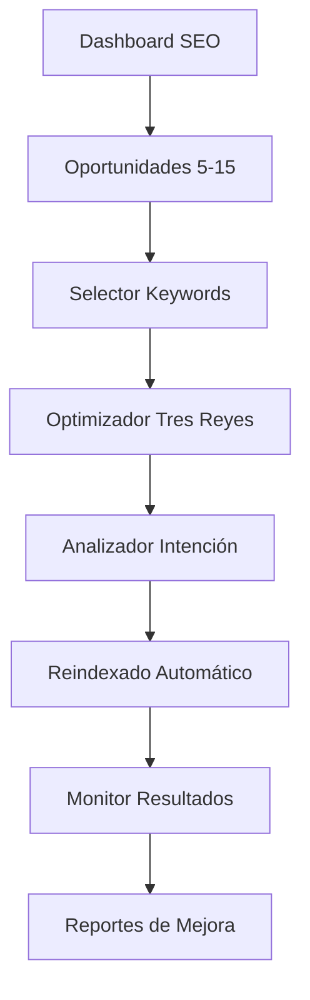

# Documento de Requisitos del Producto: Optimización SEO Estratégica "Tres Reyes"

## 1. Resumen del Producto

Sistema de optimización SEO estratégica que identifica keywords que rankean entre las posiciones 5-15 y optimiza automáticamente los "tres reyes" (title tag, H1, primera frase/párrafo) para multiplicar el tráfico orgánico sin crear contenido nuevo. La funcionalidad se integra al SEO Dashboard existente y utiliza Google Search Console API para detectar oportunidades de mejora con alto potencial de ROI.

- **Problema a resolver**: Las páginas que rankean entre posiciones 5-15 tienen gran potencial de mejora pero requieren optimización estratégica específica
- **Usuarios objetivo**: Especialistas SEO, marketers digitales, propietarios de sitios web que buscan maximizar su tráfico orgánico existente
- **Valor del producto**: Puede multiplicar el CTR hasta 7 veces al subir de posición 10 a 5, generando más tráfico sin inversión en contenido nuevo

## 2. Características Principales

### 2.1 Roles de Usuario

| Rol | Método de Registro | Permisos Principales |
|-----|-------------------|---------------------|
| Usuario SEO | Registro con email + conexión GSC | Puede analizar keywords, optimizar contenido, ver reportes básicos |
| Usuario Premium | Upgrade con suscripción | Acceso completo: análisis competencia, reindexado automático, reportes avanzados |

### 2.2 Módulos de Funcionalidad

Nuestro sistema de optimización SEO consta de las siguientes páginas principales:

1. **Dashboard de Oportunidades**: análisis de keywords 5-15, métricas de potencial, selector de keywords objetivo
2. **Optimizador de Tres Reyes**: editor en tiempo real para title tag, H1 y primera frase, preview de cambios
3. **Analizador de Intención**: verificación de search intent, comparación con competencia top 3
4. **Monitor de Resultados**: seguimiento de rankings, CTR, tráfico orgánico post-optimización

### 2.3 Detalles de Páginas

| Página | Módulo | Descripción de Funcionalidad |
|--------|--------|------------------------------|
| Dashboard de Oportunidades | Detector de Keywords 5-15 | Conecta con Google Search Console API, filtra keywords por posición >4.9, muestra clics/impresiones/CTR actual, calcula potencial de mejora |
| Dashboard de Oportunidades | Selector de Keywords | Permite elegir keyword objetivo basado en volumen, relevancia y potencial de mejora, muestra datos históricos de rendimiento |
| Optimizador de Tres Reyes | Editor de Title Tag | Campo editable con contador de caracteres, preview en SERP, sugerencias de optimización basadas en keyword objetivo |
| Optimizador de Tres Reyes | Editor de H1 | Campo editable con validación de estructura, preview visual, verificación de coincidencia con title |
| Optimizador de Tres Reyes | Editor Primera Frase | Editor de párrafo con análisis de densidad de keyword, sugerencias de mejora, preview de snippet |
| Analizador de Intención | Verificador de Search Intent | Analiza si el contenido coincide con intención (informacional/comercial/transaccional), compara con top 3 resultados |
| Analizador de Intención | Detector de Huecos Semánticos | Identifica NLP keywords faltantes usando análisis de competencia, sugiere términos relacionados para incluir |
| Monitor de Resultados | Dashboard de Seguimiento | Gráficos de evolución de rankings, CTR, tráfico orgánico, comparación antes/después de optimización |
| Monitor de Resultados | Reindexado Automático | Solicita reindexado en Search Console vía API, monitorea estado de indexación, notifica cuando se completa |

## 3. Proceso Principal

### Flujo de Usuario SEO:
1. **Conexión inicial**: Usuario conecta su cuenta de Google Search Console
2. **Detección de oportunidades**: Sistema analiza y muestra keywords que rankean entre posiciones 5-15
3. **Selección de keyword**: Usuario elige keyword objetivo basado en métricas de potencial
4. **Optimización de tres reyes**: Usuario edita title tag, H1 y primera frase con asistencia del sistema
5. **Análisis de intención**: Sistema verifica que el contenido coincida con search intent
6. **Solicitud de reindexado**: Sistema envía solicitud automática a Google Search Console
7. **Monitoreo de resultados**: Usuario sigue la evolución de rankings y tráfico

### Flujo de Usuario Premium:
Incluye todos los pasos anteriores más:
- Análisis automático de competencia top 3
- Detección de huecos semánticos con NLP
- Reportes avanzados con proyecciones de tráfico
- Optimización masiva de múltiples páginas

## 4. Diseño de Interfaz de Usuario

### 4.1 Estilo de Diseño

- **Colores primarios**: Azul #3B82F6 (primary), Verde #10B981 (success), Naranja #F59E0B (warning)
- **Colores secundarios**: Gris #6B7280 (text), Blanco #FFFFFF (background), Gris oscuro #1F2937 (dark mode)
- **Estilo de botones**: Redondeados (rounded-lg), con efectos hover y estados de carga
- **Tipografía**: Inter como fuente principal, tamaños 14px (texto), 18px (subtítulos), 24px (títulos)
- **Layout**: Diseño de cards con sombras sutiles, navegación lateral colapsible, dashboard tipo grid
- **Iconos**: Lucide React icons, estilo outline, colores que coincidan con la acción (verde para éxito, rojo para alertas)

### 4.2 Resumen de Diseño de Páginas

| Página | Módulo | Elementos UI |
|--------|--------|--------------|
| Dashboard de Oportunidades | Detector Keywords 5-15 | Tabla interactiva con filtros, badges de posición con colores (rojo 11-15, naranja 8-10, amarillo 5-7), gráficos de barras para CTR potencial |
| Dashboard de Oportunidades | Selector Keywords | Cards de keywords con métricas destacadas, botón CTA "Optimizar" prominente, tooltips explicativos para métricas |
| Optimizador Tres Reyes | Editor Title Tag | Campo de texto con contador en tiempo real (0-60 caracteres), preview SERP mockup, sugerencias en sidebar |
| Optimizador Tres Reyes | Editor H1 | Campo de texto grande, validación visual (checkmark verde), comparación lado a lado con title tag |
| Optimizador Tres Reyes | Editor Primera Frase | Editor de texto enriquecido, análisis de densidad con barra de progreso, preview de snippet de Google |
| Analizador Intención | Verificador Search Intent | Cards comparativas con competencia, badges de intención (info/comercial/transaccional), score de coincidencia |
| Monitor Resultados | Dashboard Seguimiento | Gráficos de líneas para evolución temporal, métricas en cards grandes, indicadores de cambio con flechas y colores |

### 4.3 Responsividad

El producto es desktop-first con adaptación móvil completa. En móvil, las tablas se convierten en cards apilables, los gráficos se simplifican y la navegación se colapsa en menú hamburguesa. Se optimiza para touch con botones de mínimo 44px y espaciado adecuado entre elementos interactivos.