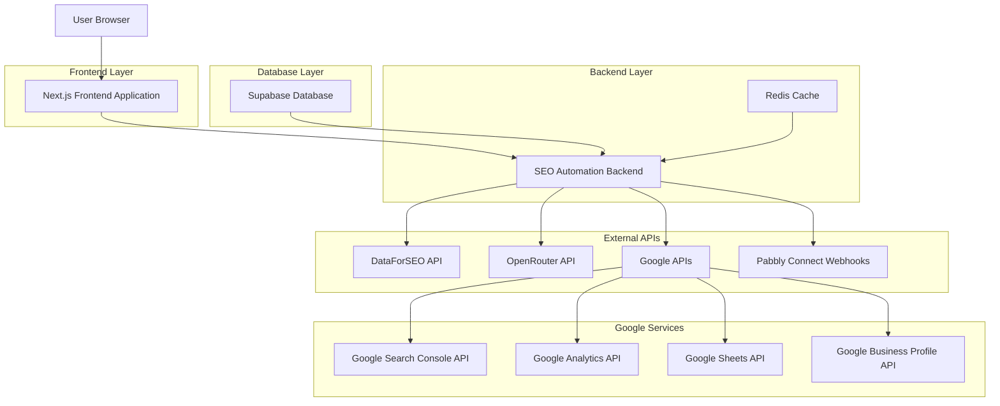
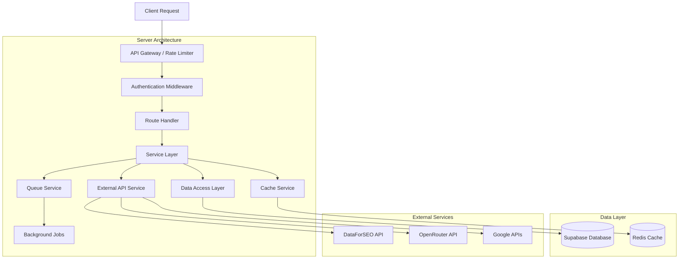
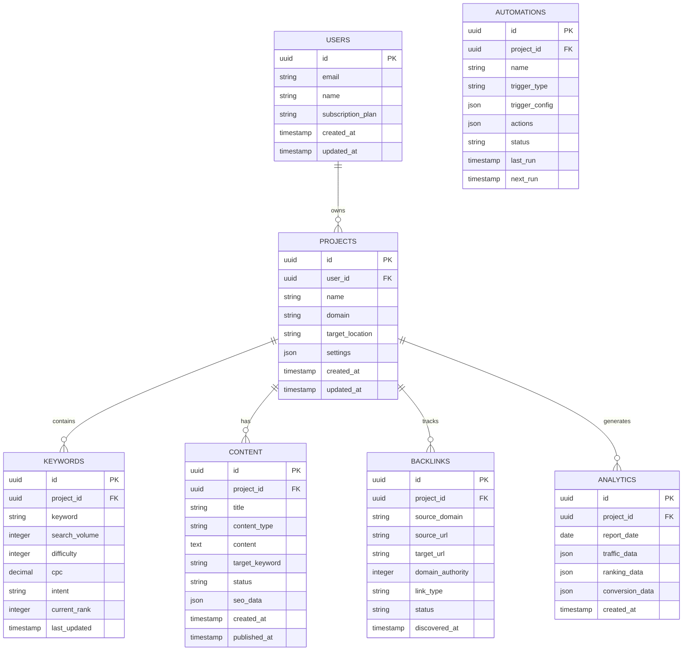

## 1. Architecture Design



## 2. Technology Description

- **Frontend**: Next.js@14 + TypeScript + Tailwind CSS + React Query
- **Backend**: Node.js + Express.js + TypeScript
- **Database**: Supabase (PostgreSQL)
- **Cache**: Redis
- **APIs**: DataForSEO, OpenRouter, Google APIs, Pabbly Connect
- **Deployment**: Vercel (Frontend) + Railway/Render (Backend)

## 3. Route Definitions

| Route | Purpose |
|-------|---------|
| `/` | Homepage with SEO-optimized content and service overview |
| `/dashboard` | SEO analytics dashboard and automation controls |
| `/keyword-research` | Keyword research tool interface |
| `/content-planner` | AI-assisted content planning and creation |
| `/backlink-tracker` | Backlink monitoring and outreach management |
| `/local-seo` | Google Business Profile management interface |
| `/analytics` | SEO performance analytics and reporting |
| `/automation` | Workflow automation setup and monitoring |
| `/api/seo/*` | SEO-related API endpoints |

## 4. API Definitions

### 4.1 Core SEO APIs

**Keyword Research**
```
POST /api/seo/keywords/research
```

Request:
| Param Name | Param Type | isRequired | Description |
|------------|------------|------------|-------------|
| seedKeyword | string | true | Primary keyword to research |
| location | string | false | Target location (default: "United States") |
| language | string | false | Target language (default: "English") |
| maxSuggestions | number | false | Maximum keywords to return (default: 80) |

Response:
| Param Name | Param Type | Description |
|------------|------------|-------------|
| keywords | KeywordData[] | Array of keyword objects |
| totalResults | number | Total number of keywords found |
| processingTime | number | API processing time in seconds |

Example Response:
```json
{
  "keywords": [
    {
      "keyword": "home equity loan rates",
      "searchVolume": 12000,
      "difficulty": 65,
      "cpc": 8.50,
      "competition": "high",
      "intent": "transactional"
    }
  ],
  "totalResults": 80,
  "processingTime": 2.3
}
```

**Content Generation**
```
POST /api/seo/content/generate
```

Request:
| Param Name | Param Type | isRequired | Description |
|------------|------------|------------|-------------|
| contentType | string | true | Type: "service-page", "blog-post", "gbp-post" |
| targetKeyword | string | true | Primary keyword to target |
| location | string | false | Target location for local content |
| tone | string | false | Content tone (default: "professional") |
| wordCount | number | false | Target word count |

Response:
| Param Name | Param Type | Description |
|------------|------------|-------------|
| content | string | Generated content |
| title | string | Suggested title |
| metaDescription | string | SEO meta description |
| headings | string[] | Suggested H2/H3 headings |
| internalLinks | LinkSuggestion[] | Suggested internal links |

**Backlink Analysis**
```
GET /api/seo/backlinks/analyze
```

Request:
| Param Name | Param Type | isRequired | Description |
|------------|------------|------------|-------------|
| domain | string | true | Domain to analyze |
| competitors | string[] | false | Competitor domains to compare |

Response:
| Param Name | Param Type | Description |
|------------|------------|-------------|
| totalBacklinks | number | Total number of backlinks |
| referringDomains | number | Number of unique referring domains |
| domainAuthority | number | Domain authority score |
| topBacklinks | BacklinkData[] | Highest quality backlinks |
| opportunities | OpportunityData[] | Link building opportunities |

**Analytics Data**
```
GET /api/seo/analytics/performance
```

Request:
| Param Name | Param Type | isRequired | Description |
|------------|------------|------------|-------------|
| startDate | string | true | Start date (YYYY-MM-DD) |
| endDate | string | true | End date (YYYY-MM-DD) |
| metrics | string[] | false | Specific metrics to retrieve |

Response:
| Param Name | Param Type | Description |
|------------|------------|-------------|
| organicTraffic | TrafficData | Organic traffic metrics |
| keywordRankings | RankingData[] | Keyword position data |
| coreWebVitals | WebVitalsData | Page experience metrics |
| conversionData | ConversionData | SEO conversion metrics |

### 4.2 Automation APIs

**Workflow Management**
```
POST /api/automation/workflows
```

Request:
| Param Name | Param Type | isRequired | Description |
|------------|------------|------------|-------------|
| name | string | true | Workflow name |
| trigger | TriggerConfig | true | Workflow trigger configuration |
| actions | ActionConfig[] | true | Array of actions to execute |
| schedule | ScheduleConfig | false | Optional scheduling configuration |

Response:
| Param Name | Param Type | Description |
|------------|------------|-------------|
| workflowId | string | Unique workflow identifier |
| status | string | Workflow status |
| nextRun | string | Next scheduled execution time |

## 5. Server Architecture Diagram



## 6. Data Model

### 6.1 Data Model Definition



### 6.2 Data Definition Language

**Users Table**
```sql
-- Create users table
CREATE TABLE users (
    id UUID PRIMARY KEY DEFAULT gen_random_uuid(),
    email VARCHAR(255) UNIQUE NOT NULL,
    name VARCHAR(100) NOT NULL,
    subscription_plan VARCHAR(20) DEFAULT 'free' CHECK (subscription_plan IN ('free', 'pro', 'enterprise')),
    api_usage_count INTEGER DEFAULT 0,
    created_at TIMESTAMP WITH TIME ZONE DEFAULT NOW(),
    updated_at TIMESTAMP WITH TIME ZONE DEFAULT NOW()
);

-- Create index for email lookups
CREATE INDEX idx_users_email ON users(email);

-- Enable RLS
ALTER TABLE users ENABLE ROW LEVEL SECURITY;

-- RLS policies
CREATE POLICY "Users can view own data" ON users FOR SELECT USING (auth.uid() = id);
CREATE POLICY "Users can update own data" ON users FOR UPDATE USING (auth.uid() = id);
```

**Projects Table**
```sql
-- Create projects table
CREATE TABLE projects (
    id UUID PRIMARY KEY DEFAULT gen_random_uuid(),
    user_id UUID REFERENCES users(id) ON DELETE CASCADE,
    name VARCHAR(100) NOT NULL,
    domain VARCHAR(255) NOT NULL,
    target_location VARCHAR(100),
    settings JSONB DEFAULT '{}',
    created_at TIMESTAMP WITH TIME ZONE DEFAULT NOW(),
    updated_at TIMESTAMP WITH TIME ZONE DEFAULT NOW()
);

-- Create indexes
CREATE INDEX idx_projects_user_id ON projects(user_id);
CREATE INDEX idx_projects_domain ON projects(domain);

-- Enable RLS
ALTER TABLE projects ENABLE ROW LEVEL SECURITY;

-- RLS policies
CREATE POLICY "Users can manage own projects" ON projects FOR ALL USING (
    user_id = auth.uid()
);
```

**Keywords Table**
```sql
-- Create keywords table
CREATE TABLE keywords (
    id UUID PRIMARY KEY DEFAULT gen_random_uuid(),
    project_id UUID REFERENCES projects(id) ON DELETE CASCADE,
    keyword VARCHAR(255) NOT NULL,
    search_volume INTEGER DEFAULT 0,
    difficulty INTEGER DEFAULT 0,
    cpc DECIMAL(10,2) DEFAULT 0.00,
    intent VARCHAR(20) CHECK (intent IN ('transactional', 'informational', 'navigational')),
    current_rank INTEGER,
    last_updated TIMESTAMP WITH TIME ZONE DEFAULT NOW(),
    created_at TIMESTAMP WITH TIME ZONE DEFAULT NOW()
);

-- Create indexes
CREATE INDEX idx_keywords_project_id ON keywords(project_id);
CREATE INDEX idx_keywords_keyword ON keywords(keyword);
CREATE INDEX idx_keywords_search_volume ON keywords(search_volume DESC);
CREATE INDEX idx_keywords_difficulty ON keywords(difficulty);

-- Enable RLS
ALTER TABLE keywords ENABLE ROW LEVEL SECURITY;

-- RLS policies
CREATE POLICY "Users can manage project keywords" ON keywords FOR ALL USING (
    project_id IN (SELECT id FROM projects WHERE user_id = auth.uid())
);
```

**Content Table**
```sql
-- Create content table
CREATE TABLE content (
    id UUID PRIMARY KEY DEFAULT gen_random_uuid(),
    project_id UUID REFERENCES projects(id) ON DELETE CASCADE,
    title VARCHAR(255) NOT NULL,
    content_type VARCHAR(50) CHECK (content_type IN ('service-page', 'blog-post', 'landing-page', 'gbp-post')),
    content TEXT,
    target_keyword VARCHAR(255),
    status VARCHAR(20) DEFAULT 'draft' CHECK (status IN ('draft', 'published', 'archived')),
    seo_data JSONB DEFAULT '{}',
    created_at TIMESTAMP WITH TIME ZONE DEFAULT NOW(),
    published_at TIMESTAMP WITH TIME ZONE
);

-- Create indexes
CREATE INDEX idx_content_project_id ON content(project_id);
CREATE INDEX idx_content_status ON content(status);
CREATE INDEX idx_content_type ON content(content_type);
CREATE INDEX idx_content_published_at ON content(published_at DESC);

-- Enable RLS
ALTER TABLE content ENABLE ROW LEVEL SECURITY;

-- RLS policies
CREATE POLICY "Users can manage project content" ON content FOR ALL USING (
    project_id IN (SELECT id FROM projects WHERE user_id = auth.uid())
);
```

**Backlinks Table**
```sql
-- Create backlinks table
CREATE TABLE backlinks (
    id UUID PRIMARY KEY DEFAULT gen_random_uuid(),
    project_id UUID REFERENCES projects(id) ON DELETE CASCADE,
    source_domain VARCHAR(255) NOT NULL,
    source_url TEXT NOT NULL,
    target_url TEXT NOT NULL,
    domain_authority INTEGER DEFAULT 0,
    link_type VARCHAR(20) CHECK (link_type IN ('follow', 'nofollow')),
    status VARCHAR(20) DEFAULT 'active' CHECK (status IN ('active', 'lost', 'pending')),
    discovered_at TIMESTAMP WITH TIME ZONE DEFAULT NOW()
);

-- Create indexes
CREATE INDEX idx_backlinks_project_id ON backlinks(project_id);
CREATE INDEX idx_backlinks_source_domain ON backlinks(source_domain);
CREATE INDEX idx_backlinks_domain_authority ON backlinks(domain_authority DESC);
CREATE INDEX idx_backlinks_status ON backlinks(status);

-- Enable RLS
ALTER TABLE backlinks ENABLE ROW LEVEL SECURITY;

-- RLS policies
CREATE POLICY "Users can manage project backlinks" ON backlinks FOR ALL USING (
    project_id IN (SELECT id FROM projects WHERE user_id = auth.uid())
);
```

**Analytics Table**
```sql
-- Create analytics table
CREATE TABLE analytics (
    id UUID PRIMARY KEY DEFAULT gen_random_uuid(),
    project_id UUID REFERENCES projects(id) ON DELETE CASCADE,
    report_date DATE NOT NULL,
    traffic_data JSONB DEFAULT '{}',
    ranking_data JSONB DEFAULT '{}',
    conversion_data JSONB DEFAULT '{}',
    created_at TIMESTAMP WITH TIME ZONE DEFAULT NOW()
);

-- Create indexes
CREATE INDEX idx_analytics_project_id ON analytics(project_id);
CREATE INDEX idx_analytics_report_date ON analytics(report_date DESC);
CREATE UNIQUE INDEX idx_analytics_project_date ON analytics(project_id, report_date);

-- Enable RLS
ALTER TABLE analytics ENABLE ROW LEVEL SECURITY;

-- RLS policies
CREATE POLICY "Users can view project analytics" ON analytics FOR SELECT USING (
    project_id IN (SELECT id FROM projects WHERE user_id = auth.uid())
);
```

**Automations Table**
```sql
-- Create automations table
CREATE TABLE automations (
    id UUID PRIMARY KEY DEFAULT gen_random_uuid(),
    project_id UUID REFERENCES projects(id) ON DELETE CASCADE,
    name VARCHAR(100) NOT NULL,
    trigger_type VARCHAR(50) NOT NULL,
    trigger_config JSONB DEFAULT '{}',
    actions JSONB DEFAULT '[]',
    status VARCHAR(20) DEFAULT 'active' CHECK (status IN ('active', 'paused', 'error')),
    last_run TIMESTAMP WITH TIME ZONE,
    next_run TIMESTAMP WITH TIME ZONE,
    created_at TIMESTAMP WITH TIME ZONE DEFAULT NOW()
);

-- Create indexes
CREATE INDEX idx_automations_project_id ON automations(project_id);
CREATE INDEX idx_automations_status ON automations(status);
CREATE INDEX idx_automations_next_run ON automations(next_run);

-- Enable RLS
ALTER TABLE automations ENABLE ROW LEVEL SECURITY;

-- RLS policies
CREATE POLICY "Users can manage project automations" ON automations FOR ALL USING (
    project_id IN (SELECT id FROM projects WHERE user_id = auth.uid())
);
```

**Initial Data Setup**
```sql
-- Insert sample automation templates
INSERT INTO automation_templates (name, description, trigger_type, actions) VALUES
('GBP Post from Blog', 'Automatically create Google Business Profile posts when new blog content is published', 'content_published', '[{"type": "generate_gbp_post", "config": {"max_length": 1500}}]'),
('Review Response', 'Generate professional responses to new Google reviews', 'new_review', '[{"type": "generate_review_response", "config": {"tone": "professional"}}]'),
('Weekly SEO Report', 'Generate and send weekly SEO performance reports', 'schedule', '[{"type": "generate_report", "config": {"frequency": "weekly"}}]');

-- Grant permissions
GRANT SELECT ON keywords TO authenticated;
GRANT ALL PRIVILEGES ON keywords TO authenticated;
GRANT SELECT ON content TO authenticated;
GRANT ALL PRIVILEGES ON content TO authenticated;
GRANT SELECT ON backlinks TO authenticated;
GRANT ALL PRIVILEGES ON backlinks TO authenticated;
GRANT SELECT ON analytics TO authenticated;
GRANT INSERT ON analytics TO authenticated;
```