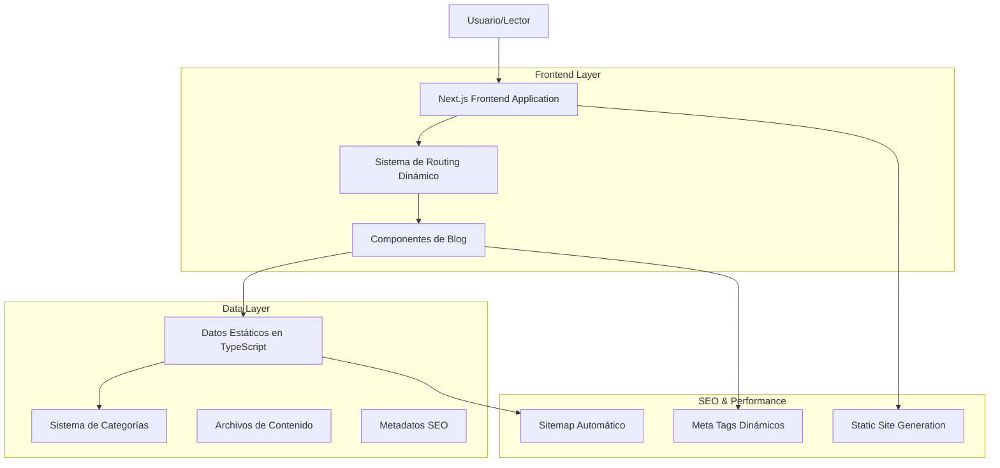
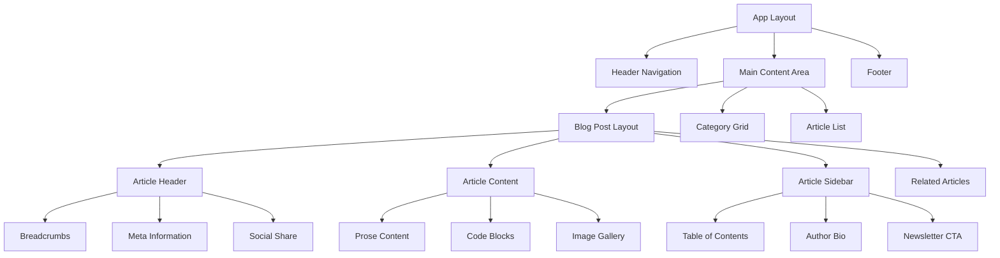

# Arquitectura Técnica para Sistema de Blog con 50 Artículos de IA

## 1. Arquitectura de Diseño



## 2. Descripción de Tecnologías

- **Frontend**: Next.js@14 + TypeScript + Tailwind CSS@3 + Lucide React Icons
- **Styling**: Tailwind CSS con configuración personalizada para tema académico
- **Componentes**: Componentes React reutilizables para blog posts, categorías y navegación
- **Routing**: Next.js App Router con rutas dinámicas para artículos individuales
- **SEO**: Next.js built-in SEO con meta tags dinámicos y sitemap automático
- **Performance**: Static Site Generation (SSG) para carga rápida de artículos
- **Deployment**: Vercel con optimización automática y CDN global

## 3. Definiciones de Rutas

| Ruta | Propósito |
|------|-----------|
| `/` | Página principal con artículos destacados y navegación por categorías |
| `/blog` | Lista completa de artículos con filtros y búsqueda |
| `/blog/[slug]` | Página individual de artículo con contenido completo |
| `/blog/categoria/[categoria]` | Listado de artículos por categoría específica |
| `/blog/tag/[tag]` | Listado de artículos por tag específico |
| `/escritura-ia` | Landing page especializada en escritura académica con IA |
| `/redaccion-profesional` | Landing page para redacción profesional |
| `/anti-deteccion-ia` | Landing page para técnicas anti-detección |
| `/sitemap.xml` | Sitemap automático para SEO |
| `/robots.txt` | Configuración para crawlers de búsqueda |

## 4. Estructura de Datos

### 4.1 Modelo de Datos Principal

```typescript
interface BlogPost {
  id: string
  title: string
  excerpt: string
  content?: string
  category: string
  subcategory?: string
  tags: string[]
  readTime: string
  date: string
  author: Author
  featured: boolean
  trending: boolean
  views?: number
  seoTitle?: string
  seoDescription?: string
  image?: string
  keywords?: string[]
  relatedPosts?: string[]
}

interface Category {
  id: string
  name: string
  description: string
  icon: string
  color: string
  subcategories: Subcategory[]
  seoTitle?: string
  seoDescription?: string
}

interface Subcategory {
  id: string
  name: string
  description: string
  postCount?: number
}

interface Author {
  name: string
  avatar: string
  bio: string
  social?: {
    twitter?: string
    linkedin?: string
    website?: string
  }
}

interface SEOMetadata {
  title: string
  description: string
  keywords: string[]
  ogImage?: string
  canonicalUrl?: string
  structuredData?: any
}
```

## 5. Arquitectura de Componentes



## 6. Estructura de Archivos del Proyecto

```
app/
├── blog/
│   ├── page.tsx                          # Lista principal de artículos
│   ├── [slug]/
│   │   └── page.tsx                      # Página individual de artículo
│   ├── categoria/
│   │   └── [categoria]/
│   │       └── page.tsx                  # Artículos por categoría
│   └── tag/
│       └── [tag]/
│           └── page.tsx                  # Artículos por tag
├── escritura-ia/
│   └── page.tsx                          # Landing especializada
├── components/
│   ├── blog/
│   │   ├── BlogPostLayout.tsx           # Layout principal de artículo
│   │   ├── ArticleCard.tsx              # Card de artículo en listas
│   │   ├── CategoryGrid.tsx             # Grid de categorías
│   │   ├── RelatedArticles.tsx          # Artículos relacionados
│   │   ├── TableOfContents.tsx          # Índice de contenidos
│   │   ├── SocialShare.tsx              # Botones de compartir
│   │   ├── Breadcrumbs.tsx              # Navegación breadcrumb
│   │   └── AuthorBio.tsx                # Información del autor
│   └── ui/
│       ├── Button.tsx                   # Componente de botón
│       ├── Badge.tsx                    # Badges para tags
│       └── SearchInput.tsx              # Buscador de artículos
├── lib/
│   ├── blog-data.ts                     # Datos de todos los artículos
│   ├── blog-utils.ts                    # Utilidades para blog
│   └── seo-utils.ts                     # Utilidades SEO
└── types/
    ├── blog.ts                          # Tipos TypeScript para blog
    └── seo.ts                           # Tipos para SEO
```

## 7. Configuración SEO Avanzada

### 7.1 Meta Tags Dinámicos

```typescript
// Ejemplo de generación de metadata para artículos
export async function generateMetadata({ params }: { params: { slug: string } }): Promise<Metadata> {
  const post = getPostBySlug(params.slug)
  
  return {
    title: post.seoTitle || post.title,
    description: post.seoDescription || post.excerpt,
    keywords: post.keywords?.join(', '),
    openGraph: {
      title: post.title,
      description: post.excerpt,
      type: 'article',
      publishedTime: post.date,
      authors: [post.author.name],
      tags: post.tags,
    },
    twitter: {
      card: 'summary_large_image',
      title: post.title,
      description: post.excerpt,
    },
    alternates: {
      canonical: `https://redcreativapro.com/blog/${params.slug}`,
    }
  }
}
```

### 7.2 Structured Data (JSON-LD)

```typescript
// Schema.org markup para artículos
const articleSchema = {
  "@context": "https://schema.org",
  "@type": "Article",
  "headline": post.title,
  "description": post.excerpt,
  "author": {
    "@type": "Person",
    "name": post.author.name
  },
  "datePublished": post.date,
  "dateModified": post.date,
  "publisher": {
    "@type": "Organization",
    "name": "Red Creativa Pro",
    "logo": {
      "@type": "ImageObject",
      "url": "https://redcreativapro.com/logo.png"
    }
  },
  "mainEntityOfPage": {
    "@type": "WebPage",
    "@id": `https://redcreativapro.com/blog/${post.id}`
  }
}
```

## 8. Optimización de Performance

### 8.1 Estrategias de Carga

- **Static Site Generation (SSG)**: Todos los artículos se generan en build time
- **Incremental Static Regeneration (ISR)**: Actualización automática cada 24 horas
- **Image Optimization**: Next.js Image component con lazy loading automático
- **Code Splitting**: Carga dinámica de componentes no críticos
- **Prefetching**: Links prefetch automático para navegación rápida

### 8.2 Configuración de Performance

```typescript
// next.config.js optimizado para blog
const nextConfig = {
  experimental: {
    optimizeCss: true,
  },
  images: {
    domains: ['i.ibb.co', 'images.unsplash.com'],
    formats: ['image/webp', 'image/avif'],
  },
  compress: true,
  poweredByHeader: false,
  generateEtags: false,
  trailingSlash: false,
}
```

## 9. Sistema de Búsqueda y Filtrado

### 9.1 Funcionalidades de Búsqueda

```typescript
interface SearchFilters {
  query?: string
  category?: string
  subcategory?: string
  tags?: string[]
  dateRange?: {
    from: Date
    to: Date
  }
  sortBy?: 'date' | 'views' | 'readTime' | 'relevance'
  sortOrder?: 'asc' | 'desc'
}

// Función de búsqueda y filtrado
function searchAndFilterPosts(posts: BlogPost[], filters: SearchFilters): BlogPost[] {
  return posts
    .filter(post => {
      if (filters.query) {
        const searchText = `${post.title} ${post.excerpt} ${post.tags.join(' ')}`.toLowerCase()
        return searchText.includes(filters.query.toLowerCase())
      }
      return true
    })
    .filter(post => filters.category ? post.category === filters.category : true)
    .filter(post => filters.subcategory ? post.subcategory === filters.subcategory : true)
    .filter(post => {
      if (filters.tags?.length) {
        return filters.tags.some(tag => post.tags.includes(tag))
      }
      return true
    })
    .sort((a, b) => {
      switch (filters.sortBy) {
        case 'date':
          return filters.sortOrder === 'desc' 
            ? new Date(b.date).getTime() - new Date(a.date).getTime()
            : new Date(a.date).getTime() - new Date(b.date).getTime()
        case 'views':
          return filters.sortOrder === 'desc' 
            ? (b.views || 0) - (a.views || 0)
            : (a.views || 0) - (b.views || 0)
        default:
          return 0
      }
    })
}
```

## 10. Analytics y Métricas

### 10.1 Tracking de Contenido

```typescript
// Eventos de analytics para artículos
interface BlogAnalytics {
  trackArticleView: (articleId: string, title: string) => void
  trackReadingProgress: (articleId: string, progress: number) => void
  trackSocialShare: (articleId: string, platform: string) => void
  trackSearchQuery: (query: string, resultsCount: number) => void
  trackCategoryView: (category: string) => void
}

// Implementación con Google Analytics 4
const analytics: BlogAnalytics = {
  trackArticleView: (articleId, title) => {
    gtag('event', 'page_view', {
      page_title: title,
      page_location: window.location.href,
      content_group1: 'Blog Article',
      custom_parameter_1: articleId
    })
  },
  
  trackReadingProgress: (articleId, progress) => {
    gtag('event', 'scroll', {
      percent_scrolled: progress,
      article_id: articleId
    })
  },
  
  trackSocialShare: (articleId, platform) => {
    gtag('event', 'share', {
      method: platform,
      content_type: 'article',
      item_id: articleId
    })
  }
}
```

## 11. Deployment y CI/CD

### 11.1 Configuración de Vercel

```json
{
  "version": 2,
  "builds": [
    {
      "src": "package.json",
      "use": "@vercel/next"
    }
  ],
  "routes": [
    {
      "src": "/blog/(.*)",
      "headers": {
        "cache-control": "s-maxage=86400, stale-while-revalidate"
      }
    }
  ],
  "env": {
    "NODE_ENV": "production"
  }
}
```

### 11.2 Automatización de Contenido

```typescript
// Script para generar automáticamente páginas de artículos
interface ArticleGenerator {
  generateArticlePage: (post: BlogPost) => string
  generateCategoryPage: (category: Category) => string
  updateSitemap: (posts: BlogPost[]) => void
  optimizeImages: (imagePaths: string[]) => Promise<void>
}

// Workflow de publicación automatizada
const publishWorkflow = {
  1: 'Validar estructura del artículo',
  2: 'Generar página Next.js',
  3: 'Optimizar imágenes',
  4: 'Actualizar sitemap',
  5: 'Regenerar páginas estáticas',
  6: 'Deploy a Vercel',
  7: 'Notificar en redes sociales'
}
```

Esta arquitectura técnica proporciona una base sólida y escalable para el sistema de blog, optimizada específicamente para los 50 artículos de escritura con IA y contenido académico, con enfoque en performance, SEO y experiencia de usuario.