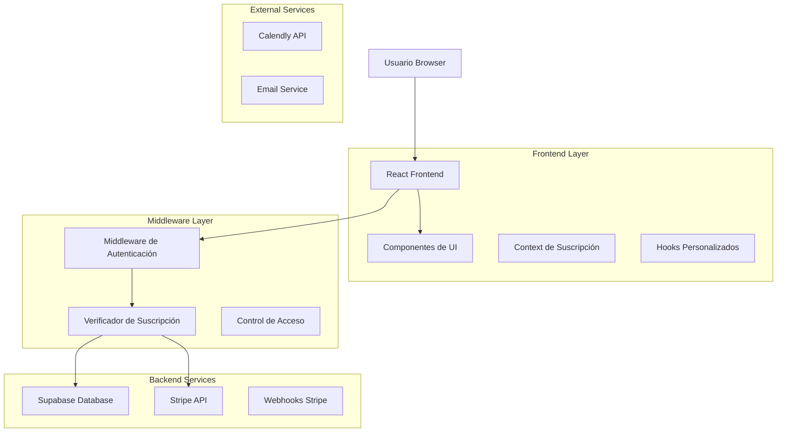
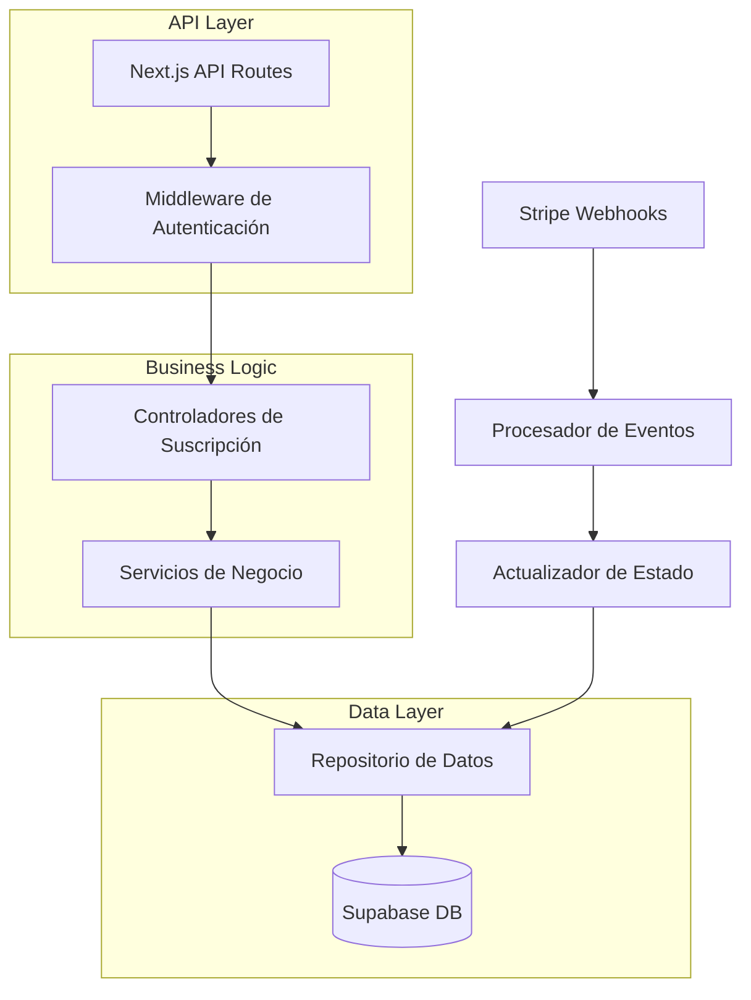
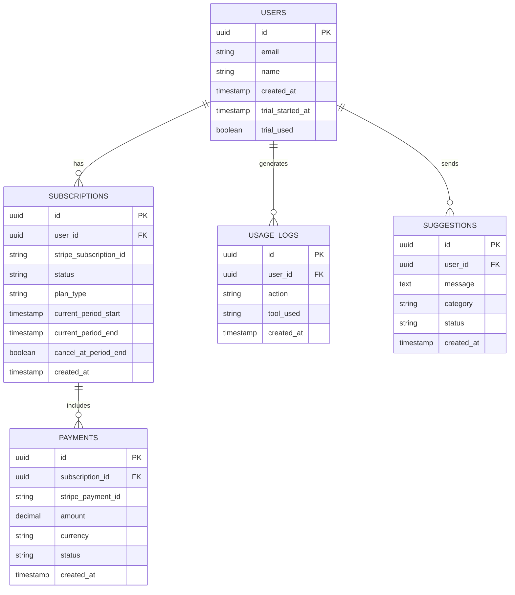

# Arquitectura Técnica - Sistema de Suscripciones

## 1. Arquitectura del Sistema



## 2. Stack Tecnológico

- **Frontend**: React@18 + TypeScript + Tailwind CSS + Next.js@14
- **Backend**: Next.js API Routes + Supabase
- **Base de Datos**: Supabase (PostgreSQL)
- **Pagos**: Stripe + Webhooks
- **Autenticación**: Supabase Auth
- **Estado Global**: React Context + Custom Hooks

## 3. Definición de Rutas

| Ruta | Propósito | Acceso |
|------|-----------|--------|
| `/dashboard` | Panel principal con estado de suscripción | Autenticado |
| `/planes` | Página de planes y precios | Público |
| `/suscripcion/estado` | Estado detallado de suscripción | Autenticado |
| `/contacto/creador` | Contacto directo con el creador | Público |
| `/cancelar` | Centro de cancelación | Suscriptor activo |
| `/herramientas/*` | Todas las herramientas premium | Premium activo |
| `/api/subscription/*` | APIs de gestión de suscripción | Interno |

## 4. APIs del Sistema

### 4.1 APIs Core de Suscripción

**Verificación de Estado de Suscripción**
```
GET /api/subscription/status
```

Request:
| Parámetro | Tipo | Requerido | Descripción |
|-----------|------|-----------|-------------|
| userId | string | true | ID del usuario autenticado |

Response:
| Campo | Tipo | Descripción |
|-------|------|-------------|
| isActive | boolean | Si la suscripción está activa |
| planType | string | 'free', 'premium', 'expired' |
| daysRemaining | number | Días restantes (-1 si ilimitado) |
| expirationDate | string | Fecha de expiración ISO |
| canAccessTools | boolean | Si puede acceder a herramientas |

**Creación de Checkout de Stripe**
```
POST /api/subscription/create-checkout
```

Request:
| Parámetro | Tipo | Requerido | Descripción |
|-----------|------|-----------|-------------|
| priceId | string | true | ID del precio en Stripe |
| userId | string | true | ID del usuario |
| successUrl | string | true | URL de éxito |
| cancelUrl | string | true | URL de cancelación |

**Cancelación de Suscripción**
```
POST /api/subscription/cancel
```

Request:
| Parámetro | Tipo | Requerido | Descripción |
|-----------|------|-----------|-------------|
| subscriptionId | string | true | ID de suscripción Stripe |
| reason | string | false | Motivo de cancelación |
| feedback | string | false | Comentarios del usuario |

### 4.2 APIs de Contacto

**Envío de Sugerencias**
```
POST /api/contact/suggestion
```

Request:
| Parámetro | Tipo | Requerido | Descripción |
|-----------|------|-----------|-------------|
| userId | string | true | ID del usuario |
| message | string | true | Mensaje de sugerencia |
| category | string | false | Categoría de sugerencia |

## 5. Arquitectura del Servidor



## 6. Modelo de Datos

### 6.1 Diagrama de Entidades



### 6.2 DDL (Data Definition Language)

**Tabla de Usuarios Extendida**
```sql
-- Extender tabla users existente
ALTER TABLE users ADD COLUMN IF NOT EXISTS trial_started_at TIMESTAMP WITH TIME ZONE;
ALTER TABLE users ADD COLUMN IF NOT EXISTS trial_used BOOLEAN DEFAULT FALSE;

-- Tabla de Suscripciones
CREATE TABLE subscriptions (
    id UUID PRIMARY KEY DEFAULT gen_random_uuid(),
    user_id UUID REFERENCES users(id) ON DELETE CASCADE,
    stripe_subscription_id VARCHAR(255) UNIQUE,
    status VARCHAR(50) NOT NULL CHECK (status IN ('active', 'canceled', 'past_due', 'unpaid')),
    plan_type VARCHAR(50) NOT NULL CHECK (plan_type IN ('monthly', 'yearly', 'lifetime')),
    current_period_start TIMESTAMP WITH TIME ZONE NOT NULL,
    current_period_end TIMESTAMP WITH TIME ZONE NOT NULL,
    cancel_at_period_end BOOLEAN DEFAULT FALSE,
    created_at TIMESTAMP WITH TIME ZONE DEFAULT NOW(),
    updated_at TIMESTAMP WITH TIME ZONE DEFAULT NOW()
);

-- Tabla de Pagos
CREATE TABLE payments (
    id UUID PRIMARY KEY DEFAULT gen_random_uuid(),
    subscription_id UUID REFERENCES subscriptions(id) ON DELETE CASCADE,
    stripe_payment_id VARCHAR(255) UNIQUE NOT NULL,
    amount DECIMAL(10,2) NOT NULL,
    currency VARCHAR(3) DEFAULT 'EUR',
    status VARCHAR(50) NOT NULL,
    created_at TIMESTAMP WITH TIME ZONE DEFAULT NOW()
);

-- Tabla de Logs de Uso
CREATE TABLE usage_logs (
    id UUID PRIMARY KEY DEFAULT gen_random_uuid(),
    user_id UUID REFERENCES users(id) ON DELETE CASCADE,
    action VARCHAR(100) NOT NULL,
    tool_used VARCHAR(100),
    metadata JSONB,
    created_at TIMESTAMP WITH TIME ZONE DEFAULT NOW()
);

-- Tabla de Sugerencias
CREATE TABLE suggestions (
    id UUID PRIMARY KEY DEFAULT gen_random_uuid(),
    user_id UUID REFERENCES users(id) ON DELETE CASCADE,
    message TEXT NOT NULL,
    category VARCHAR(50),
    status VARCHAR(20) DEFAULT 'pending' CHECK (status IN ('pending', 'reviewed', 'implemented')),
    admin_response TEXT,
    created_at TIMESTAMP WITH TIME ZONE DEFAULT NOW()
);

-- Índices para optimización
CREATE INDEX idx_subscriptions_user_id ON subscriptions(user_id);
CREATE INDEX idx_subscriptions_stripe_id ON subscriptions(stripe_subscription_id);
CREATE INDEX idx_subscriptions_status ON subscriptions(status);
CREATE INDEX idx_payments_subscription_id ON payments(subscription_id);
CREATE INDEX idx_usage_logs_user_id ON usage_logs(user_id);
CREATE INDEX idx_usage_logs_created_at ON usage_logs(created_at DESC);
CREATE INDEX idx_suggestions_user_id ON suggestions(user_id);
CREATE INDEX idx_suggestions_status ON suggestions(status);

-- Políticas de seguridad RLS (Row Level Security)
ALTER TABLE subscriptions ENABLE ROW LEVEL SECURITY;
ALTER TABLE payments ENABLE ROW LEVEL SECURITY;
ALTER TABLE usage_logs ENABLE ROW LEVEL SECURITY;
ALTER TABLE suggestions ENABLE ROW LEVEL SECURITY;

-- Políticas para usuarios autenticados
CREATE POLICY "Users can view own subscriptions" ON subscriptions
    FOR SELECT USING (auth.uid() = user_id);

CREATE POLICY "Users can view own payments" ON payments
    FOR SELECT USING (
        EXISTS (
            SELECT 1 FROM subscriptions 
            WHERE subscriptions.id = payments.subscription_id 
            AND subscriptions.user_id = auth.uid()
        )
    );

CREATE POLICY "Users can insert own usage logs" ON usage_logs
    FOR INSERT WITH CHECK (auth.uid() = user_id);

CREATE POLICY "Users can view own usage logs" ON usage_logs
    FOR SELECT USING (auth.uid() = user_id);

CREATE POLICY "Users can insert own suggestions" ON suggestions
    FOR INSERT WITH CHECK (auth.uid() = user_id);

CREATE POLICY "Users can view own suggestions" ON suggestions
    FOR SELECT USING (auth.uid() = user_id);

-- Permisos para roles
GRANT SELECT, INSERT, UPDATE ON subscriptions TO authenticated;
GRANT SELECT ON payments TO authenticated;
GRANT SELECT, INSERT ON usage_logs TO authenticated;
GRANT SELECT, INSERT ON suggestions TO authenticated;

-- Datos iniciales de configuración
INSERT INTO public.app_config (key, value, description) VALUES
('free_trial_days', '3', 'Días de prueba gratuita'),
('creator_phone', '+34 686887074', 'Teléfono del creador'),
('creator_photo_url', 'https://drive.google.com/file/d/17tDmIvcSeRPIIvsfQ-gzlEo58i9_xQFw/view?usp=sharing', 'URL de la foto del creador'),
('calendly_url', 'https://calendly.com/tu-usuario', 'URL para agendar reuniones')
ON CONFLICT (key) DO UPDATE SET value = EXCLUDED.value;
```

## 7. Funciones y Triggers

```sql
-- Función para calcular días restantes
CREATE OR REPLACE FUNCTION calculate_days_remaining(user_uuid UUID)
RETURNS INTEGER AS $$
DECLARE
    subscription_end TIMESTAMP WITH TIME ZONE;
    trial_start TIMESTAMP WITH TIME ZONE;
    days_remaining INTEGER;
BEGIN
    -- Verificar suscripción activa
    SELECT current_period_end INTO subscription_end
    FROM subscriptions 
    WHERE user_id = user_uuid AND status = 'active'
    ORDER BY created_at DESC LIMIT 1;
    
    IF subscription_end IS NOT NULL THEN
        -- Usuario con suscripción activa
        days_remaining := EXTRACT(DAY FROM (subscription_end - NOW()));
        RETURN GREATEST(days_remaining, 0);
    END IF;
    
    -- Verificar período de prueba
    SELECT trial_started_at INTO trial_start
    FROM users WHERE id = user_uuid;
    
    IF trial_start IS NOT NULL THEN
        days_remaining := 3 - EXTRACT(DAY FROM (NOW() - trial_start));
        RETURN GREATEST(days_remaining, 0);
    END IF;
    
    -- Usuario nuevo, iniciar prueba
    UPDATE users SET trial_started_at = NOW() WHERE id = user_uuid;
    RETURN 3;
END;
$$ LANGUAGE plpgsql;

-- Trigger para actualizar timestamp
CREATE OR REPLACE FUNCTION update_updated_at_column()
RETURNS TRIGGER AS $$
BEGIN
    NEW.updated_at = NOW();
    RETURN NEW;
END;
$$ LANGUAGE plpgsql;

CREATE TRIGGER update_subscriptions_updated_at
    BEFORE UPDATE ON subscriptions
    FOR EACH ROW EXECUTE FUNCTION update_updated_at_column();
```