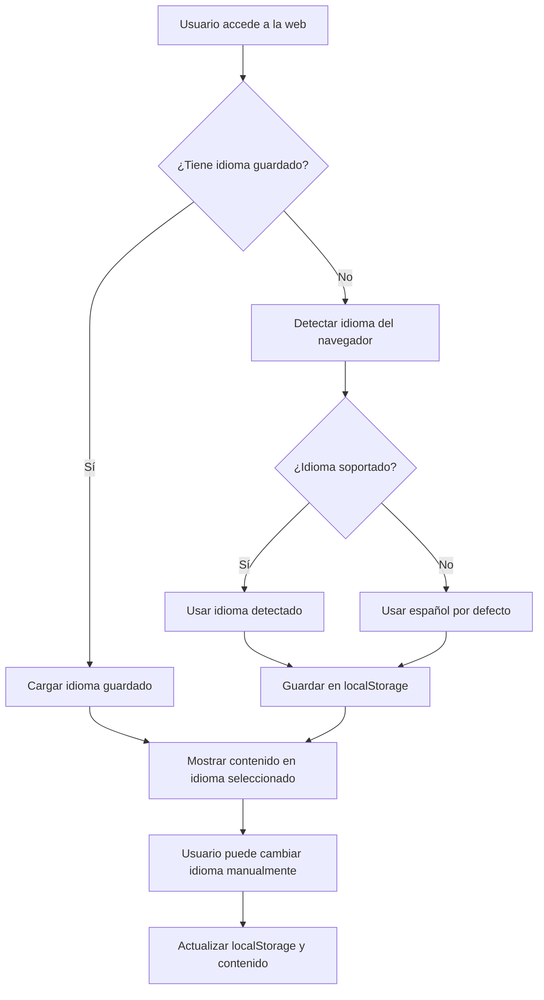

# Requisitos de Internacionalización (i18n) - Red Creativa Pro

## 1. Resumen del Proyecto

Implementar un sistema de internacionalización completo para la aplicación de escritura con IA que permita soportar múltiples idiomas sin modificar las rutas existentes. El sistema debe detectar automáticamente el idioma del navegador del usuario y proporcionar una experiencia fluida de cambio de idioma.

## 2. Características Principales

### 2.1 Idiomas Soportados
- **Español** (es) - Idioma por defecto
- **Inglés** (en) - Mercado internacional principal
- **Alemán** (de) - Mercado europeo
- **Francés** (fr) - Mercado francófono
- **Chino Simplificado** (zh) - Mercado asiático

### 2.2 Funcionalidades del Sistema i18n

| Característica | Descripción | Prioridad |
|----------------|-------------|-----------|
| Detección automática | Detecta idioma del navegador al primer acceso | Alta |
| Persistencia local | Guarda preferencia en localStorage | Alta |
| Selector de idioma | Componente UI para cambiar idioma manualmente | Alta |
| Traducción dinámica | Cambio de idioma sin recargar página | Alta |
| Rutas sin prefijo | Mantener rutas actuales sin /es, /en, etc. | Crítica |
| SEO multiidioma | Meta tags y contenido optimizado por idioma | Media |
| Contenido dinámico | Traducción de contenido generado por IA | Media |

### 2.3 Detalles de Páginas Afectadas

Todas las páginas existentes necesitarán traducción:

1. **Página Principal** (/): Hero section, navegación, características principales
2. **Autenticación** (/auth/login, /auth/signup): Formularios y mensajes
3. **Dashboard** (/dashboard): Interfaz principal de usuario
4. **Escritor IA** (/escritor-ia): Herramientas de escritura
5. **Plantillas** (/plantillas): Catálogo de plantillas
6. **Planes** (/planes): Información de suscripciones
7. **Blog** (/blog): Artículos y contenido
8. **Contacto** (/contacto): Formularios de contacto
9. **Centro de Ayuda** (/centro-ayuda): Documentación y soporte

## 3. Flujo de Usuario Principal

### Detección y Configuración de Idioma

## 4. Diseño de Interfaz

### 4.1 Estilo del Selector de Idioma
- **Ubicación**: Esquina superior derecha del header
- **Estilo**: Dropdown minimalista con banderas e iconos
- **Colores**: Consistente con el tema actual (modo claro/oscuro)
- **Animación**: Transición suave al cambiar idioma
- **Responsive**: Adaptable a dispositivos móviles

### 4.2 Elementos de UI por Traducir

| Componente | Elementos a Traducir | Notas Especiales |
|------------|---------------------|------------------|
| Header/Navegación | Menús, botones, enlaces | Mantener estructura |
| Formularios | Labels, placeholders, validaciones | Incluir mensajes de error |
| Botones de Acción | Textos de CTA, confirmaciones | Mantener longitud similar |
| Mensajes del Sistema | Notificaciones, alertas, toasts | Contexto importante |
| Footer | Enlaces legales, información de contacto | Adaptar a regulaciones locales |

### 4.3 Consideraciones de Diseño Responsive
- **Móvil**: Selector compacto en menú hamburguesa
- **Tablet**: Selector visible en barra superior
- **Desktop**: Selector completo con texto e iconos
- **Longitud de texto**: Considerar expansión de texto en alemán (~30% más largo)