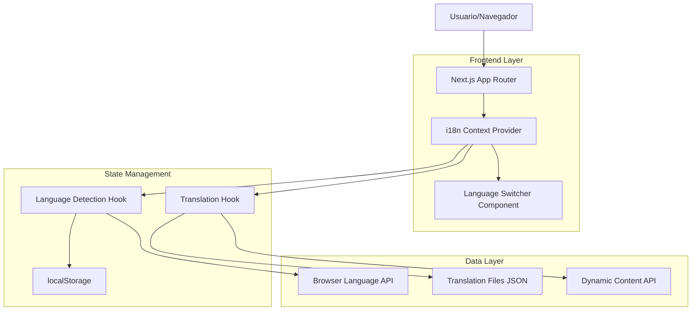
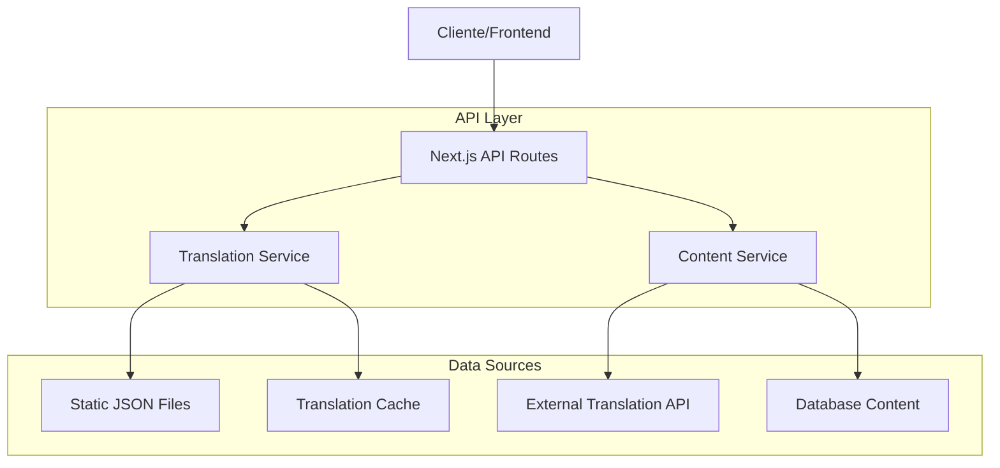
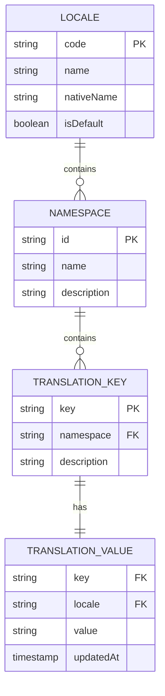

# Arquitectura Técnica - Sistema de Internacionalización

## 1. Diseño de Arquitectura



## 2. Descripción de Tecnologías

- **Frontend**: Next.js 15 + React 18 + TypeScript + Tailwind CSS
- **Estado**: React Context API + Custom Hooks
- **Almacenamiento**: localStorage (navegador)
- **Detección**: Navigator.language API
- **Traducciones**: Archivos JSON estáticos + API dinámica

## 3. Definición de Rutas

| Ruta | Propósito | Traducción |
|------|-----------|------------|
| / | Página principal | Hero, navegación, características |
| /auth/login | Página de login | Formularios, validaciones |
| /auth/signup | Página de registro | Formularios, términos |
| /dashboard | Panel principal | Interfaz completa |
| /escritor-ia | Herramienta de escritura | UI y prompts |
| /plantillas | Catálogo de plantillas | Títulos y descripciones |
| /planes | Planes de suscripción | Precios y características |
| /blog | Blog de contenido | Títulos y metadatos |
| /contacto | Formulario de contacto | Labels y mensajes |

## 4. Definiciones de API

### 4.1 API de Traducciones

**Obtener traducciones por idioma**
```
GET /api/translations/[locale]
```

Request:
| Parámetro | Tipo | Requerido | Descripción |
|-----------|------|-----------|-------------|
| locale | string | true | Código de idioma (es, en, de, fr, zh) |

Response:
| Campo | Tipo | Descripción |
|-------|------|-------------|
| locale | string | Código de idioma |
| translations | object | Objeto con todas las traducciones |

Ejemplo:
```json
{
  "locale": "en",
  "translations": {
    "common": {
      "welcome": "Welcome",
      "login": "Login",
      "signup": "Sign Up"
    },
    "dashboard": {
      "title": "Dashboard",
      "createNew": "Create New"
    }
  }
}
```

### 4.2 API de Contenido Dinámico

**Traducir contenido generado**
```
POST /api/translate
```

Request:
| Parámetro | Tipo | Requerido | Descripción |
|-----------|------|-----------|-------------|
| text | string | true | Texto a traducir |
| targetLang | string | true | Idioma destino |
| sourceLang | string | false | Idioma origen (auto-detectar) |

Response:
```json
{
  "originalText": "Hola mundo",
  "translatedText": "Hello world",
  "sourceLang": "es",
  "targetLang": "en"
}
```

## 5. Arquitectura del Servidor



## 6. Modelo de Datos

### 6.1 Estructura de Archivos de Traducción



### 6.2 Estructura de Archivos JSON

**Estructura de directorios:**
```
/public/locales/
├── es/
│   ├── common.json
│   ├── auth.json
│   ├── dashboard.json
│   └── errors.json
├── en/
│   ├── common.json
│   ├── auth.json
│   ├── dashboard.json
│   └── errors.json
├── de/
├── fr/
└── zh/
```

**Ejemplo de archivo common.json:**
```json
{
  "navigation": {
    "home": "Inicio",
    "dashboard": "Panel",
    "templates": "Plantillas",
    "plans": "Planes",
    "blog": "Blog",
    "contact": "Contacto",
    "help": "Ayuda"
  },
  "actions": {
    "login": "Iniciar Sesión",
    "signup": "Registrarse",
    "logout": "Cerrar Sesión",
    "save": "Guardar",
    "cancel": "Cancelar",
    "delete": "Eliminar",
    "edit": "Editar",
    "create": "Crear"
  },
  "messages": {
    "loading": "Cargando...",
    "error": "Ha ocurrido un error",
    "success": "Operación exitosa",
    "confirm": "¿Estás seguro?",
    "noData": "No hay datos disponibles"
  }
}
```

**Configuración de idiomas soportados:**
```typescript
// /app/lib/i18n/config.ts
export const SUPPORTED_LOCALES = {
  es: {
    code: 'es',
    name: 'Español',
    nativeName: 'Español',
    flag: '🇪🇸',
    isDefault: true
  },
  en: {
    code: 'en',
    name: 'English',
    nativeName: 'English',
    flag: '🇺🇸',
    isDefault: false
  },
  de: {
    code: 'de',
    name: 'German',
    nativeName: 'Deutsch',
    flag: '🇩🇪',
    isDefault: false
  },
  fr: {
    code: 'fr',
    name: 'French',
    nativeName: 'Français',
    flag: '🇫🇷',
    isDefault: false
  },
  zh: {
    code: 'zh',
    name: 'Chinese',
    nativeName: '中文',
    flag: '🇨🇳',
    isDefault: false
  }
} as const;

export const DEFAULT_LOCALE = 'es';
export const FALLBACK_LOCALE = 'es';
```