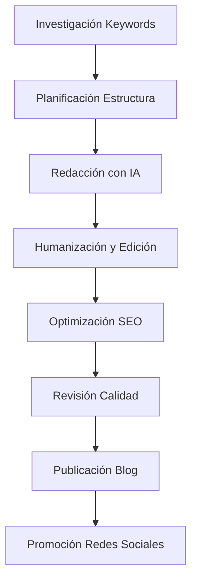

# Requisitos para 50 Artículos de Escritura con IA y Contenido Académico

## 1. Visión General del Proyecto

Este documento define los requisitos para crear 50 artículos de blog especializados en escritura con inteligencia artificial, redacción profesional y escritura académica. El objetivo es expandir el contenido del blog existente con artículos únicos, SEO-optimizados y de alta calidad que posicionen la plataforma como referente en escritura asistida por IA.

**Problema a resolver:** Necesidad de contenido especializado que enseñe técnicas avanzadas de escritura con IA, especialmente para contextos académicos y profesionales donde la detección de IA es una preocupación.

**Audiencia objetivo:** Estudiantes universitarios, investigadores, profesionales académicos, escritores freelance y creadores de contenido que buscan usar IA de manera ética y efectiva.

**Valor del mercado:** Posicionamiento como la plataforma líder en español para escritura académica y profesional asistida por IA.

## 2. Características Principales

### 2.1 Roles de Usuario
No aplica - el contenido será público y accesible para todos los visitantes del blog.

### 2.2 Módulos de Características

Nuestros requisitos de contenido consisten en las siguientes categorías principales:

1. **Escritura Académica con IA**: Técnicas para trabajos universitarios, tesis, ensayos y papers de investigación
2. **Redacción Profesional**: Metodologías para contenido corporativo, informes y documentos técnicos  
3. **Herramientas y Técnicas Anti-Detección**: Estrategias para humanizar texto generado por IA
4. **Optimización SEO**: Artículos diseñados para posicionar en búsquedas específicas
5. **Casos de Uso Prácticos**: Ejemplos reales y aplicaciones específicas por disciplina

### 2.3 Detalles de Contenido

| Categoría | Subcategoría | Descripción de Características |
|-----------|--------------|-------------------------------|
| Escritura Académica | Fundamentos | Introducción a IA para estudiantes, ética académica, mejores prácticas |
| Escritura Académica | Técnicas Avanzadas | Metodologías específicas por disciplina, investigación asistida por IA |
| Escritura Académica | Anti-Detección | Técnicas de humanización, herramientas de parafraseo, revisión manual |
| Redacción Profesional | Documentos Técnicos | Informes, manuales, documentación técnica con IA |
| Redacción Profesional | Comunicación Corporativa | Emails, propuestas, presentaciones empresariales |
| Herramientas IA | Comparativas | Análisis detallado de ChatGPT, Claude, Gemini para uso académico |
| Herramientas IA | Tutoriales | Guías paso a paso para cada herramienta principal |
| SEO y Posicionamiento | Keywords Académicas | Investigación y optimización para términos educativos |
| SEO y Posicionamiento | Contenido Long-tail | Artículos de 3000+ palabras para posicionamiento |

## 3. Proceso Principal

**Flujo de Creación de Contenido:**

1. **Investigación de Keywords**: Identificar términos de búsqueda relevantes para cada artículo
2. **Planificación de Contenido**: Estructurar el artículo con títulos, subtítulos y puntos clave
3. **Redacción con IA**: Usar herramientas IA para generar contenido base siguiendo las mejores prácticas
4. **Humanización y Edición**: Revisar, editar y personalizar el contenido para evitar detección
5. **Optimización SEO**: Ajustar meta tags, densidad de keywords y estructura
6. **Revisión de Calidad**: Verificar originalidad, coherencia y valor educativo
7. **Publicación y Promoción**: Integrar al blog y crear contenido promocional

## 4. Diseño de Interfaz de Usuario

### 4.1 Estilo de Diseño

- **Colores primarios**: Azul académico (#1e40af), Verde profesional (#059669)
- **Colores secundarios**: Gris neutro (#6b7280), Blanco (#ffffff)
- **Estilo de botones**: Redondeados con sombras sutiles, hover effects suaves
- **Tipografía**: Inter para títulos (24px-32px), Open Sans para cuerpo (16px-18px)
- **Layout**: Diseño limpio tipo revista académica, navegación superior fija
- **Iconos**: Lucide React icons, estilo minimalista y profesional
- **Animaciones**: Transiciones suaves de 300ms, efectos de hover discretos

### 4.2 Diseño de Páginas

| Página | Módulo | Elementos UI |
|--------|--------|--------------|
| Artículo Individual | Header | Título principal (H1), breadcrumbs, fecha, autor, tiempo de lectura, tags |
| Artículo Individual | Contenido | Texto estructurado con H2/H3, imágenes, código destacado, citas |
| Artículo Individual | Sidebar | Tabla de contenidos, artículos relacionados, CTA suscripción |
| Artículo Individual | Footer | Compartir en redes, comentarios, navegación anterior/siguiente |
| Lista de Artículos | Grid | Cards con imagen, título, excerpt, categoría, fecha |
| Lista de Artículos | Filtros | Búsqueda, categorías, tags, ordenamiento por fecha/popularidad |

### 4.3 Responsividad

El diseño será mobile-first con adaptación completa para desktop. Optimización táctil para dispositivos móviles, con especial atención a la legibilidad en pantallas pequeñas para estudiantes que leen desde móviles.

## 5. Lista de 50 Artículos Propuestos

### Categoría: Escritura Académica con IA (15 artículos)

1. **"Cómo Escribir Ensayos Universitarios con IA sin ser Detectado en 2025"**
   - Keywords: escribir ensayos con IA, detectar IA ensayos, ChatGPT universidad
   - Enfoque: Técnicas de humanización, herramientas anti-detección

2. **"Guía Completa: Tesis de Grado con Inteligencia Artificial - Metodología Paso a Paso"**
   - Keywords: tesis con IA, escribir tesis ChatGPT, IA investigación académica
   - Enfoque: Proceso completo desde investigación hasta redacción

3. **"10 Técnicas Avanzadas para Humanizar Textos Generados por IA"**
   - Keywords: humanizar texto IA, parafrasear IA, evitar detección IA
   - Enfoque: Métodos específicos de edición y reescritura

4. **"Papers de Investigación con IA: Cómo Mantener la Integridad Académica"**
   - Keywords: papers investigación IA, ética académica IA, ChatGPT investigación
   - Enfoque: Balance entre eficiencia y honestidad académica

5. **"Revisión Bibliográfica Automatizada: IA para Estado del Arte"**
   - Keywords: revisión bibliográfica IA, estado del arte IA, investigación automática
   - Enfoque: Herramientas para análisis de literatura académica

6. **"Citas y Referencias Académicas con IA: APA, MLA, Chicago"**
   - Keywords: citas académicas IA, referencias APA IA, formato académico
   - Enfoque: Automatización de formatos de citación

7. **"Análisis de Datos Cualitativos con IA para Investigación"**
   - Keywords: análisis cualitativo IA, investigación cualitativa IA, NVivo alternativas
   - Enfoque: Herramientas IA para análisis de entrevistas y textos

8. **"Propuestas de Investigación Ganadoras con Inteligencia Artificial"**
   - Keywords: propuesta investigación IA, grant writing IA, financiamiento investigación
   - Enfoque: Estructura y persuasión en propuestas académicas

9. **"Metodología de Investigación Asistida por IA: Guía Práctica"**
   - Keywords: metodología investigación IA, diseño investigación IA, métodos cuantitativos
   - Enfoque: Diseño de estudios con apoyo de IA

10. **"Presentaciones Académicas Impactantes con IA"**
    - Keywords: presentaciones académicas IA, PowerPoint IA, conferencias académicas
    - Enfoque: Creación de slides y guiones para conferencias

11. **"Abstracts y Resúmenes Ejecutivos Perfectos con IA"**
    - Keywords: abstract IA, resumen ejecutivo IA, síntesis académica
    - Enfoque: Técnicas para condensar información académica

12. **"Traducción Académica con IA: Inglés-Español para Papers"**
    - Keywords: traducción académica IA, papers inglés español, DeepL académico
    - Enfoque: Herramientas especializadas en traducción científica

13. **"Detección de Plagio vs IA: Cómo Navegar las Nuevas Políticas Universitarias"**
    - Keywords: plagio IA universidad, políticas IA académicas, Turnitin IA
    - Enfoque: Comprensión de regulaciones institucionales

14. **"Colaboración Académica con IA: Coautoría y Trabajo en Equipo"**
    - Keywords: colaboración académica IA, coautoría IA, trabajo equipo investigación
    - Enfoque: Herramientas para investigación colaborativa

15. **"Escritura Científica en Diferentes Disciplinas con IA"**
    - Keywords: escritura científica IA, disciplinas académicas IA, STEM humanidades
    - Enfoque: Adaptación por área de conocimiento

### Categoría: Redacción Profesional (12 artículos)

16. **"Informes Ejecutivos Profesionales con IA: Plantillas y Estrategias"**
    - Keywords: informes ejecutivos IA, reportes empresariales IA, documentos corporativos
    - Enfoque: Estructura y contenido para informes de negocio

17. **"Propuestas Comerciales Ganadoras Generadas con IA"**
    - Keywords: propuestas comerciales IA, business proposals IA, ventas B2B
    - Enfoque: Técnicas de persuasión y estructura comercial

18. **"Manuales Técnicos y Documentación con Inteligencia Artificial"**
    - Keywords: manuales técnicos IA, documentación software IA, technical writing
    - Enfoque: Claridad y precisión en documentación técnica

19. **"Comunicación Interna Empresarial Optimizada con IA"**
    - Keywords: comunicación interna IA, emails corporativos IA, memos empresariales
    - Enfoque: Eficiencia en comunicación organizacional

20. **"Contenido para LinkedIn que Genera Leads con IA"**
    - Keywords: LinkedIn IA, contenido profesional IA, networking digital
    - Enfoque: Personal branding y generación de oportunidades

21. **"Currículums y Cartas de Presentación con IA que Consiguen Entrevistas"**
    - Keywords: currículum IA, CV IA, carta presentación IA, búsqueda empleo
    - Enfoque: Optimización para ATS y reclutadores

22. **"Presentaciones de Ventas Persuasivas con Inteligencia Artificial"**
    - Keywords: presentaciones ventas IA, pitch deck IA, sales presentation
    - Enfoque: Storytelling y persuasión comercial

23. **"Newsletters Corporativas Automatizadas con IA"**
    - Keywords: newsletter corporativo IA, email marketing B2B, comunicación empleados
    - Enfoque: Automatización de comunicación interna

24. **"Casos de Estudio Empresariales Convincentes con IA"**
    - Keywords: casos estudio IA, case studies IA, marketing contenidos B2B
    - Enfoque: Estructura narrativa para casos de éxito

25. **"Políticas y Procedimientos Empresariales Claros con IA"**
    - Keywords: políticas empresariales IA, procedimientos IA, compliance documentación
    - Enfoque: Claridad legal y operacional

26. **"Contenido para Sitios Web Corporativos con IA"**
    - Keywords: contenido web corporativo IA, copywriting empresarial IA, páginas empresa
    - Enfoque: SEO y conversión para sitios corporativos

27. **"Comunicados de Prensa Efectivos Generados con IA"**
    - Keywords: comunicados prensa IA, PR IA, relaciones públicas IA
    - Enfoque: Estructura periodística y distribución mediática

### Categoría: Herramientas y Técnicas Anti-Detección (10 artículos)

28. **"Bypass AI Detection: 15 Técnicas Probadas para 2025"**
    - Keywords: bypass AI detection, evitar detección IA, humanizar texto IA
    - Enfoque: Métodos actualizados y efectivos

29. **"Comparativa: Los Mejores Humanizadores de Texto IA del Mercado"**
    - Keywords: humanizador texto IA, parafrasear IA, reescribir IA
    - Enfoque: Análisis de herramientas especializadas

30. **"Quillbot vs Paraphrase Tool vs Spinbot: ¿Cuál Elegir?"**
    - Keywords: Quillbot alternativas, paraphrase tool comparación, spinbot review
    - Enfoque: Comparativa detallada de herramientas

31. **"Técnicas de Reescritura Manual para Textos Generados por IA"**
    - Keywords: reescritura manual IA, edición texto IA, humanización manual
    - Enfoque: Métodos manuales sin herramientas

32. **"Cómo Funciona la Detección de IA: GPTZero, Turnitin, Copyleaks"**
    - Keywords: detección IA funcionamiento, GPTZero análisis, Turnitin IA
    - Enfoque: Comprensión técnica de detectores

33. **"Prompts Avanzados para Generar Texto Más Humano"**
    - Keywords: prompts humanizar IA, ChatGPT prompts humanos, Claude prompts naturales
    - Enfoque: Ingeniería de prompts para naturalidad

34. **"Variación de Estilo y Tono para Evitar Patrones de IA"**
    - Keywords: variación estilo IA, tono escritura IA, personalidad texto IA
    - Enfoque: Diversificación estilística

35. **"Integración de Fuentes y Referencias para Autenticidad"**
    - Keywords: fuentes IA autenticidad, referencias texto IA, credibilidad contenido
    - Enfoque: Respaldo documental del contenido

36. **"Errores Comunes que Delatan el Uso de IA en Textos"**
    - Keywords: errores IA textos, señales IA escritura, detectar IA características
    - Enfoque: Identificación y corrección de patrones

37. **"Workflow Completo: De IA a Texto 100% Humano"**
    - Keywords: workflow humanización IA, proceso completo IA humano, metodología IA
    - Enfoque: Proceso sistemático paso a paso

### Categoría: Optimización SEO y Marketing (8 artículos)

38. **"SEO para Contenido Generado con IA: Guía Completa 2025"**
    - Keywords: SEO contenido IA, posicionamiento IA, Google IA contenido
    - Enfoque: Optimización específica para contenido IA

39. **"Keywords Research Automatizado con Inteligencia Artificial"**
    - Keywords: keywords research IA, investigación palabras clave IA, SEO automático
    - Enfoque: Herramientas IA para investigación SEO

40. **"Meta Títulos y Descripciones Perfectas Generadas con IA"**
    - Keywords: meta títulos IA, meta descriptions IA, snippets SEO IA
    - Enfoque: Optimización de metadatos con IA

41. **"Contenido Long-form SEO con IA: Artículos de 5000+ Palabras"**
    - Keywords: contenido long-form IA, artículos largos IA, SEO contenido extenso
    - Enfoque: Estrategias para contenido extenso

42. **"Link Building con Contenido IA: Estrategias de Outreach"**
    - Keywords: link building IA, outreach IA, guest posting IA
    - Enfoque: Construcción de enlaces con contenido IA

43. **"Análisis de Competencia SEO Automatizado con IA"**
    - Keywords: análisis competencia IA, competitor analysis IA, SEO intelligence
    - Enfoque: Investigación competitiva automatizada

44. **"Optimización de Imágenes y Multimedia con IA para SEO"**
    - Keywords: optimización imágenes IA, multimedia SEO IA, alt text IA
    - Enfoque: SEO visual y multimedia

45. **"Estrategia de Contenido Anual Planificada con IA"**
    - Keywords: estrategia contenido IA, planificación editorial IA, calendario contenido
    - Enfoque: Planificación estratégica a largo plazo

### Categoría: Casos de Uso Específicos (5 artículos)

46. **"IA para Estudiantes de Derecho: Casos Prácticos y Jurisprudencia"**
    - Keywords: IA estudiantes derecho, casos jurídicos IA, jurisprudencia IA
    - Enfoque: Aplicación específica en ciencias jurídicas

47. **"Investigación Médica y Científica Asistida por IA"**
    - Keywords: investigación médica IA, papers medicina IA, ciencias salud IA
    - Enfoque: Aplicaciones en ciencias de la salud

48. **"IA para Estudiantes de Ingeniería: Documentación Técnica"**
    - Keywords: IA ingeniería, documentación técnica IA, proyectos ingeniería IA
    - Enfoque: Aplicaciones en ingeniería y tecnología

49. **"Humanidades y Ciencias Sociales: Ensayos y Análisis con IA"**
    - Keywords: humanidades IA, ciencias sociales IA, ensayos filosóficos IA
    - Enfoque: Aplicaciones en humanidades

50. **"Tesis Doctorales con IA: Metodología para Investigación Avanzada"**
    - Keywords: tesis doctoral IA, PhD IA, investigación doctoral IA
    - Enfoque: Investigación de nivel doctoral

## 6. Especificaciones Técnicas

### 6.1 Estructura de Cada Artículo

- **Longitud**: 2500-4000 palabras por artículo
- **Estructura H2/H3**: Mínimo 6 secciones principales con subsecciones
- **Keywords**: 3-5 keywords principales + 10-15 long-tail keywords
- **Imágenes**: 3-5 imágenes relevantes por artículo
- **Enlaces**: 5-8 enlaces internos + 3-5 enlaces externos de autoridad
- **CTA**: Call-to-action específico en cada artículo
- **Meta datos**: Título SEO (60 caracteres), descripción (160 caracteres)

### 6.2 Criterios de Calidad

- **Originalidad**: 100% contenido único verificado con herramientas anti-plagio
- **Legibilidad**: Score Flesch-Kincaid de 60-70 (nivel universitario)
- **Densidad de keywords**: 1-2% para keyword principal
- **Tiempo de lectura**: 8-15 minutos por artículo
- **Valor educativo**: Información práctica y aplicable
- **Actualización**: Referencias a herramientas y técnicas de 2024-2025

### 6.3 Cronograma de Producción

- **Fase 1** (Semanas 1-2): Artículos 1-15 (Escritura Académica)
- **Fase 2** (Semanas 3-4): Artículos 16-27 (Redacción Profesional)  
- **Fase 3** (Semanas 5-6): Artículos 28-37 (Anti-Detección)
- **Fase 4** (Semanas 7-8): Artículos 38-45 (SEO y Marketing)
- **Fase 5** (Semanas 9-10): Artículos 46-50 (Casos Específicos)

**Producción**: 5 artículos por semana
**Revisión**: 2 días por lote de 5 artículos
**Publicación**: 1 artículo por día laborable

## 7. Métricas de Éxito

### 7.1 KPIs de Contenido
- **Tráfico orgánico**: +300% en 6 meses
- **Posicionamiento**: Top 10 para 80% de keywords objetivo
- **Tiempo en página**: >5 minutos promedio
- **Tasa de rebote**: <40%
- **Compartidos sociales**: >50 por artículo

### 7.2 KPIs de Negocio
- **Leads generados**: +500 suscriptores mensuales
- **Conversión a premium**: 15% de lectores regulares
- **Autoridad de dominio**: Incremento de 10 puntos
- **Menciones y backlinks**: 200+ enlaces naturales

Este documento servirá como guía completa para la creación sistemática de los 50 artículos especializados, asegurando coherencia, calidad y efectividad SEO en todo el contenido producido.