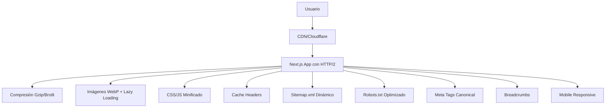

# Documento Técnico: Optimizaciones SEO Técnico para Next.js 15

## 1. Arquitectura de Optimización



## 2. Tecnologías y Dependencias

### Frontend
- Next.js 15 con App Router
- React 18 con Suspense
- TailwindCSS para estilos optimizados
- next/image para optimización de imágenes
- next/font para optimización de fuentes

### Optimización
- Compresión Gzip/Brotli nativa de Next.js
- WebP automático con next/image
- Lazy loading nativo
- Bundle analyzer para análisis de tamaño
- CDN integration (Vercel/Cloudflare)

## 3. Implementaciones Específicas

### 3.1 Optimización de Imágenes y Lazy Loading

| Componente | Tecnología | Implementación |
|------------|------------|----------------|
| Image Optimization | next/image | WebP automático, responsive, lazy loading |
| Video Lazy Loading | Intersection Observer | Carga diferida de videos e iframes |
| Background Images | CSS + Intersection Observer | Lazy loading para imágenes de fondo |

### 3.2 Compresión y Cache

| Tipo | Método | Configuración |
|------|--------|---------------|
| Gzip/Brotli | Next.js nativo | Automático en producción |
| Browser Cache | Headers HTTP | Cache-Control, ETag, Last-Modified |
| Static Assets | CDN | Versionado automático con _next |

### 3.3 SEO Técnico

| Elemento | Implementación | Prioridad |
|----------|----------------|-----------|
| Sitemap.xml | Dinámico con Supabase | Alta |
| Robots.txt | Configurado para bloquear rutas sensibles | Alta |
| Meta Canonical | Automático por página | Alta |
| Breadcrumbs | Componente reutilizable con JSON-LD | Media |
| URLs Optimizadas | Estructura semántica | Alta |

## 4. Configuración Next.js Optimizada

### 4.1 next.config.js Mejorado

```javascript
/** @type {import('next').NextConfig} */
const nextConfig = {
  output: 'standalone',
  trailingSlash: false,
  
  // Optimización de imágenes
  images: {
    formats: ['image/webp', 'image/avif'],
    deviceSizes: [640, 750, 828, 1080, 1200, 1920, 2048, 3840],
    imageSizes: [16, 32, 48, 64, 96, 128, 256, 384],
    minimumCacheTTL: 31536000, // 1 año
    dangerouslyAllowSVG: true,
    contentSecurityPolicy: "default-src 'self'; script-src 'none'; sandbox;",
  },
  
  // Compresión
  compress: true,
  
  // Headers de seguridad y cache
  async headers() {
    return [
      {
        source: '/(.*)',
        headers: [
          {
            key: 'X-Frame-Options',
            value: 'DENY',
          },
          {
            key: 'X-Content-Type-Options',
            value: 'nosniff',
          },
          {
            key: 'Referrer-Policy',
            value: 'origin-when-cross-origin',
          },
        ],
      },
      {
        source: '/api/(.*)',
        headers: [
          {
            key: 'Cache-Control',
            value: 'public, max-age=3600, stale-while-revalidate=86400',
          },
        ],
      },
      {
        source: '/_next/static/(.*)',
        headers: [
          {
            key: 'Cache-Control',
            value: 'public, max-age=31536000, immutable',
          },
        ],
      },
    ];
  },
  
  // Redirects para evitar múltiples redirecciones
  async redirects() {
    return [
      {
        source: '/home',
        destination: '/',
        permanent: true,
      },
    ];
  },
  
  // Webpack optimizations
  webpack: (config, { isServer, dev }) => {
    if (!dev) {
      // Optimizaciones de producción
      config.optimization.splitChunks = {
        chunks: 'all',
        cacheGroups: {
          vendor: {
            test: /[\\/]node_modules[\\/]/,
            name: 'vendors',
            chunks: 'all',
          },
        },
      };
    }
    
    return config;
  },
  
  // Experimental features
  experimental: {
    optimizeCss: true,
    optimizePackageImports: ['lucide-react', '@radix-ui/react-icons'],
  },
};

module.exports = nextConfig;
```

### 4.2 Componente de Imagen Optimizada

```typescript
// components/OptimizedImage.tsx
import Image from 'next/image';
import { useState } from 'react';

interface OptimizedImageProps {
  src: string;
  alt: string;
  width: number;
  height: number;
  priority?: boolean;
  className?: string;
}

export function OptimizedImage({ 
  src, 
  alt, 
  width, 
  height, 
  priority = false,
  className = '' 
}: OptimizedImageProps) {
  const [isLoading, setIsLoading] = useState(true);

  return (
    <div className={`relative overflow-hidden ${className}`}>
      <Image
        src={src}
        alt={alt}
        width={width}
        height={height}
        priority={priority}
        quality={85}
        placeholder="blur"
        blurDataURL="data:image/jpeg;base64,/9j/4AAQSkZJRgABAQAAAQABAAD/2wBDAAYEBQYFBAYGBQYHBwYIChAKCgkJChQODwwQFxQYGBcUFhYaHSUfGhsjHBYWICwgIyYnKSopGR8tMC0oMCUoKSj/2wBDAQcHBwoIChMKChMoGhYaKCgoKCgoKCgoKCgoKCgoKCgoKCgoKCgoKCgoKCgoKCgoKCgoKCgoKCgoKCgoKCgoKCj/wAARCAABAAEDASIAAhEBAxEB/8QAFQABAQAAAAAAAAAAAAAAAAAAAAv/xAAhEAACAQMDBQAAAAAAAAAAAAABAgMABAUGIWGRkqGx0f/EABUBAQEAAAAAAAAAAAAAAAAAAAMF/8QAGhEAAgIDAAAAAAAAAAAAAAAAAAECEgMRkf/aAAwDAQACEQMRAD8AltJagyeH0AthI5xdrLcNM91BF5pX2HaH9bcfaSXWGaRmknyJckliyjqTzSlT54b6bk+h0R//2Q=="
        onLoad={() => setIsLoading(false)}
        className={`
          duration-700 ease-in-out
          ${isLoading ? 'scale-110 blur-2xl grayscale' : 'scale-100 blur-0 grayscale-0'}
        `}
      />
    </div>
  );
}
```

### 4.3 Lazy Loading para Videos e Iframes

```typescript
// components/LazyVideo.tsx
'use client';

import { useEffect, useRef, useState } from 'react';

interface LazyVideoProps {
  src: string;
  poster?: string;
  className?: string;
  autoPlay?: boolean;
  muted?: boolean;
  loop?: boolean;
}

export function LazyVideo({ 
  src, 
  poster, 
  className = '',
  autoPlay = false,
  muted = true,
  loop = false 
}: LazyVideoProps) {
  const [isLoaded, setIsLoaded] = useState(false);
  const [isInView, setIsInView] = useState(false);
  const videoRef = useRef<HTMLVideoElement>(null);

  useEffect(() => {
    const observer = new IntersectionObserver(
      ([entry]) => {
        if (entry.isIntersecting) {
          setIsInView(true);
          observer.disconnect();
        }
      },
      { threshold: 0.1 }
    );

    if (videoRef.current) {
      observer.observe(videoRef.current);
    }

    return () => observer.disconnect();
  }, []);

  return (
    <div className={`relative ${className}`}>
      {!isInView ? (
        <div 
          ref={videoRef}
          className="w-full h-full bg-gray-200 animate-pulse flex items-center justify-center"
          style={{ aspectRatio: '16/9' }}
        >
          {poster && (
            
          )}
        </div>
      ) : (
        <video
          src={src}
          poster={poster}
          autoPlay={autoPlay}
          muted={muted}
          loop={loop}
          controls
          className="w-full h-full"
          onLoadedData={() => setIsLoaded(true)}
        />
      )}
    </div>
  );
}
```

## 5. SEO Meta Tags y Canonical

### 5.1 Layout Root con SEO

```typescript
// app/layout.tsx
import type { Metadata } from 'next';

export const metadata: Metadata = {
  metadataBase: new URL('https://redcreativa.pro'),
  title: {
    default: 'Red Creativa Pro - Herramientas de IA para Marketing',
    template: '%s | Red Creativa Pro'
  },
  description: 'Plataforma de inteligencia artificial para marketing digital, escritura automática y optimización SEO.',
  keywords: ['IA', 'marketing digital', 'SEO', 'escritura automática', 'inteligencia artificial'],
  authors: [{ name: 'Red Creativa Pro' }],
  creator: 'Red Creativa Pro',
  publisher: 'Red Creativa Pro',
  formatDetection: {
    email: false,
    address: false,
    telephone: false,
  },
  openGraph: {
    type: 'website',
    locale: 'es_ES',
    url: 'https://redcreativa.pro',
    siteName: 'Red Creativa Pro',
    title: 'Red Creativa Pro - Herramientas de IA para Marketing',
    description: 'Plataforma de inteligencia artificial para marketing digital, escritura automática y optimización SEO.',
    images: [
      {
        url: '/og-image.jpg',
        width: 1200,
        height: 630,
        alt: 'Red Creativa Pro',
      },
    ],
  },
  twitter: {
    card: 'summary_large_image',
    title: 'Red Creativa Pro - Herramientas de IA para Marketing',
    description: 'Plataforma de inteligencia artificial para marketing digital, escritura automática y optimización SEO.',
    images: ['/twitter-image.jpg'],
  },
  robots: {
    index: true,
    follow: true,
    googleBot: {
      index: true,
      follow: true,
      'max-video-preview': -1,
      'max-image-preview': 'large',
      'max-snippet': -1,
    },
  },
  verification: {
    google: 'tu-codigo-de-verificacion-google',
  },
};
```

### 5.2 Componente Breadcrumbs con JSON-LD

```typescript
// components/Breadcrumbs.tsx
'use client';

import Link from 'next/link';
import { ChevronRight } from 'lucide-react';

interface BreadcrumbItem {
  label: string;
  href: string;
}

interface BreadcrumbsProps {
  items: BreadcrumbItem[];
}

export function Breadcrumbs({ items }: BreadcrumbsProps) {
  const jsonLd = {
    '@context': 'https://schema.org',
    '@type': 'BreadcrumbList',
    itemListElement: items.map((item, index) => ({
      '@type': 'ListItem',
      position: index + 1,
      name: item.label,
      item: `https://redcreativa.pro${item.href}`,
    })),
  };

  return (
    <>
      <script
        type="application/ld+json"
        dangerouslySetInnerHTML={{ __html: JSON.stringify(jsonLd) }}
      />
      <nav aria-label="Breadcrumb" className="flex items-center space-x-2 text-sm text-gray-600">
        {items.map((item, index) => (
          <div key={item.href} className="flex items-center">
            {index > 0 && <ChevronRight className="w-4 h-4 mx-2" />}
            {index === items.length - 1 ? (
              <span className="font-medium text-gray-900">{item.label}</span>
            ) : (
              <Link 
                href={item.href}
                className="hover:text-blue-600 transition-colors"
              >
                {item.label}
              </Link>
            )}
          </div>
        ))}
      </nav>
    </>
  );
}
```

## 6. Optimización de Fuentes Web

### 6.1 Configuración de Fuentes

```typescript
// app/fonts.ts
import { Inter, Roboto_Mono } from 'next/font/google';

export const inter = Inter({
  subsets: ['latin'],
  display: 'swap',
  variable: '--font-inter',
  preload: true,
});

export const robotoMono = Roboto_Mono({
  subsets: ['latin'],
  display: 'swap',
  variable: '--font-roboto-mono',
  preload: false, // Solo cargar cuando sea necesario
});
```

## 7. Manejo de Errores 404 y Redirects

### 7.1 Página 404 Personalizada

```typescript
// app/not-found.tsx
import Link from 'next/link';
import { Metadata } from 'next';

export const metadata: Metadata = {
  title: 'Página no encontrada - 404',
  description: 'La página que buscas no existe. Explora nuestras herramientas de IA para marketing.',
  robots: {
    index: false,
    follow: true,
  },
};

export default function NotFound() {
  return (
    <div className="min-h-screen flex items-center justify-center bg-gray-50">
      <div className="max-w-md w-full text-center">
        <h1 className="text-6xl font-bold text-gray-900 mb-4">404</h1>
        <h2 className="text-2xl font-semibold text-gray-700 mb-4">
          Página no encontrada
        </h2>
        <p className="text-gray-600 mb-8">
          La página que buscas no existe o ha sido movida.
        </p>
        <div className="space-y-4">
          <Link 
            href="/"
            className="inline-block bg-blue-600 text-white px-6 py-3 rounded-lg hover:bg-blue-700 transition-colors"
          >
            Volver al inicio
          </Link>
          <div className="text-sm text-gray-500">
            <Link href="/contacto" className="hover:text-blue-600">
              ¿Necesitas ayuda? Contáctanos
            </Link>
          </div>
        </div>
      </div>
    </div>
  );
}
```

## 8. Middleware para Redirects y Seguridad

### 8.1 middleware.ts Optimizado

```typescript
// middleware.ts
import { NextResponse } from 'next/server';
import type { NextRequest } from 'next/server';

export function middleware(request: NextRequest) {
  const { pathname } = request.nextUrl;
  
  // Forzar HTTPS en producción
  if (process.env.NODE_ENV === 'production' && 
      request.headers.get('x-forwarded-proto') !== 'https') {
    return NextResponse.redirect(
      `https://${request.headers.get('host')}${pathname}`,
      301
    );
  }
  
  // Redirects para URLs antiguas
  const redirects: Record<string, string> = {
    '/old-page': '/',
    '/escritor': '/escritor-ia',
    '/correos': '/correos-ia',
  };
  
  if (redirects[pathname]) {
    return NextResponse.redirect(
      new URL(redirects[pathname], request.url),
      301
    );
  }
  
  // Headers de seguridad
  const response = NextResponse.next();
  
  response.headers.set('X-Frame-Options', 'DENY');
  response.headers.set('X-Content-Type-Options', 'nosniff');
  response.headers.set('Referrer-Policy', 'origin-when-cross-origin');
  response.headers.set(
    'Strict-Transport-Security',
    'max-age=31536000; includeSubDomains'
  );
  
  return response;
}

export const config = {
  matcher: [
    '/((?!api|_next/static|_next/image|favicon.ico).*)',
  ],
};
```

## 9. Análisis y Monitoreo

### 9.1 Bundle Analyzer

```json
// package.json - scripts adicionales
{
  "scripts": {
    "analyze": "cross-env ANALYZE=true next build",
    "lighthouse": "lighthouse http://localhost:3000 --output html --output-path ./lighthouse-report.html"
  }
}
```

### 9.2 Web Vitals Tracking

```typescript
// app/web-vitals.tsx
'use client';

import { useReportWebVitals } from 'next/web-vitals';

export function WebVitals() {
  useReportWebVitals((metric) => {
    // Enviar métricas a tu servicio de analytics
    console.log(metric);
    
    // Ejemplo: enviar a Google Analytics
    if (typeof window !== 'undefined' && window.gtag) {
      window.gtag('event', metric.name, {
        custom_map: { metric_id: 'web_vitals' },
        value: Math.round(metric.name === 'CLS' ? metric.value * 1000 : metric.value),
        event_category: 'Web Vitals',
        event_label: metric.id,
        non_interaction: true,
      });
    }
  });

  return null;
}
```

## 10. Checklist de Implementación

### 10.1 Optimizaciones de Rendimiento
- [x] Compresión Gzip/Brotli habilitada
- [ ] Imágenes convertidas a WebP/AVIF
- [ ] Lazy loading implementado en imágenes
- [ ] Lazy loading implementado en videos/iframes
- [ ] Cache headers configurados
- [ ] CSS y JS minificados automáticamente
- [ ] HTTP/2 habilitado (servidor)
- [ ] CDN configurado
- [ ] Fuentes web optimizadas

### 10.2 SEO Técnico
- [x] HTTPS forzado en producción
- [ ] Redirects múltiples eliminados
- [ ] Página 404 personalizada
- [x] Sitemap.xml dinámico
- [x] Robots.txt optimizado
- [ ] Meta canonical en todas las páginas
- [ ] URLs optimizadas y semánticas
- [ ] Enlaces rotos identificados y corregidos
- [ ] Breadcrumbs con JSON-LD
- [ ] Mobile-friendly verificado
- [ ] AMP implementado (si aplica)

### 10.3 Monitoreo
- [ ] Web Vitals tracking
- [ ] Bundle analyzer configurado
- [ ] Lighthouse CI configurado
- [ ] Error tracking implementado

## 11. Comandos de Despliegue

```bash
# Análisis de bundle
npm run analyze

# Test de rendimiento local
npm run lighthouse

# Build optimizado
npm run build

# Verificar optimizaciones
npm run start
```

Este documento proporciona una guía completa para implementar todas las optimizaciones de SEO técnico solicitadas en tu proyecto Next.js 15.