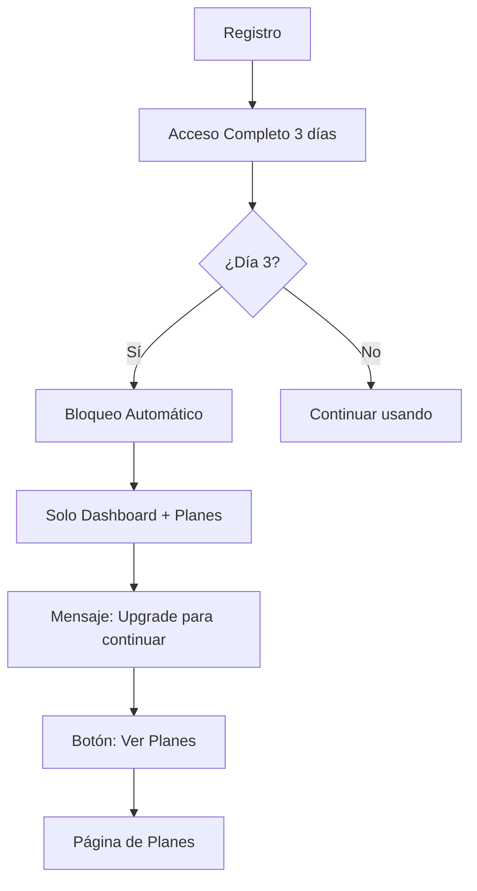
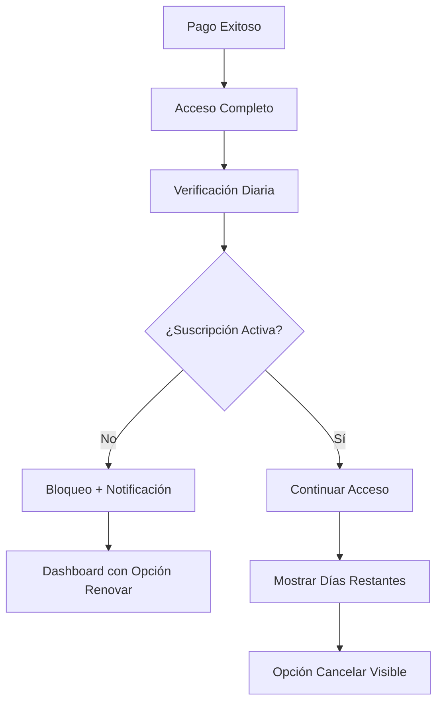
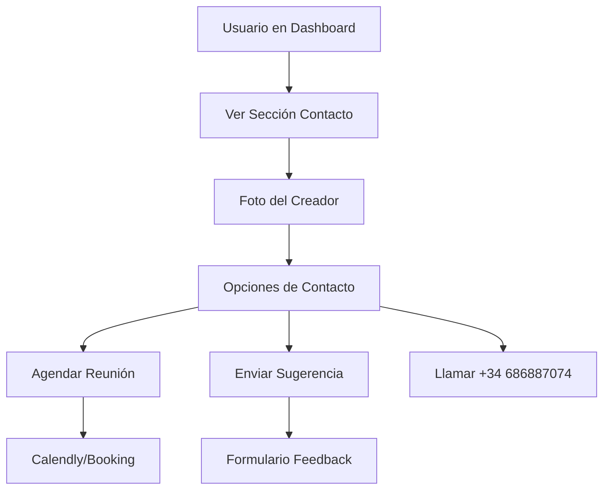

# Sistema de Gestión de Suscripciones y Control de Acceso

## 1. Resumen Ejecutivo

Sistema crítico para el control de acceso basado en suscripciones que gestiona usuarios gratuitos (3 días) y de pago, con bloqueo automático de funcionalidades y opciones de contacto directo con el creador.

**Objetivo Principal**: Convertir usuarios gratuitos en clientes de pago mediante un sistema de limitaciones claras y experiencia de usuario optimizada.

**Valor de Negocio**: Control total sobre el acceso a funcionalidades premium, maximización de conversiones y retención de clientes.

## 2. Funcionalidades Core

### 2.1 Roles de Usuario

| Rol | Método de Registro | Permisos Core | Duración |
|-----|-------------------|---------------|----------|
| Usuario Gratuito | Email + registro | Acceso completo por 3 días, luego solo dashboard y planes | 3 días |
| Usuario Premium | Pago con Stripe | Acceso completo mientras esté activa la suscripción | Según plan |
| Usuario Expirado | Automático al vencer | Solo dashboard, planes y contacto | Indefinido hasta renovación |

### 2.2 Módulos del Sistema

**Páginas Principales**:
1. **Dashboard de Suscripción**: Estado actual, días restantes, opciones de upgrade
2. **Página de Planes**: Comparación de planes, precios, botones de pago
3. **Panel de Control de Acceso**: Middleware que bloquea/permite acceso
4. **Página de Contacto con Creador**: Agendar reunión, sugerencias, soporte
5. **Centro de Cancelación**: Proceso de cancelación y retención

### 2.3 Detalles de Funcionalidades

| Página | Módulo | Descripción de Funcionalidad |
|--------|--------|------------------------------|
| Dashboard Suscripción | Contador de Días | Mostrar días restantes con colores (verde >7, amarillo 3-7, rojo <3). Actualización en tiempo real |
| Dashboard Suscripción | Estado de Plan | Indicador visual del tipo de plan (Gratuito, Premium, Expirado) con iconos |
| Dashboard Suscripción | Botones de Acción | "Upgrade a Premium", "Ver Planes", "Contactar Creador" según estado |
| Control de Acceso | Middleware de Verificación | Verificar estado de suscripción en cada ruta protegida. Redireccionar si expirado |
| Control de Acceso | Bloqueo de Herramientas | Mostrar mensaje de bloqueo con CTA a planes cuando acceso denegado |
| Página de Planes | Comparación Visual | Tabla comparativa con características, precios y botones de pago Stripe |
| Página de Planes | Integración Stripe | Botones de checkout que crean sesiones de pago para cada plan |
| Contacto Creador | Enlace de Reunión | Botón para agendar reunión con Calendly o similar |
| Contacto Creador | Formulario Sugerencias | Campo para enviar mejoras y feedback directo |
| Contacto Creador | Información Personal | Foto del creador, teléfono +34 686887074, descripción |
| Centro Cancelación | Proceso de Cancelación | Formulario de cancelación con opciones de retención |
| Centro Cancelación | Soporte Cancelación | Información de contacto si hay problemas técnicos |

## 3. Flujos de Usuario

### Flujo Usuario Gratuito (Días 1-3):

### Flujo Usuario Premium:

### Flujo de Contacto con Creador:

## 4. Diseño de Interfaz

### 4.1 Estilo de Diseño

- **Colores Primarios**: 
  - Verde (#10B981) para estados activos
  - Amarillo (#F59E0B) para advertencias
  - Rojo (#EF4444) para bloqueos/expiración
  - Azul (#3B82F6) para acciones principales
- **Estilo de Botones**: Redondeados con gradientes sutiles
- **Tipografía**: Inter, tamaños 14px (texto), 18px (títulos), 24px (contadores)
- **Layout**: Cards con sombras suaves, espaciado generoso
- **Iconos**: Lucide React, estilo minimalista

### 4.2 Componentes de Interfaz

| Página | Módulo | Elementos UI |
|--------|--------|--------------|
| Dashboard | Contador Días | Card destacado con número grande, color dinámico, icono reloj |
| Dashboard | Estado Plan | Badge con color de fondo, icono de corona/usuario, texto descriptivo |
| Dashboard | Foto Creador | Avatar circular 64px, nombre, título "Creador de Red Creativa" |
| Bloqueo | Mensaje Restricción | Modal/overlay con icono candado, texto explicativo, botón CTA grande |
| Planes | Tabla Comparativa | Grid responsive, highlights en plan recomendado, checkmarks verdes |
| Contacto | Sección Creador | Card con foto, información personal, botones de acción coloridos |

### 4.3 Responsividad

- **Desktop-first** con adaptación móvil completa
- **Breakpoints**: 768px (tablet), 640px (móvil)
- **Touch-optimized**: Botones mínimo 44px, espaciado táctil
- **Navegación móvil**: Bottom tabs con indicadores de estado